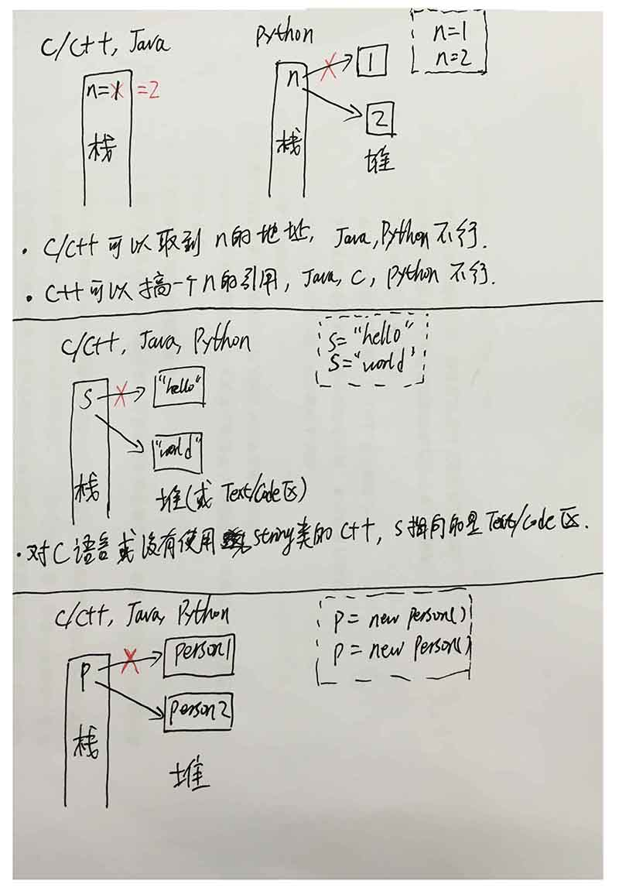
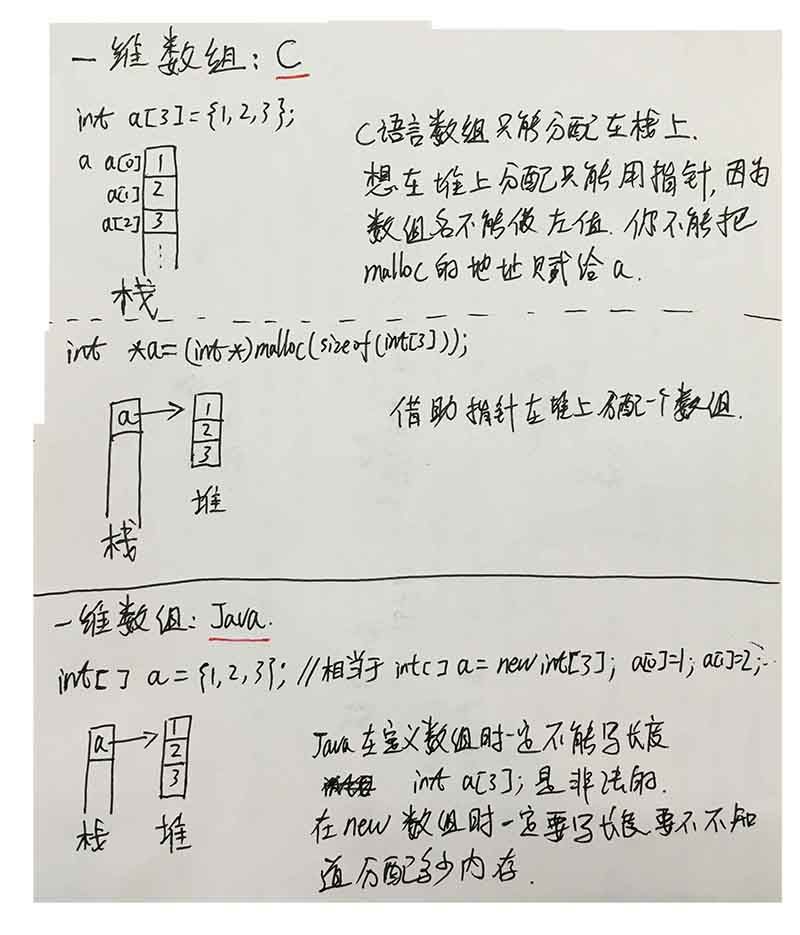
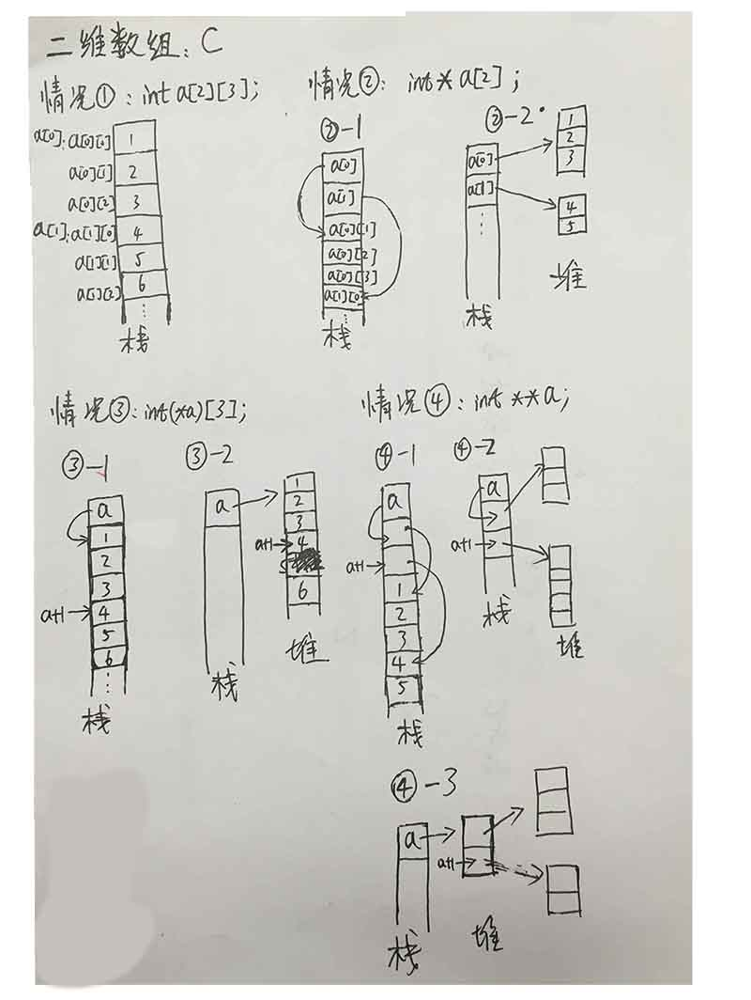
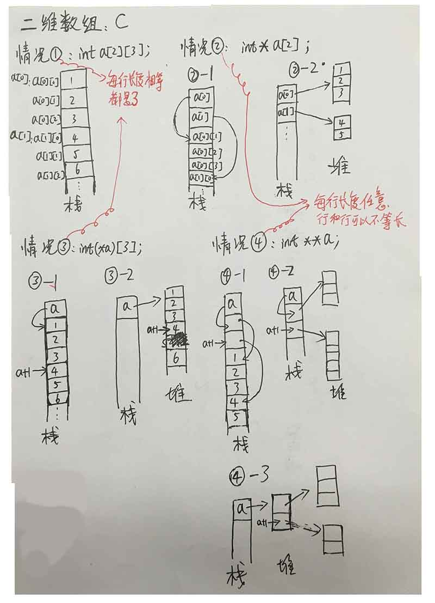
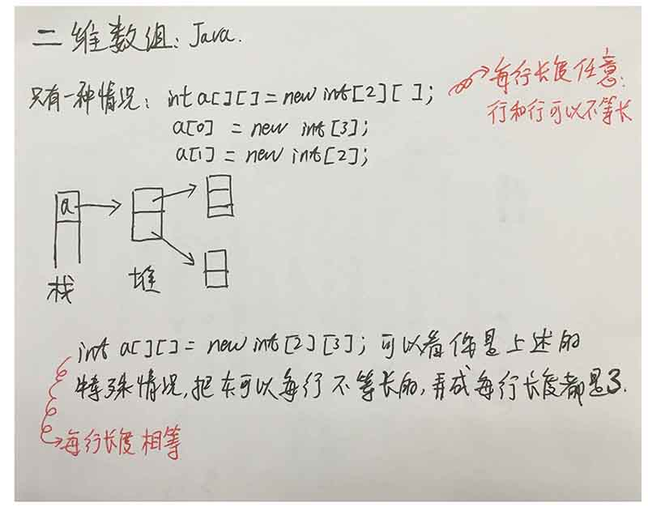

### 对象的内存地址
* Python 有个 build-in 的函数，叫 id(),能返回一个对象的内存地址，以十进制的形式。
* 以下是 Python 2.7 官方文档里对 id() 的描述，它确实返回的是内存地址。（Python 3.3 文档也看了，描述一样）

		id(object) 
		Return the “identity” of an object. This is an integer (or long integer) which is guaranteed to be unique and constant for this object during its lifetime.
		Two objects with non-overlapping lifetimes may have the same id() value.
		CPython implementation detail: This is the address of the object in memory.

### 赋值（assignment）
* a = 1  这句话。
* a 是名字（即变量）
* 1 是对象（你没看错，数字1也是一个对象：整型对象）
* 赋值操作就是名字和对象的绑定或重绑定。 （Assignments do not copy data — they just bind names to objects.）
* a = 1 即把名字a和对象1进行了绑定
* “变量a” 是对 “对象1” 的引用，可以理解为a是一根指针，指向内存里的对象：1

### 栈空间和堆空间
* id() 取的是对象的地址，而不是变量的
* python 里无法得到变量的地址
* C语言里：`int a=1; int b=a;` 
	* a有a的地址，b有b的地址。&a可以取到a的地址，&b可以取到b的地址，&1语法错误。
	* a 和 b 都在栈空间上
* python里：`a=1 b=a` 
	* id(a)==id(b)==id(1)
	* 变量a和b本身的地址是得不到的，无论id(a)还是id(b)，得到的都是内存中对象1的地址。
	* python栈空间上的所有变量都是引用类型，都指向堆空间的一个对象。
	* a分分钟可以被绑定到别的对象上，而且可以是别的类型的对象，比如随时可以 a="hello"
	* 再次强调，在python里给a赋值，只是给a重新绑定到另一个对象上
* Java 里 `Person p = new Person();`，相当于在栈空间上搞了一个引用型（指针）变量p，让它指向堆空间上的Person型对象。
* C语言里 `struct person *p = malloc(sizeof(struct person));`跟上面同理
* C++里 `Person *p = new Person();` 跟上面同理
* python里 `p = Person()` 跟上面同理
* 其实这些都体现不出来啥区别，能体现出区别（容易出问题）的地方是：
	* 函数调用：传值还是传引用？C/C++ 很容易实现的 swap()，在java和python这种没有指针的语言里，是很难实现的。
	* a=[] b=a b[0]=100 // 即深浅拷贝
	* 
	
### 数组
* C的数组默认在栈空间，可以利用指针制作堆空间上的数组，二维数组甚至可以弄成堆和栈上都有的。
* Java的数组只能在堆空间，只能new出来。
* C在定义数组时必须写大小，因为此时要在栈空间上分配连续的内存了。
* Java在定义数组时必须不写大小，因为无论这个数组多大，在栈空间上都只占一个引用型变量的空间。具体多大，日后从堆上new时再指定。
* C想模拟Java这个过程，只能用指针。
* 二维数组C语言则更加复杂（灵活），而Java则比较好控制。具体看图。

### 函数调用-参数传递

* python 里任何类型的变量都是引用，包括基本型的变量，比如int、float；也包括复杂型的变量，比如list、dict。
而在 C/C++ 和 Java 里，基本数据类型的变量不是引用，复杂的才是。具体什么是复杂，C/C++ 和 Java 是有区别的。
具体看下面的例子。

####例1.1，基本数据类型1
##### python：

	>>> n = 1
	>>> id(n)
	>>> n = 2
	>>> id(n)
* n被重新赋值后，其所在的内存地址发生了变化。
##### C/C++:

	int n =1;
	printf("0x%x",&n);
	n=2;
	printf("0x%x",&n);
* n被重新赋值后，其所在的内存地址没有变化，只是这个地址里存放的值发生了变化。
对于以上例子， Java 的内存使用情况跟 C/C++ 一样。

####例1.2，基本数据类型2
#####python：

	>>> n1=1
	>>> n2=2
	>>> id(n1)
	38843208
	>>> id(n2)
	38843196
	>>> n1=n2
	>>> id(n1)
	38843196
* C/C++/Java，n1=n2 之后，n1的地址不变。

####例1.3，基本数据类型作为函数的参数
#####python：

	def add_one(a):
	    print("id(a)={id_a}".format(id_a=id(a)))
	    a+=1
		print("id(a)={id_a}".format(id_a=id(a)))
		return a
	n=1
	print("id(n)={id_n1}".format(id_n=id(n)))
	add_one(n)
	print("id(n)={id_n1}".format(id_n=id(n)))
	#运行结果：
	id(n)=39335424
	id(a)=39335424
	id(a)=39335412
	id(n)=39335424

#####C/C++:

	int add_one(int a)
	{
		printf("&a=0x%x \n",&a);
		return ++a;
	}
	void main()
	{
		int n=1;
		printf("&n=0x%x \n",&n);
		add_one(n);
		system("pause");
	}
	//运行结果：
	&n=0x2dfcf8
	&a=0x2dfc24

* C/C++ 可以用引用传递实现改变参数的值，即便参数是基本数据类型

		void change_int(int* a)
		{
			++*a;
		}
		
		int _tmain(int argc, _TCHAR* argv[])
		{
			int n=1;
			printf("%d\n",n);
			change_int(&n);
			printf("%d\n",n);
			system("pause");
			return 0;
		}

* Python 和 Java 是没有办法像 C++ 这样在函数里改变实参的值的

####例二，字符串

	>>> s1="abc"
	>>> s2="def"
	>>> id(s1)
	35633776
	>>> id(s2)
	41726944
	>>>
	>>> s1=s1+"Z"
	>>> id(s1)
	41730336
	>>> s1
	'abcZ'
	>>>
	
	def change_str(s):
		s=s+'Z'
		return s
	str1 = "abc"
	str2 = change_str(str1)
	print(str1)
	print(str2)
