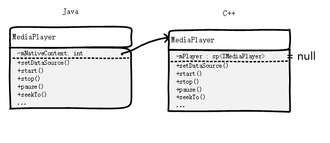

# 当你在 Java 层 new 了一个 MediaPlayer，到底发生了什么？

## 一. 静态语句块	

> MediaPlayer 类的定义在  `frameworks/base/media/java/android/media/MediaPlayer.java`

* 类体里，进来先是一个静态语句块（当这个类的第一个实例生成的时候，会自动调用）: 

```java 	
static {
    System.loadLibrary("media_jni");
    native_init();
}
```  

* `System.loadLibrary("media_jni");` 用来加载 native 库 `libmedia_jni.so`，没什么好说的
* `native_init()` 做了一些初始化工作，部分代码如下：

```c++
// frameworks/base/media/jni/android_media_MediaPlayer.cpp 
static void
android_media_MediaPlayer_native_init(JNIEnv *env)
{
    jclass clazz;		
    clazz = env->FindClass("android/media/MediaPlayer");		
    fields.context = env->GetFieldID(clazz, "mNativeContext", "J");		
    fields.post_event = env->GetStaticMethodID(clazz, "postEventFromNative", "(Ljava/lang/Object;IIILjava/lang/Object;)V");
    fields.surface_texture = env->GetFieldID(clazz, "mNativeSurfaceTexture", "J");
    env->DeleteLocalRef(clazz);
	...	
}
```
* `native_init()` 使用了全局变量 fields 来保存从 Java 层得到的这些成员变量和方法。
	*  fields.context 保存了 java 层 MediaPlayer **类的** mNativeContext
	*  fields.post_event 保存了 java 层 MediaPlayer **类的** postEventFromNative() 静态方法。
	*  fields.surface_texture 保存了 java 层 MediaPlayer **类的** mNativeSurfaceTexture

## 二. 构造函数
* MediaPlayer 的构造函数如下：

```java
public MediaPlayer() {
	...

    /* Native setup requires a weak reference to our object.
     * It's easier to create it here than in C++.
     */
    native_setup(new WeakReference<MediaPlayer>(this));
}
```

* 调用了 native 函数 `native_setup()`：

```java
private native final void native_setup(Object mediaplayer_this);
```

* 把 this 作为 WeakReference<MediaPlayer> 传了下去。
* 注意这里传的是一个 weak reference。后面会看到 C++ 拿到这个参数后用它生成了一个 Global reference。如果这里不传 weak，而是直接把 this 传下去（JNI 本来就会把 this 作为第二个参数传下去的），那么只要 C++ 不释放那个 Global reference，那么 JVM 就没办法 GC 这个 MediaPlayer。

### native_setup 实现
 
* 代码如下

```c++
// frameworks/base/media/jni/android_media_MediaPlayer.cpp

static void
android_media_MediaPlayer_native_setup(JNIEnv *env, jobject thiz, jobject weak_this)
{
    ALOGV("native_setup");
    // 1. new 了一个纯 native 的 MediaPlayer
    sp<MediaPlayer> mp = new MediaPlayer();  
    if (mp == NULL) {
        jniThrowException(env, "java/lang/RuntimeException", "Out of memory");
        return;
    }
	
    // create new listener and give it to MediaPlayer
    // 2. 这里用到了 java 层传下来的 MediaPlayer 实例的 WeakReference： weak_this，传给了 Listener 的构造
    sp<JNIMediaPlayerListener> listener = new JNIMediaPlayerListener(env, thiz, weak_this);  
    mp->setListener(listener);
	
    // Stow our new C++ MediaPlayer in an opaque field in the Java object.
    // 3. 让  java MediaPlayer 对象的 mNativeContext 指向 C++ 的 MediaPlayer 对象。
    setMediaPlayer(env, thiz, mp); 
}
```

#### 1.new 了一个 C++ 的 MediaPlayer
* C++ 的 MediaPlayer 类定义在这里： `frameworks/av/include/media/mediaplayer.h`，实现这这里: `frameworks/av/media/libmedia/mediaplayer.cpp`
* C++ 的 MediaPlayer 只不过是个壳（所以Java 的MediaPlayer也只是个壳），它里面有一个成员变量 `sp<IMediaPlayer>  mPlayer;`，我猜这才是真正干活的 player，它可能是 NuPlayer 也可能是其他的 Player。
* 这一步没什么实际东西，只需要记住，C++ 的 MediaPlayer 类继承自 BnMediaPlayerClient 和 IMediaDeathNotifier

```c++
class MediaPlayer : public BnMediaPlayerClient,
                    public virtual IMediaDeathNotifier
{
	...
}
```
* 注意 C++ 的 MediaPlayer 类是 native 层的东西，它完全不知道有 Java 层的存在。


#### 2.new 了一个 JNIMediaPlayerListener，set 给了 mp
* JNIMediaPlayerListener 类在 android_media_MediaPlayer.cpp 里定义并实现。这是一个 JNI 层的类，所以写在 JNI 层源文件里。
* 它继承自 MediaPlayerListener，这是一个 native 层的类。这里就体现出了 JNI 层的意义： 他连接了 native 层和 Java 层。

##### 2.1 JNIMediaPlayerListener 的构造函数:

```c++
JNIMediaPlayerListener::JNIMediaPlayerListener(JNIEnv* env, jobject thiz, jobject weak_thiz)
{
	
    // Hold onto the MediaPlayer class for use in calling the static method
    // that posts events to the application thread.
    jclass clazz = env->GetObjectClass(thiz);
    if (clazz == NULL) {
        ALOGE("Can't find android/media/MediaPlayer");
        jniThrowException(env, "java/lang/Exception", NULL);
        return;
    }
    mClass = (jclass)env->NewGlobalRef(clazz);
	
    // We use a weak reference so the MediaPlayer object can be garbage collected.
    // The reference is only used as a proxy for callbacks.
    mObject  = env->NewGlobalRef(weak_thiz);
}
```

* 首先，把 java 类 MediaPlayer 得到，并转成了 Global Reference，存储到成员变量 mClass 中。 保存 MediaPlayer 这个类是因为 JNIMediaPlayerListener 需要调用它的静态函数 postEventFromNative() 给它的实例发消息。
* 然后从 weak_thiz（即 java 层的 MediaPlayer 实例） 生成了一个 Global Reference，存储到成员变量 mObject 里。这里之所以没有用 thiz 来做 Global Reference，而是让 java 层额外传一个 weak reference 下来来做 Global Reference，是因为不能让某个 Java 层的 MediaPlayer 对象因为在 native 层有一个 Listener 就不会被 GC。
* JNIMediaPlayerListener 在给 java 层发 notify 时，调用的是自己的 `notify(int msg, int ext1, int ext2, const Parcel *obj)` 。 它真正发消息的代码是：

```c++
env->CallStaticVoidMethod(mClass, fields.post_event, mObject,
msg, ext1, ext2, jParcel);
// 还记得 fields.post_event 保存了 java 层 MediaPlayer 类的静态方法 postEventFromNative() 吗？
```

* 调用了 java 层 MediaPlayer 的静态方法  postEventFromNative()，把消息发给了 mObject。 
* 如果这时候 mObject 对应的 java 层对象已经被GC了怎么办？ 没事，postEventFromNative() 里做了处理了，只会安静的返回，因为这是正常现象。

##### 2.2 mp->setListener(listener)
* JNIMediaPlayerListener new 好了之后，就 mp->setListener(listener)，把它 set 给了 C++ 的 MediaPlayer 实例。
* 在 new JNIMediaPlayerListener 的时候，我们通过 weak_thiz ，让这个 listener 和 java 层的 MediaPlayer 对象对应了起来。
* 现在又把这个 listener set 给了 C++ 的 MediaPlayer 实例 mp。
* 这样，当底层的 mp 想给 Java 层的 MediaPlayer 发消息的时候，只要调用这个 listener 的 notify() 就可以了。
* 通过上面的分析我们知道，就算底层 mp 发消息的时候，java 层的 mp 对象已经不存在了也没关系。


#### 3.setMediaPlayer(env, thiz, mp);
* 这个函数的实现：

```c++
static sp<MediaPlayer> setMediaPlayer(JNIEnv* env, jobject thiz, const sp<MediaPlayer>& player)
{
    Mutex::Autolock l(sLock);
    sp<MediaPlayer> old = (MediaPlayer*)env->GetLongField(thiz, fields.context);
    if (player.get()) {
        player->incStrong((void*)setMediaPlayer);
    }
    if (old != 0) {
        old->decStrong((void*)setMediaPlayer);
    }
    // 把 player.get() 设给 java 层 MediaPlayer 对象的 mNativeContext
    // fields.context 保存的是 mNativeContext 还记得吧
    env->SetLongField(thiz, fields.context, (jlong)player.get());
    return old;
}
```

* 除了引用计数的更改，实际上做的事儿就是把 java mp 对象的 mNativeContext 成员设置成了 C++ 的 mp
* 注：player.get() 中的 get() 是类 sp 的方法，不用太纠结这个



* 经过这步，上图的箭头就连上了。

## 总结
* 静态语句块：如果是本进程第一次 new MediaPlayer，则会把 native 库 load 进来，并且进行一下 `native_init()`。其作用是用全局变量 fields 保存一些 java 层类的 field id。
* 构造函数：会在 C++ 层也 new 一个 MediaPlayer，并把 java 的 mp.mNativeContext 设置成 C++ 的这个 MediaPlayer 实例。并且做 C++ 层 new 了一个 JNIMediaPlayerListener，用于底层给 java 层发消息。

## 再看层次的划分
* Java 层、JNI层的代码都在 `frameworks/base/...` 里
* C++ 的 MediaPlayer 就不属于 JNI 层了，而是纯的 Native 层，所以它相关的代码都在 `frameworks/av/...` 里