##Java层的 setDataSource 会走到哪个 native 函数
* java 层的 setDataSource() 有5个重载，我们只看其中这一个：`setDataSource(String path)`
* 它会先走到重载的 `setDataSource(path, null, null)`, 然后在这里有个分叉

	1. 如果 path 是 file，则走到 `setDataSource(FileDescriptor fd_from_path);` ，最终会调用 native 方法： `private native void _setDataSource(FileDescriptor fd, long offset, long length)`

	2. 如果 path 不是 file 而是 http/rtsp，则走到 `nativeSetDataSource(MediaHTTPService.createHttpServiceBinderIfNecessary(path), path, null, null);`
	
* 我们这里只看是 file 的情况，不是 file 的，我们在另外一篇单看。

##native 的 setDataSource()
* 对应 file，会走到的 native 函数是： `private native void _setDataSource(FileDescriptor fd, long offset, long length)`。 它在JNI层的实现是 `android_media_MediaPlayer_setDataSourceFD(env,thiz,fd,offset,length)`
* 因为我们没有传 offset 和 length（我们只传了一个 path，java层根据这个 path 生成了 fd），java 层把 offset 设成了 0，length 设成了 0x7ffffffffffffffL —— 一个巨大的数。
* 下面来看这个 native 方法。

		static void
		android_media_MediaPlayer_setDataSourceFD(JNIEnv *env, jobject thiz, jobject fileDescriptor, jlong offset, jlong length)
		{
		    sp<MediaPlayer> mp = getMediaPlayer(env, thiz); // 1.
		    if (mp == NULL ) {
		        jniThrowException(env, "java/lang/IllegalStateException", NULL);
		        return;
		    }
		
		    if (fileDescriptor == NULL) {
		        jniThrowException(env, "java/lang/IllegalArgumentException", NULL);
		        return;
		    }
		    int fd = jniGetFDFromFileDescriptor(env, fileDescriptor);
		    ALOGV("setDataSourceFD: fd %d", fd);
		    process_media_player_call( env, thiz, mp->setDataSource(fd, offset, length), "java/io/IOException", "setDataSourceFD failed." ); // 2.
		}

####1. mp = getMediaPlayer() 
* 上来是个 getMediaPlayer()，这个函数没什么，就是从 java 的 mp 对象里拿到它的 mNativeContext 的值，强转成(MediaPlayer*)类型，返回。
* 这跟我们之前分析过的 setMediaPlayer() 呼应。 
* Java MediaPlayer 的 mNativeContext 成员，就是用来保存 C++ MediaPlayer 对象的指针的。
* C++ 把 Java **类** MediaPlayer 的成员 mNativeContext **的 ID** 存在 fields.context 里。 Java mediaplayer **对象**的 mNativeContext 的值，对应 C++ mediaplayer **对象**的指针。
* 这里我们 getMediaPlayer() 得到的就是之前在 native_setup() 时（java 层 new MediaPlayer 会走到） new 出来的那个 C++ 的 MediaPlayer。 

####2. mp->setDataSource(fd, offset, length)
* 接下来有用的代码是这一行：`process_media_player_call( env, thiz, mp->setDataSource(fd, offset, length), "java/io/IOException", "setDataSourceFD failed." );`
* 外面包的这层 `process_media_player_call()` 应该是跟 java 层交互的，先不展开看，不影响主线思路。我们只看里面的 `mp->setDataSource(fd, offset, length)`
* 这个函数干了很多很多的事情。它执行完之后，在另外一个进程 mediaserver 里，创建了真正干活的 player。先看一下这个函数执行完的效果，我们再详细的看这个函数。

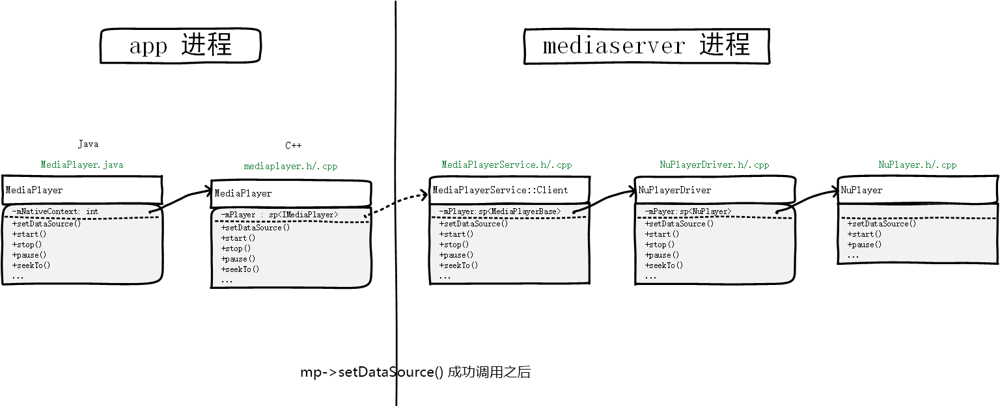

##mp->setDataSource(fd, offset, length) 详细展开
* 首先要记住，我们现在分析的是 app 进程里的，C++ 类 MediaPlayer 对象 mp 的 setDataSource() 函数。
* 我们先看 `mp->setDataSource(fd, offset, length)`的原型（frameworks/av/include/media/mediaplayer.h），并不是虚函数：

		status_t  setDataSource(int fd, int64_t offset, int64_t length); 

* 其实现如下（frameworks/av/media/libmedia/mediaplayer.cpp）：

		status_t MediaPlayer::setDataSource(int fd, int64_t offset, int64_t length)
		{
		    ALOGV("setDataSource(%d, %" PRId64 ", %" PRId64 ")", fd, offset, length);
		    status_t err = UNKNOWN_ERROR;
		    const sp<IMediaPlayerService>& service(getMediaPlayerService());  // (0).
		    if (service != 0) {
		        sp<IMediaPlayer> player(service->create(this, mAudioSessionId)); // (1).
		        if ((NO_ERROR != doSetRetransmitEndpoint(player)) ||
		            (NO_ERROR != player->setDataSource(fd, offset, length)    // (2).
					)) 
					{
			            player.clear();
			        }
		        err = attachNewPlayer(player);  // (3).
		    }
		    return err;
		}

* 其中最关键的4个点即注释中的 (0) ~ (3)，它各自的作用见下图：

* (0). 用 service 建立了 app 进程和 mediaserver 进程的联系
* (1). 用 service 向 mediaserver 进程发送了 create 命令，得到了一个 player。player 实际上代表着 mediaserver 进程里的一个对象。
* (2). 用 player 向 mediaserver 进程发送 setDataSource 命令，致使 mediaserver 进程干了一些 setDataSource 的活，干完之后，mediaserver 进程里才真正有了 NuPlayer。
* (3). 把 player 保存到 mp 的 mPlayer 成员里。
* 下面逐条详细展开看。

###(0). `const sp<IMediaPlayerService>& service(getMediaPlayerService())`

* 这句话定义了一个 `sp<IMediaPlayerService>&` 类型的变量 service，并赋值为 getMediaPlayerService() 的返回值。
* 对于 app 进程来说 ServiceManager 是另外一个进程，所以这是一次跨进程通信。我们借此来看一下 Android 典型的基于 Binder 的进程间通信。
* getMediaPlayerService() 我们不展开一行一行的看，它从 ServiceManager 那里获取到了一个 BpMediaPlayerService。

####getMediaPlayerService() 中的几个重要步骤如下：
1. `sp<IServiceManager> sm = defaultServiceManager() ` 得到 BpServiceManager sm。defaultServiceManager() 是 Android binder 系统提供的一个函数（IServiceManager.h/.cpp），它不需要参数，返回一个 BpServiceManager。至于BpXXX是什么意思，现在只需要知道其中有个成员变量 mRemote 能代表另外一个进程里的某个服务即可。后续我们再详细分析。

	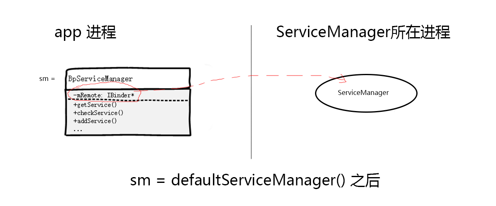

2. `sp<IBinder> binder = sm->getService(String16("media.player")) `，从 ServiceManager 那里取得 MediaPlayerService。**注意，因为 MediaPlayerService 是另外一个进程里的对象，所以你拿到的只能是 IBinder。**

	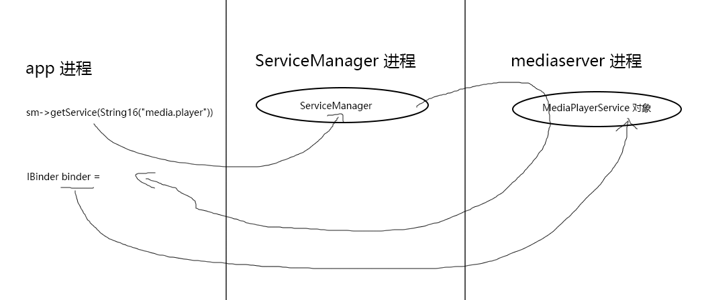

3. 最后 `return interface_cast<IMediaPlayerService>(binder) `，`interface_cast`是个模板函数（IInterface.h）：

		template<typename INTERFACE>
		inline sp<INTERFACE> interface_cast(constsp<IBinder>& obj)
		{
		    return INTERFACE::asInterface(obj);
		}
	
	所以最后 return 的是 `IMediaPlayerService::asInterface(binder)`。 而 asInterface() 又是由宏 `IMPLEMENT_META_INTERFACE` 实现的，宏展开后，相当于 return 了 new BpMediaPlayerService(binder)。而 BpMediaPlayerService 的构造函数一路调用父类的构造函数，最终使得其 mRemote = binder。  
	**总之，我们用上一步中得到的 binder，new 了一个指向远端进程的 BpMediaPlayerService。**

	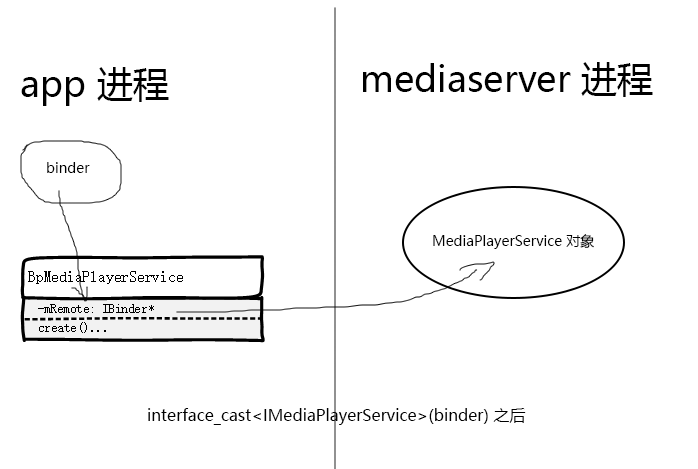

####为什么 IBinder* 能指向另外一个进程中的某个对象？
* IBinder 是 Android 系统的一个组件，在 Android 的世界里，任何进程都认识 IBinder 类的对象。这就是 Android 基于 Binder 通信的原理。
* 因为两个进程不可能互相认识对方内存里的对象，所以 Android 就抽象出了一个 Binder 类，让需要跨进程通信的类从它继承。
* 既然这样，我们 app 进程的 binder 之所以能指向 mediaserver 进程的 MediaPlayerService 对象，肯定是因为 MediaPlayerService 类也继承自 IBinder。
* 没错，MediaPlayerService 继承自 BnMediaPlayerService，而 BnMediaPlayerService 继承自 BBinder，BBinder 继承自 IBinder。这里的 BnMediaPlayerService 是什么，我们稍后再看。目前需要知道，被指向的对象，肯定是 IBinder 的后代。

	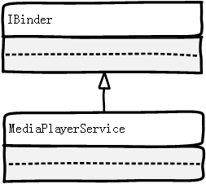

* 以上的“指向”均带引号，因为这不是用指针直接的指，而是跨进程的指，是个逻辑上的概念。

####再看 BpXXX
* BpXXX 一方面肩负着指向远端进程的任务：BpMediaPlayerService 要能指向远端进程的 MediaPlayerService 对象，所以其必须有个成员变量 mRemote，是 IBinder* 类型的，这继承自 BpRefBase。
* 另一方面肩负着调用业务函数的任务：BpMediaPlayerService 要能调用 MediaPlayerService 的业务函数 create() 等等，这继承自 IMediaPlayerService。
* 所以说 BpXXX 一般继承自 BpRefBase 和 IXXX，Android 为我们准备好了这一切，它搞了个模板类 `BpInterface<INTERFACE>` ，它继承自 BpRefBase 和 INTERFACE。所以我们的 BpXXX 直接从 `BpInterface<IXXX>` 继承即可。

	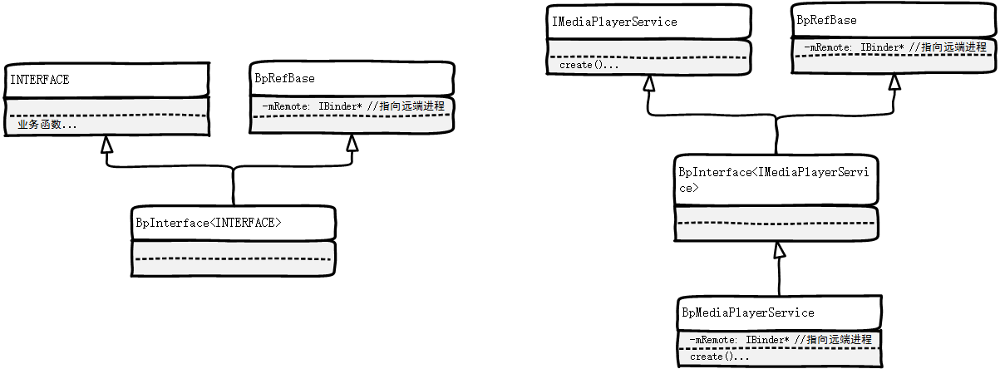

* 至于 BpXXX 调用业务函数时，是怎么把业务逻辑交给对端进程去处理的，我们稍后再看，现在来做一下小结：以上过程实际上是 Android 跨进程通信一般套路中典型的第一步。

####Android 跨进程通信一般套路之： Step 1.得到对端进程的代理 BpXXX
* Step1-1. `sp<IServiceManager> sm = defaultServiceManager() `   // 建立与 ServiceManager 的联系
* Step1-2. `sp<IBinder> binder = sm->getService(String16("media.player")) ` // 从 ServiceManager 得到对端进程的 Binder
* Step1-3. `interface_cast<IMediaPlayerService>(binder)`  // 把 Binde 转换成（ 根据 Binder new 出来）对端的代理 BpXXX

###(1). `sp<IMediaPlayer> player(service->create(this, mAudioSessionId))`

* 这句话定义了一个 `sp<IMediaPlayer>` 类型的变量 player，并赋值为 `service->create(this, mAudioSessionId)` 的返回值。 
* 我们已经知道了 service 是一个 BpMediaPlayerService 类型的变量，它指向 mediaserver 进程的 MediaPlayerService 对象，同时它拥有 IMediaPlayerService 的业务函数 create()。
* 那么 `service->create(this, mAudioSessionId)` 无疑是在调用业务函数，它应该能使远端 mediaserver 进程去完成真正的业务逻辑，然后把业务函数的结果返回过来。
* 现在我们就来看看本端进程是如何通过 Binder 调用了远端进程的业务函数的。

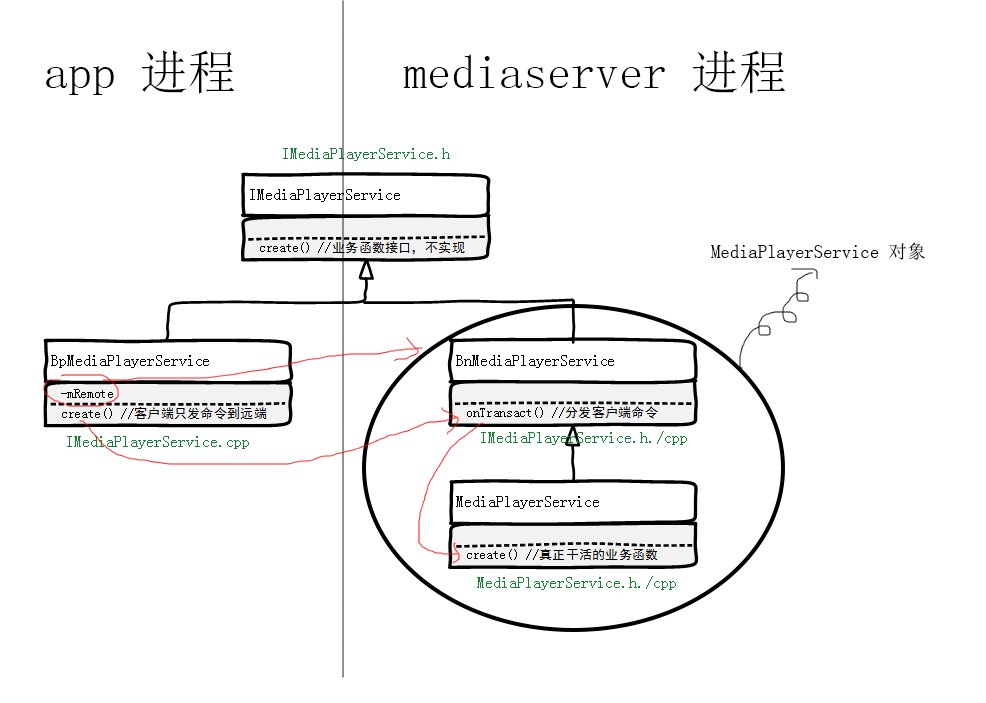

* 如图中红线，BpMediaPlayerService 的 create() 其实只是把 create 命令发送到远端进程而已，远端进程的 onTransac() 函数会处理这个命令。
* BpMediaPlayerService 的 create() 实现（frameworks/av/media/libmedia/IMediaPlayerService.cpp）：

		virtual sp<IMediaPlayer> create(const sp<IMediaPlayerClient>& client, int audioSessionId) {
		    Parcel data, reply;
		    data.writeInterfaceToken(IMediaPlayerService::getInterfaceDescriptor());
		    data.writeStrongBinder(IInterface::asBinder(client));
		    data.writeInt32(audioSessionId);
		
		    remote()->transact(CREATE, data, &reply); // 发送 CREATE 命令到远端进程
		    return interface_cast<IMediaPlayer>(reply.readStrongBinder());
		}

* BpMediaPlayerService 用 transact() 发送的命令会被 BnMediaPlayerService 的 onTransact() 收到。 onTransact 会用一个 switch 语句检查发来的命令是什么，这里即 CREATE。最终该命令会被分发给 MediaPlayerService 的 create() 函数处理。

		status_t BnMediaPlayerService::onTransact(uint32_t code, const Parcel& data, Parcel* reply, uint32_t flags)
		{
		    switch (code) {
		        case CREATE: {
		            CHECK_INTERFACE(IMediaPlayerService, data, reply);

					// 读取客户端发来的参数
		            sp<IMediaPlayerClient> client = interface_cast<IMediaPlayerClient>(data.readStrongBinder());
		            audio_session_t audioSessionId = (audio_session_t) data.readInt32();

					// 调用 MediaPlayerService 的 create()，即把客户端的 CREATE 命令分发给 MediaPlayerService 的 create() 函数
		            sp<IMediaPlayer> player = create(client, audioSessionId);  

					// 给客户端回消息
		            reply->writeStrongBinder(IInterface::asBinder(player));
		            return NO_ERROR;
		        } break;
				...
		}

####再看BnXXX
* BnXXX 与 BpXXX 相呼应，它用 onTransact() 接收 BpXXX 发来的命令。（BpXXX的业务函数里，实际上都是 `remote()->transact()` 把命令发送给远端处理）
* BnXXX 继承自 IBinder，让别的进程可以用一个 IBinder 指向自己。（BpXXX 的 mRemote 成员变量是 IBinder* 还记得吗？）
* 另外 BnXXX 也需要继承业务函数，让其子类可以去实现这些业务函数。所以 BnMediaPlayerService 需要从 IMediaPlayerService 继承。
* 同样，Android 为我们准备了模版类 `BnInterface<INTERFACE>`。

	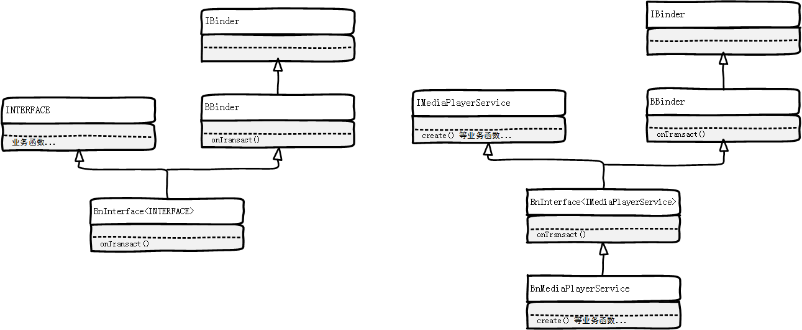

####再看 `service->create(this, mAudioSessionId)`
* 我们知道了这个函数的本质是调用 `remote()->transact()` 把活交给远端进程干。不过，它是怎么把参数传递给远端进程，又是怎么从远端进程拿到返回结果的呢？
* 像 mAudioSessionId 是个 int 型的参数还好说，直接在打包数据时用 `data.writeInt32(mAudioSessionId)` 就可以了。那 this 这种本进程的对象，怎么传给远端进程呢，还是同样的问题，别的进程不认识你的对象啊。
* 解决方法也是一样的，把 this 对象，转换成 IBinder 对象，对方就认识了：`IInterface::asBinder(client)`
* 返回值也是一样，从对端接收到的东西，只能理解为 Binder：`reply.readStrongBinder()`，拿到 Binder 后再转成你想要的东西，我们这里想要的是一个 BpMediaPlayer：`interface_cast<IMediaPlayer>(reply.readStrongBinder())`
* 总之，你交给其他进程的、从其他进程拿到的，只能是 Binder。 当你要把你的对象交给别的进程时，要用 asBinder() 先转成 Binder；当你想从别的进程拿到 BpXXX 的时候，你先read出 Binder，然后再 `interface_cast<IXXX>(binder)`
* 另外，这个函数最后 return 的是：`return interface_cast<IMediaPlayer>(reply.readStrongBinder());`，这是一个 BpMediaPlayer，它是根据 reply.readStrongBinder() 这个 Binder new 出来的。

####小结
* 到目前为止，我们内存中的东西应该大致是下图这个样子：（sm哪去了？ 这个临时变量应该在函数getMediaPlayerService()退出后就释放了）

	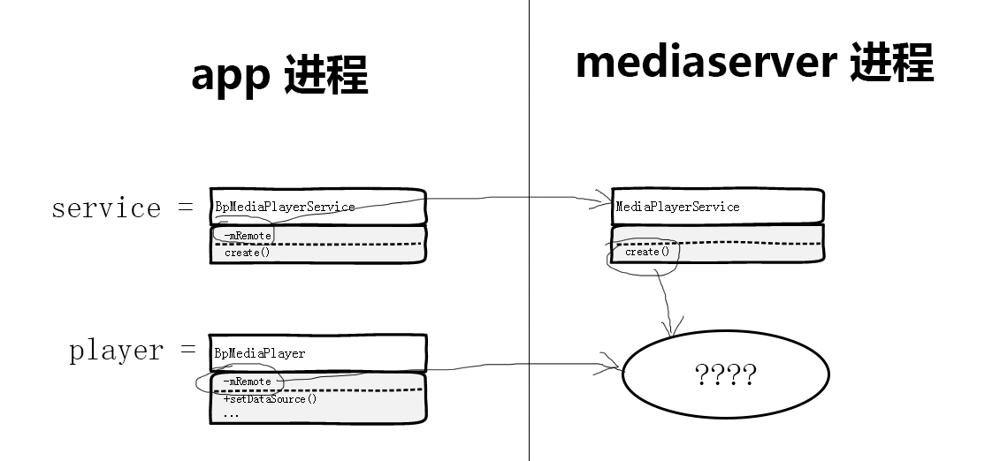

* 当然，service 和 player 都是 setDataSource() 函数里的临时变量。
* MediaPlayerService 的 create() 函数，肯定是创建了一个什么对象，最后返回给了 app 进程，转换成了 BpMediaPlayer 赋值给了 player 变量。
* 我们接下来看看

####真正干活的 create()
* MediaPlayerService 的 create() 函数位于：`frameworks/av/media/libmediaplayerservice/MediaPlayerService.cpp` ，其实现如下：

		sp<IMediaPlayer> MediaPlayerService::create(const sp<IMediaPlayerClient>& client,
		        int audioSessionId)
		{
		    pid_t pid = IPCThreadState::self()->getCallingPid();
		    int32_t connId = android_atomic_inc(&mNextConnId);
		
		    sp<Client> c = new Client(
		            this, pid, connId, client, audioSessionId,
		            IPCThreadState::self()->getCallingUid());
		
		    ALOGV("Create new client(%d) from pid %d, uid %d, ", connId, pid,
		         IPCThreadState::self()->getCallingUid());
		
		    wp<Client> w = c;
		    {
		        Mutex::Autolock lock(mLock);
		        mClients.add(w);
		    }
		    return c;
		}

* 实际上就是 new 了一个 Client 并把它 return 出去了。 Client 是啥？
* Client 是 MediaPlayerService 的内部类，它继承自 BnMediaPlayer，Client 的定义也在 MediaPlayerService.h:

	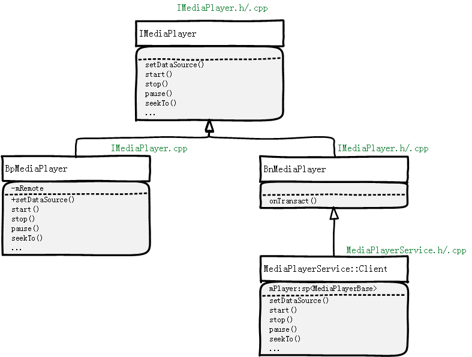

####再次小结
* 所以，到目前为止，内存中是这个样子：

	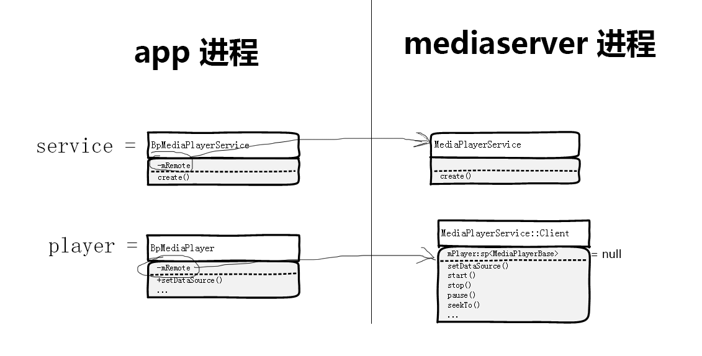

* 注意，Client 对象的 mPlayer 目前还是 null，因为 Client 的构造函数里看，并没有对其赋值。

###(2).player->setDataSource(fd, offset, length)
* 在(1).里面，我们调用了 service 的业务函数 create()，于是我们得到了 player。
* 其本质是用 BpMediaPlayerService 向远端进程发送了 CREATE 命令，让远端进程创建了 Client 对象并以 Binder 返回，我们的进程根据这个 Binder，new 了一个 BpMediaPlayer——player。
* 现在，我们要调用 player 的业务函数了：`player->setDataSource()`，按照之前的思路，它应该也是给远端进程发个消息而已。
* 首先，这个 setDataSource(fd, offset, length) 是 BpMediaPlayer 的方法。其实现如下（IMediaPlayer.cpp）：

		status_t setDataSource(int fd, int64_t offset, int64_t length) {
		    Parcel data, reply;
		    data.writeInterfaceToken(IMediaPlayer::getInterfaceDescriptor());
		    data.writeFileDescriptor(fd);
		    data.writeInt64(offset);
		    data.writeInt64(length);
		    remote()->transact(SET_DATA_SOURCE_FD, data, &reply);
		    return reply.readInt32();
		}

* 果然，是给远端进程发了个 `SET_DATA_SOURCE_FD` 消息。看看 BnMediaPlayer 的 onTransact() 吧，不出意料的话应该是分发给 MediaPlayerService::Client 的 setDataSource() 处理：

        case SET_DATA_SOURCE_FD: {
            CHECK_INTERFACE(IMediaPlayer, data, reply);
            int fd = data.readFileDescriptor();
            int64_t offset = data.readInt64();
            int64_t length = data.readInt64();
            reply->writeInt32(setDataSource(fd, offset, length)); //BnMediaPlayer 没有实现setDataSource()方法，是其子类Client实现的。
            return NO_ERROR;
        }

* MediaPlayerService::Client setDataSource() 的实现。 注意 Client 虽然是 BnMediaPlayer 的子类，但它是在 MediaPlayerService.cpp 里实现的，它是 MediaPlayerService 的内部类。

		status_t MediaPlayerService::Client::setDataSource(int fd, int64_t offset, int64_t length)
		{
			...
		    player_type playerType = MediaPlayerFactory::getPlayerType(this,fd,offset,length);  // (a). 
		    sp<MediaPlayerBase> p = setDataSource_pre(playerType);  // (b). 
		    if (p == NULL) {
		        return NO_INIT;
		    }
		
		    // now set data source
		    setDataSource_post(p, p->setDataSource(fd, offset, length)); // (c).
		    return mStatus;
		}

* 以上就是 mediaserver 进程里真正干活的 setDataSource()了，其中要点就是 (a).，(b).，(c).，跟我们最开那张图想对应。

##### (a). MediaPlayerFactory::getPlayerType(this,fd,offset,length)
* 文件位置：`av/media/libmediaplayerservice/MediaPlayerFactory.h`， `av/media/libmediaplayerservice/MediaPlayerFactory.cpp`
* 首先返回值 `player_type` 是一个枚举，在 MediaPlayerInterface.h 定义如下：

		enum player_type {
		    STAGEFRIGHT_PLAYER = 3,
		    NU_PLAYER = 4,
		    // Test players are available only in the 'test' and 'eng' builds.
		    // The shared library with the test player is passed passed as an
		    // argument to the 'test:' url in the setDataSource call.
		    TEST_PLAYER = 5,
		};

* 函数的实现如下：

		player_type MediaPlayerFactory::getPlayerType(const sp<IMediaPlayer>& client,int fd, int64_t offset,int64_t length) 
		{
		    GET_PLAYER_TYPE_IMPL(client, fd, offset, length);
		}

* 宏替换之后：

		player_type MediaPlayerFactory::getPlayerType(const sp<IMediaPlayer>& client,int fd, int64_t offset,int64_t length) 
		{
		    Mutex::Autolock lock_(&sLock);                      
		                                                        
		    player_type ret = STAGEFRIGHT_PLAYER;               
		    float bestScore = 0.0;                              
		                                                        
		    for (size_t i = 0; i < sFactoryMap.size(); ++i) {   
		                                                        
		        IFactory* v = sFactoryMap.valueAt(i);           
		        float thisScore;                                
		        CHECK(v != NULL);                               
		        thisScore = v->scoreFactory(client, fd, offset, length, bestScore);      
		        if (thisScore > bestScore) {                    
		            ret = sFactoryMap.keyAt(i);                 
		            bestScore = thisScore;                      
		        }                                               
		    }                                                   
		                                                        
		    if (0.0 == bestScore) {                             
		        ret = getDefaultPlayerType();                   
		    }                                                   
		                                                        
		    return ret;
		}

* 这里能看出来是怎么决定 `player_type` 的， 到底是 NuPlayer 呢 还是 Stagefright 呢 还是 `test_player` 呢？
* sFactoryMap 是 tFactoryMap 类型的变量，在 MediaPlayerFactory.cpp 里定义，是个**全局变量**。
* tFactoryMap 是 `typedef KeyedVector<player_type, IFactory*> tFactoryMap;`
* sFactoryMap 只有在函数 `registerFactory_l()` 里才增加元素，而 `registerFactory_l() `只在 MediaPlayerFactory.cpp 里被调用过2次：`registerFactory_l(new NuPlayerFactory(), NU_PLAYER)、registerFactory_l(new TestPlayerFactory(), TEST_PLAYER)`，这里只加了 NuPlayer 和 TestPlayer，没有加 StageFright。看上面的代码可以看到，默认是 StageFright——0分，如果任何一个 player 的评分比 StageFright 高了，则使用高分的那个。所以没必要把 StageFright 加进来。
* 每一种 player 想给自己评分，必须自己去实现 scoreFactory() 方法。
* 如果不实现，则默认返回0.0。见 MediaPlayerFactory.h。
* scoreFactory() 可能的参数有，因为 scoreFactory() 的参数跟 getPlayerType() 是一模一样的，宏替换来的。所以 getPlayerType() 有几种可能的重载，scoreFactory() 就有几种。而 getPlayerType() 又跟 setDataSource() 一致。所以，理论上每种 player 都应该实现所有 setDataSource() 可能的参数列表。如果不实现该参数列表，则说明该 player 不支持这种类型的 DataSource，返回 0.0，不会选到该 player。
* 我们看到 NuPlayerFactory（在 MediaPlayerFactory.cpp 里定义） 并没有重写 `scoreFactory(const sp<IMediaPlayer>&,int,int64_t,int64_t,float)`，所以这里最后会走到 `getDefaultPlayerType()`，还是会 `return NU_PLAYER`。看来 Android 已经彻底放弃 StageFright 了。
* 具体怎么打分的策略之类的就不展开看了
* 总之到此为止，`getPlayerType(this,fd,offset,length)` 得到了一个枚举值： `NU_PLAYER`

##### (b). sp<MediaPlayerBase\> p = setDataSource_pre(playerType)
* 该函数返回的是 MediaPlayerBase
* 该函数是 MediaPlayerService::Client 的成员函数， 在 MediaPlayerService.cpp 里实现：

		sp<MediaPlayerBase> MediaPlayerService::Client::setDataSource_pre(player_type playerType)
		{
		    // create the right type of player
		    sp<MediaPlayerBase> p = createPlayer(playerType); 
			...
		    return p;
		}

* 这个 `createPlayer(playerType)` 是 MediaPlayerService::Client 的成员函数，如下：

		sp<MediaPlayerBase> MediaPlayerService::Client::createPlayer(player_type playerType)
		{
		    // determine if we have the right player type
		    sp<MediaPlayerBase> p = mPlayer;
		    if ((p != NULL) && (p->playerType() != playerType)) {
		        ALOGV("delete player");
		        p.clear();
		    }
		    if (p == NULL) {
		        p = MediaPlayerFactory::createPlayer(playerType, this, notify, mPid); // 真正创建 player 的地方
		    }
		
		    if (p != NULL) {
		        p->setUID(mUID);
		    }
		
		    return p;
		}

* MediaPlayerFactory::createPlayer() 的实现就不贴代码了，它根据传入的 player type，new 一个相应的 player 出来。 我们这里就会 new 一个 NuPlayerDriver。
* 对，new 的是 NuPlayerDriver 而不是 NuPlayer 本身，这个不用去纠结，NuPlayer 就是这么做的。 NuPlayerDriver 有个成员变量 mPlayer，指向 NuPlayer。并且 NuPlayerDriver 的构造函数，会 new 一个 NuPlayer 出来，赋给自己的 mPlayer。

##### (c). setDataSource_post(p, p->setDataSource(fd, offset, length))
* 拆分成：
	* `status = p->setDataSource(fd, offset, length)`
	* `setDataSource_post(p, status)`
* 其中 `p->setDataSource(fd, offset, length)` 是真正干活的，是 NuPlayerDriver 的函数，它会调用 NuPlayer 的 setDataSource()，我们就不看了。
* `setDataSource_post(p, status)` 如下：

		void MediaPlayerService::Client::setDataSource_post(const sp<MediaPlayerBase>& p, status_t status)
		{
		    ALOGV(" setDataSource");
		    mStatus = status;  // 把真正的player
		    if (mStatus != OK) {
		        ALOGE("  error: %d", mStatus);
		        return;
		    }
		
		    // Set the re-transmission endpoint if one was chosen.
		    if (mRetransmitEndpointValid) {
		        mStatus = p->setRetransmitEndpoint(&mRetransmitEndpoint);
		        if (mStatus != NO_ERROR) {
		            ALOGE("setRetransmitEndpoint error: %d", mStatus);
		        }
		    }
		
		    if (mStatus == OK) {
		        mPlayer = p;  // 把 NuPlayerDriver 保存到 Client 的 mPlayer 里
		    }
		}

* 其中的 `mPlayer = p` 是把 NuPlayerDriver 保存到 Client 的 mPlayer 里

####小结一下
* 步骤(2).结束后，在 mediaserver 进程里，有了如下的东西：

	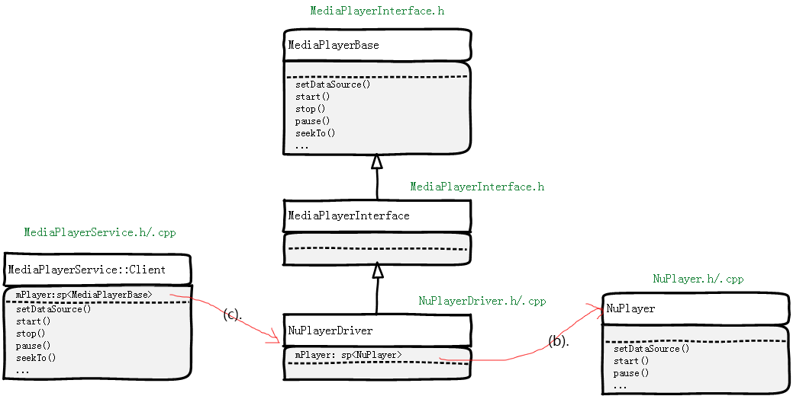

* 把它跟之前小结时的图连起来，就离我们开篇的那个完整图不远了，现在还差最后一步，我们在 (3).里把最后一条线也连上。

###(3).attachNewPlayer(player)
* attachNewPlayer()实现就不贴代码了，其核心的一句话： `mPlayer = player;`
* 核心的作用就是把自己的 mPlayer 设置为 player
* 顺带把原来的 mPlayer（如果有的话） 给 disconnect() 掉。
