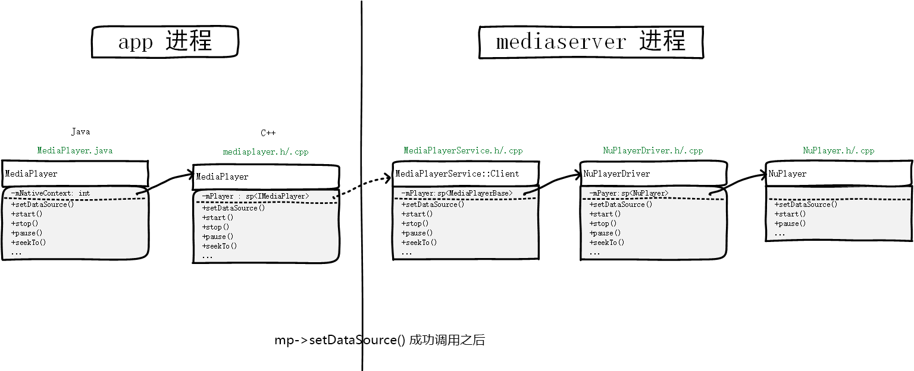
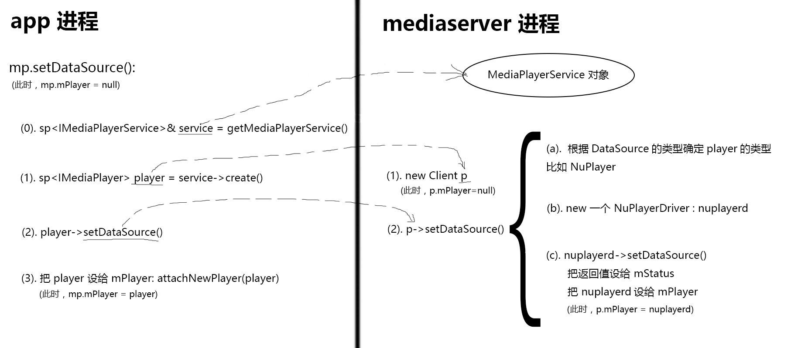

## Java层的 setDataSource 会走到哪个 native 函数
* java 层的 setDataSource() 会走到 native setDataSource()
* ???? 如果是 http/rtsp 也会走到同一个 native 方法吗？

## native 的 setDataSource()
* 对应 file，会走到的 native 函数是：

```java 
private native void _setDataSource(FileDescriptor fd, long offset, long length)
```

* 它在JNI层的实现是 

```c++
android_media_MediaPlayer_setDataSourceFD(env,thiz,fd,offset,length)
```

* 因为我们没有传 offset 和 length（我们只传了一个 path，java层根据这个 path 生成了 fd），java 层把 offset 设成了 0，length 设成了 0x7ffffffffffffffL —— 一个巨大的数。
* 下面来看这个 native 方法调用之后的结果：



* 大致过程，涉及到基于 Binder 的跨进程通信，不需要了解其中细节：



#### 为了缕清思路，略去了很多过程
* 跨进程通信全部省略
* 根据 DataSource 的类型确定 player 的类型省略了

