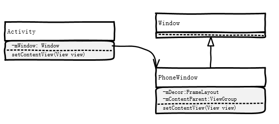
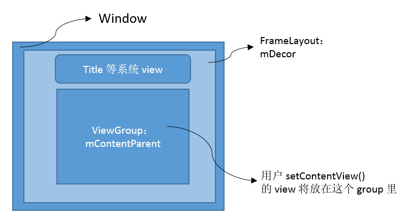

## Activity 的创建
* 根据第4章的流程图可知，app 进程是从 zygote 进程 fork 出来的
* 当 app 进程 fork 好了之后，会走到 android.app.ActivityThread 的 main() 函数，即图中第4步。
* 然后经过一系列调用，第一个 Activity 会通过 performLaunchActivity(r, customIntent) 函数创建。
* Activity 的实际创建过程是根据类名反射出来的。

## setContentView()
* Activity 的 setContentView() 实际上只是调用了 mWindow 的 setContentView()：

		:::Java
		/* Activity.java */
		public void setContentView(View view) {
		 getWindow().setContentView(view);
		}
		 
		public Window getWindow() {
		  return mWindow; 
		}

* mWindow 是 Activity 的成员，类型为 Window。在 Activity 被创建之后，其 mWindow 成员实际上是一个 new 出来的 PhoneWindow 对象。 PhoneWindow 是 Window 的子类。
* 总之，Activity 的 setContentView() 调用了 PhoneWindow 对象的 setContentView()。

### 如果不关心 mWindow 对象到底是怎么来的，请略过此节

* mWindow 是在创建 Activity 的时候初始化的。具体是在 Activity 被反射生成了对象之后，调用 activity.attach() 时被创建的。

		/* Activity.java */
		final void attach(...) {
		        ...
		        // 创建 mWindow 对象
		       mWindow = PolicyManager.makeNewWindow(this);
		       mWindow.setCallback(this);
		        ...
		}

* mWindow 是由类 PolicyManager 的静态方法 makeNewWindow() 产生的，该方法如下：

		:::Java
		/* PolicyManager.java */
		public final class PolicyManager {
			...
		    public static Window makeNewWindow(Context context) {
		       return sPolicy.makeNewWindow(context); // sPolicy 是 PolicyManager 的成员，它是 IPolicy 类的一个单例对象
		    }
		   ...
		}

* sPolicy 的 makeNewWindwo() 方法如下：

		:::Java
		/* Policy.java */
		public class Policy implements IPolicy {
			...
		 
			public PhoneWindow makeNewWindow(Contextcontext) {
			       return new PhoneWindow(context);
			    }
		 
		    ...
		}

* 至此，Activity 的 mWindow 确实是一个被 new 出来的 PhoneWindow。

### PhoneWindow 对象的 setContentView()

#### PhoneWindow 类概览：
* 有个 mDecor 成员，是 DecorView 类型，从 FrameLayout 继承。 这个 Layout 里放着本 Window 所有的 View，包括系统的 View——比如说 title；和用户的 View——比如说用户用 setContentView() 画的 View。
* 有个 mContentParent 成员，是 ViewGroup 类型。它也放在 mDecor 这个 Layout 里。 它是用来包裹用户的 View 的，即 setContentView() 传进来的 view，将以它为 Parent。

#### setContentView()
* 代码如下：

		:::Java
		/* PhoneWindow.java */
		public void setContentView(View view) {
		   setContentView(view, new ViewGroup.LayoutParams(MATCH_PARENT,MATCH_PARENT));
		}
		 
		public void setContentView(View view,ViewGroup.LayoutParams params) {
			if(mContentParent == null) { // mContentParent 初值为 null
			   installDecor(); // 这函数创建了 mDecor 和 mContentParent
			}else {
			   mContentParent.removeAllViews();
			}
			//把 view 加入到 mContentParent 这个 ViewGroup 中
			mContentParent.addView(view, params);
		     ...
		}

* 总之，PhoneWindow 把 setContentView() 传进来的 view，add 到了它的 mContentParent 里。而 mContentParent 在 mDecor 里。完成后如下：

