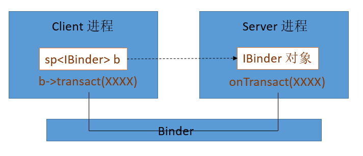
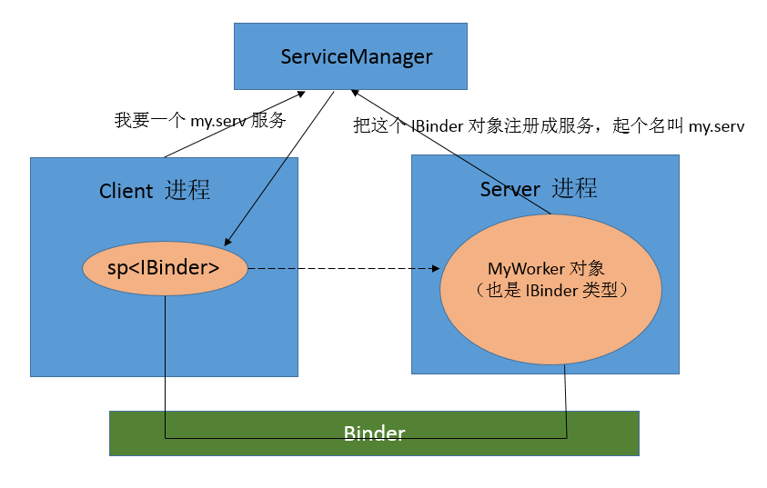
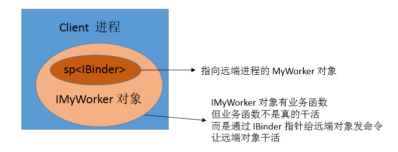
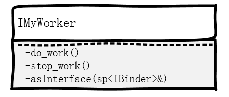
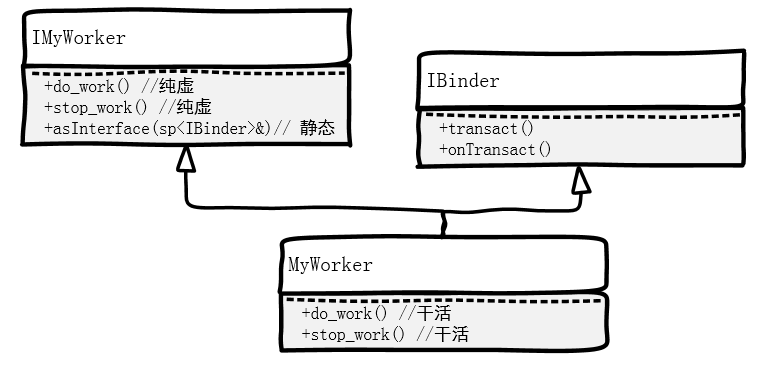
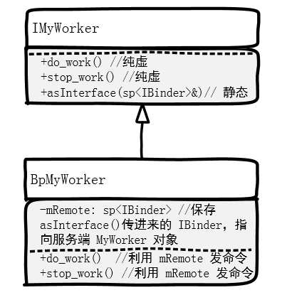

## 理论基础

### 1. 服务是什么？
* 可以简单的把服务理解为一个进程里的一个对象，它能干活，而且能被别的进程“引用”。
* 比如你搞了个进程，里面 new 了一个 MyWorker 对象，该对象可以被其他进程“引用”，并调用它的 `do_work()` 函数来干活。那么这个对象就是一个服务。
* 一个对象想成为“服务”的必要条件是：
	* 1. 能被其他进程引用，在 Binder 系统里，代表着它必须继承自 IBinder 类。
	* 2. 能提供业务能力，即能干活，这说明它必须同时继承自某个业务类。

* 如上图所示，一个 MyWorker 对象可以成为一个服务。

### 2. Binder 是什么？
* 把 Binder 理解为一个管道，它能连通两个进程，一个进程是 Server 端，另一个是客户端。
* Server 端里有一个 IBinder 类型的对象，客户端可以拿到一个“指向它的指针”。当然不是真的指向，而是逻辑上的。因为只有在同一个进程里，才能用一个指针指向一个对象。

* 图中的虚线表示这是逻辑上的指向。实线表示实际数据流是通过 Binder 传送的。
* 当 Client 端调用了 b 的 transact() 函数时，Server 端的 onTransact() 函数会被调用，并把 Client 端的参数传进来。
* 比如，Client 可以在 transact() 的参数里写上“DOWORK”，Server 端在 onTransact() 里看到参数“DOWORK”，则去调用自己的  `do_work()` 函数干活。
* 那么现在的问题是，如何在一个 Client 进程里，弄一个指针 b，指向另一个进程（Server）的对象呢？答案就是：ServiceManager。

### 3. ServiceManager 是什么？
* Android 提供了一个 ServiceManager，服务端向它注册服务，客户端从他得到服务。
* ServiceManager 只认识 Binder，向它注册服务时，要提供 IBinder 类型的对象；向它获取服务时，返回的是 IBinder 类型的指针。

* 上图说明了 Client 进程指向 Server 进程里的对象这条虚线“指针”，是通过 ServiceManager 建立的。

### 4. 注册服务
* 注册服务使用 ServiceManager 的 addService() 函数，原型如下

		status_t addService(const String16& name, const sp<IBinder>& service)

* 注册服务需要提供2个东西：
	* 服务名称，是个字符串。
	* 指向务的指针，是 `sp<IBinder>` 类型
* 比如我们注册一个自己的服务：

		ServiceManager::addService("my.serv", new MyWorker()); 
		// MyWorker 同时继承自 IBinder 和 IMyWorker

* 以上语句在 ServiceManager 里注册了一个名为 "my.serv" 的服务，该服务的提供者就是一个 MyWorker 对象。以后客户端拿到该服务，就能使用 MyWorker 对象的业务函数 `do_work()` 了。
* 另外注意，addService() 并不是静态函数，不能直接 `ServiceManager::` 调用，上面的代码只是示意。实际使用时，我们使用 Android 提供的 defaultServiceManager() 函数来得到一个 ServiceManager 的实例，然后通过实例调用：

		sp<IServiceManager>sm = defaultServiceManager();
		sm->addService("my.serv", new MyWorker());

### 5. 得到服务
* 得到服务使用 ServiceManager 的 getService() 函数，原型如下

		sp<IBinder> getService(constString16& name)

* 取得服务只需要提供服务名称字符串，返回值是个 IBinder 指针。
* 比如我们得到刚才注册的那个服务：

		sp<IServiceManager>sm = defaultServiceManager();
		sp<IBinder> binder = sm->getService("my.serv");

* 以上语句从 ServiceManager 处得到了刚才注册的 my.serv 这个服务。它是一个 IBinder 类型的指针。
* 我们可以调用 IBinder 的 transact() 函数，向远端对象发命令：

		binder->transact("DOWORK");

* 以上语句把"DOWORK" 发送给 Server 进程的 onTransact() 函数。"DOWORK"可以是我们自己定义的枚举类型，让 Server 端根据它选择干什么。
* 现实中更加稳妥的做法不是让用户直接调用 transact() 函数，而是服务端把这一切封装好，让客户端产生一种幻觉，感觉自己真的在使用 MyWorker 对象的指针，而忘记这是在跨进程。
* 做法是：服务端实现一个 IMyWorker 的子类， 该子类的 `do_work()` 函数就是调用 `this->binder->transact("DOWORK");`。对，该子类里需要有一个 binder 来指向服务端，该子类的构造函数需要一个 binder。然后服务端暴露给客户端的接口是一个静态函数，该函数让客户端把“指向”服务端的 binder 换成该子类的指针。这样，在客户端看来，只要以 binder 为参数调用该函数，就能返回一个 IMyWorker 类型的指针了。
* 这个函数一般叫做 asInterface()，原型如下：

		sp<IMyWorker> IMyWorker::asInterface(sp<IBinder>& binder)

* 该函数以 binder 为参数，返回一个 IMyWorker 对象。IMyWorker 对象虽有业务函数，但也并非真的干活，它只是通过 transact() 发送指令，指挥远端进程的 MyWorker 干活。
* 再次提醒，虽然以上所说的子类是给客户端使用的，但也要有服务端的编写者来编写。客户端只负责用。

* 这样，客户端就可以像调用本地对象的业务函数一样，调用服务端对象的业务函数了：

		sp<IServiceManager>sm = defaultServiceManager();
		sp<IBinder> binder = sm->getService("my.serv");
		sp<IMyWorker> wk = IMyWorker::asInterface(binder)；
		wk->do_work();

### 6. 理论基础回顾：客户端视角
* 客户端进程通过 ServiceManager 和 IMyWorker 类的 asInterface() 函数，能“看到”服务进程里的 IMyWorker 对象。
* 客户端感觉不到自己是在跨进程，在客户端进程看来，就像是自己 new 出来一个 IMyWorker 对象一样。只不过不是 new 出来，而是从 ServiceManager 那 get 一个。
* 客户端看到的 IWorker 类是这样：

* 小结：客户端需要做的事情很少，仅需get一个binder，转换成逻辑上的 IMyWoker “对象”，然后调用该对象的业务函数即可。
* 所有这些功能，都是在服务端的代码里实现的。

## 代码实现
* 代码的实现完全是服务端的事情，尽管 asInterface() 函数是只有客户端才会使用的，但要由服务端提供。

#### 1. 定义 IMyWorker 类

	:::C++
	/* IMyWorker.h */
	class IMyWorker: public IInterface
	{
	public:
	  virtual void do_work() = 0;
	  virtual void stop_work() = 0;
	  static sp<IMyWorker> asInterface(const sp<IBinder>& obj);
	}

#### 2. 用子类 MyWorker 实现业务函数
* 子类 MyWorker 实现 IMyWorker 的业务函数 `do_work()`, `stop_work()`, 真正的干活。它同时还要继承自 IBinder，以便可以被添加到 ServiceManager 里。

* 将来客户端用 getService() 得到的 binder，就指向这个 MyWorker 对象。
* 代码如下：

		/* IMyWorker.cpp */
		class MyWorker: publilc IMyWorker, public IBinder
		{
			
		}

		void MyWorker::do_work()
		{
			// do work here ...
		}	

		void MyWorker::stop_work()
		{
			// stop work here ...
		}	

#### 3. 实现 static 函数 asInterface()
* asInterface() 返回的东西需要继承自 IMyWorker，它的业务函数 `do_work()` 和 `stop_work()` 要能给远端 Server 进程里的对象发命令，让它干活。如何实现？？
* 肯定是利用 IBinder 的某个函数。 asInterface() 的参数是从 ServiceManager 得到的“指向”远端 MyWorker 对象的 IBinder 指针，我们可以利用这个 IBinder 指针实现给远端发命令的功能。
* 所以现在看起来 asInterface() 返回的东西应该是如下图这个样子的，我们暂且给他起名为 BpMyWorker：

* IBinder 有个 transact() 函数，用于发命令。我们利用这个函数来实现 BpMyWorker 的业务函数：

		/* IMyWorker.cpp */

		// 定义 BpMyWorker 类，用于 asInterface() 返回
		class BpMyWorker: public IMyWorker
		{
		public:
			// 构造函数接收一个 IBindre 指针，把它保存到成员变量 mRemote 里
			BpMyWorker(sp<IBinder>& binder)
			:mRemote(binder)
			{
				
			}

			// 业务函数仅仅是利用 mRemote 给远端进程发送命令
			vitural do_work()
			{
				Parcel data, reply;
				mRemote->transact(WORK, data, &reply);
				return;
			}

			// 业务函数仅仅是利用 mRemote 给远端进程发送命令		
			vitural stop_work()
			{
				Parcel data, reply;
				mRemote->transact(STOP, data, &reply);
				return;
			}
		private:
			sp<IBinder> mRemote; //用于指向 Server 端的对象
		}

		// 实现 asInterface()
		sp<IMyWorker> IMyWorker::asInterface(const sp<IBinder>& binder)
		{
			return new BpMyWorker(binder);
		}

* 现在我们实现了给客户端使用的类，以及其业务函数。客户端的业务函数只负责给服务端发命令，服务端要接收并处理。

#### 4. 服务端处理命令
* 服务端怎么接受该命令？ 同样是用 IBinder，IBinder 还有个方法叫 onTransact()，会收到 transact() 发来的命令。
* 所以，现在服务端还要多干一件事，处理客户的命令

		:::C++
		/* IMyWorker.cpp */
		class MyWorker: publilc IMyWorker, public IBinder
		{
			
		}

		void MyWorker::do_work()
		{
			// do work here ...
		}	

		void MyWorker::stop_work()
		{
			// stop work here ...
		}

		// 实现来自 IBinder 的 onTransact() 函数，处理客户端 transact() 发来的命令
		status_t MyWorker::onTransact(uint32_t code, const Parcel& data, Parcel* reply, uint32_t flags)
		{
			switch(code)
			{
				case WORK:
					do_work();
					break;
				case STOP:
					stop_work();
					break;
			}
		}

#### 5. 写个主程序，生成进程，注册服务
* 需要写个主程序，能运行起来，形成进程，该进程向 ServiceManager 注册服务

		int main()
		{
		  sp<IServiceManager> sm =defaultServiceManager();
		  // 注册服务
		  sm->addService(“my.serv”, new MyWorker());
		  while(1){}
		}

#### 6. 写个客户端程序，使用服务
* 再写个测试程序，试一下使用服务的感觉

		int main()
		{
			sp<IServiceManager> sm =defaultServiceManager();
			// 取得服务
			sp<IBinder> binder = sm->getService(“my.serv”);
			// 转为 IMyWorker 指针
			sp<IMyWorker> wk = IMyWorker::asInterface(binder);
			// 调用远端对象业务函数
			wk->do_work();
			wl->stop_work();
		}
		
## Android 都准备好了
* 上面的流程里，有很多东西是所有 Service 通用的，所以 Android 为我们准备好了一些好东西。
* 用上这些东西，我们的代码会简短一些。

### 1. asInterface()，transact() 和 BpXXX

### 2. onTransact() 和 BnXXX

### 3. 用了这些之后

---
## 跟 ServiceManager 的交互，也是一次基于 Binder 的 IPC

### ServiceManager 是一个远端进程

### ServiceManager 的业务函数：addService(), getService()

---
## 实例2：基于 Binder 的 IPC —— Java 层：AIDL、Messenger or Binder？

---
### 业务层整体逻辑
* 有 3 个东西： Client、Server、ServiceManager
* Server 向 ServiceManager 注册 Service，Client 向 ServiceManager 查询 Service，Client 使用 Server 的 Service
* Server 向 ServiceManager 注册 Service 的过程中，Server 相当于 Client，ServiceManager 相当于 Server

#### Client 和 Server 交互的一般流程
* Client 先调用 defaultServiceManager() 获取一个 IServiceManager 的指针（实际上是其子类 BpServiceManager 的指针）: `sp<IServiceManager> sm = defaultServiceManager();`
	* 注：函数 defaultServiceManager() 是 Android binder 组件的一部分，在 IServiceManager.cpp 中实现的。
* 然后 Client 利用这个指针，向 ServiceManager 查询 Service，得到这个 Service 的 IXXXService 指针。查询 Service 分为两小步，以查询 MediaPlayerService 为例：
	1. `sp<IBinder> binder = sm->getService(String16("media.player");`： 得到 binder
	2. `sp<IMediaPlayerService> service = interface_cast<IMediaPlayerService>(binder);` ： 把 binder cast 成 IMediaPlayerService（实际上是其子类 BpMediaPlayerService）。 
* 最后 Client 用得到的 IMediaPlayerService 指针，调用该 Service 提供的业务函数。 `service->create(this, mAudioSessionId);`

#### 再捋一次
* 一个 Service，要提供一个接口类来供 Client 调用其业务函数，一般这个接口类叫做 IXXXService。
* 比如上面的 IMediaPlayerService 就是 MediaPlayerService 的接口类，它的 create() 函数就是提供给 Client 的业务函数之一。
* ServiceManager 本身也是一个 Service，它提供给 Client 的业务函数就是 getService()，addService() 等等
* 所以 ServiceManager 也有一个接口类，IServiceManager，上面的过程中 Client 就调用了这个接口里的 getService() 函数来查询 Service。
* 得到普通 Server 的接口类的指针，需要向 ServiceManager 查询，方法是调用 IServiceManager 的 getService();
* 得到 ServiceManager 的接口类指针，binder 系统为我们提供了方便函数： defaultServiceManager()

#### Server 向 ServiceManager 注册 Service
* 上面说过，Server 向 ServiceManager 注册 Service 的过程中，Server 相当于 Client，ServiceManager 相当于 Server
* 此时的流程跟 Client 使用 Service 是一个道理
* Server 先调用 defaultServiceManager() 获取一个 IServiceManager 的指针（实际上是其子类 BpServiceManager 的指针）:`sp<IServiceManager> sm = defaultServiceManager();`
* Server 得到这个指针时候，调用 ServiceManager 的业务函数 addService() 来注册自己的 Service：`sm->addService(String16("media.player"), new MediaPlayerService());`

#### 业务层小结
* 其实抛开底层 binder 具体是怎么实现的，业务层已经很简单清晰了
* 业务层使用起来流程也相对固定，没什么难理解的
* 接下来我们稍微深入一点（但还没深到binder那么深），看看作为一个 Service，是怎么提供服务的，Client 是怎么使用这个服务的。

---
