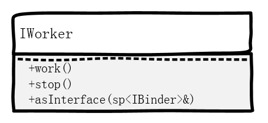

### 业务层整体逻辑
* 有 3 个东西： Client、Server、ServiceManager
* Server 向 ServiceManager 注册 Service，Client 向 ServiceManager 查询 Service，Client 使用 Server 的 Service
* Server 向 ServiceManager 注册 Service 的过程中，Server 相当于 Client，ServiceManager 相当于 Server

#### Client 和 Server 交互的一般流程
* Client 先调用 defaultServiceManager() 获取一个 IServiceManager 的指针（实际上是其子类 BpServiceManager 的指针）: `sp<IServiceManager> sm = defaultServiceManager();`
	* 注：函数 defaultServiceManager() 是 Android binder 组件的一部分，在 IServiceManager.cpp 中实现的。
* 然后 Client 利用这个指针，向 ServiceManager 查询 Service，得到这个 Service 的 IXXXService 指针。查询 Service 分为两小步，以查询 MediaPlayerService 为例：
	1. `sp<IBinder> binder = sm->getService(String16("media.player");`： 得到 binder
	2. `sp<IMediaPlayerService> service = interface_cast<IMediaPlayerService>(binder);` ： 把 binder cast 成 IMediaPlayerService（实际上是其子类 BpMediaPlayerService）。 
* 最后 Client 用得到的 IMediaPlayerService 指针，调用该 Service 提供的业务函数。 `service->create(this, mAudioSessionId);`

#### 再捋一次
* 一个 Service，要提供一个接口类来供 Client 调用其业务函数，一般这个接口类叫做 IXXXService。
* 比如上面的 IMediaPlayerService 就是 MediaPlayerService 的接口类，它的 create() 函数就是提供给 Client 的业务函数之一。
* ServiceManager 本身也是一个 Service，它提供给 Client 的业务函数就是 getService()，addService() 等等
* 所以 ServiceManager 也有一个接口类，IServiceManager，上面的过程中 Client 就调用了这个接口里的 getService() 函数来查询 Service。
* 得到普通 Server 的接口类的指针，需要向 ServiceManager 查询，方法是调用 IServiceManager 的 getService();
* 得到 ServiceManager 的接口类指针，binder 系统为我们提供了方便函数： defaultServiceManager()

#### Server 向 ServiceManager 注册 Service
* 上面说过，Server 向 ServiceManager 注册 Service 的过程中，Server 相当于 Client，ServiceManager 相当于 Server
* 此时的流程跟 Client 使用 Service 是一个道理
* Server 先调用 defaultServiceManager() 获取一个 IServiceManager 的指针（实际上是其子类 BpServiceManager 的指针）:`sp<IServiceManager> sm = defaultServiceManager();`
* Server 得到这个指针时候，调用 ServiceManager 的业务函数 addService() 来注册自己的 Service：`sm->addService(String16("media.player"), new MediaPlayerService());`

#### 业务层小结
* 其实抛开底层 binder 具体是怎么实现的，业务层已经很简单清晰了
* 业务层使用起来流程也相对固定，没什么难理解的
* 接下来我们稍微深入一点（但还没深到binder那么深），看看作为一个 Service，是怎么提供服务的，Client 是怎么使用这个服务的。

---

## 理论基础
* 把 Binder 理解为一个管道，一根网线，一个硬件，它能连通两个进程。

### 客户端视角
* 假设有个类 IWorker，有个 IWorker 对象在服务端进程里，客户端进程可以让它干活，通过 Binder。
* 客户端感觉不到自己是在跨进程，在客户端进程看来，就像是自己 new 出来一个 IWorker 对象一样。
* 只不过不是 new 出来，而是从 ServiceManager 那 get 一个：调用 ServiceManager 的 `getService()` ：

		sp<IBinder> binder = ServiceManager->getService("myworker"）// 只是示意代码，实际要先搞个 ServiceManger 的对象再调用 getService()

* 注意：字符串 "myworker" 是服务端进程在 ServiceManager 里注册好的，客户端需要知道这个名字。
* 注意：从 ServiceManager 那里 get 到的东西，只能是 `sp<IBinder>` 类型，因为 getService() 返回 `sp<IBinder>` 类型。这个 binder 指向服务端进程的 IWorker 对象。
* 客户端需要利用 `IWorker::asInterface(sp<IBinder>& binder)` 把得到的 `sp<IBinder>` ，转换成 `sp<IWorker>` 类型：

		sp<IWorker> wk = IWorker::asInterface(sp<IBinder>& binder)

* 即 IWorker 要为客户端提供一个函数 asInterface()，能把 IBinder 类型转换成自己的类型。
* 转换完成后，客户端就可以调用它的业务函数了，比如: 

		wk->work();
		wk->stop();
 
* 客户端看到的 IWorker 类是这样：

* 小结：客户端需要做的事情很少，仅需get一个binder，转换成逻辑上的IWoker“对象”，然后调用该对象的业务函数即可。

### 服务端视角
* 服务端需要做的事情很多，他需要：
	* 定义 IWorker 类
	* 实现客户端能看见的函数：包括 work(), stop() 这种业务函数，还包括 asInterface() 这种用于 Binder 通信的函数。
	* 实现客户端看不到的函数：基本都是用于 Binder 通信的
	* 为了能逻辑更加清晰，定义若干子类，在子类里实现各函数。
* 服务端几乎要干所有的事情，所以直接看例子。 

## 实例1：基于 Binder 的 IPC —— 纯 Native版

### 1. 预置条件
* Android 系统已经存在，Binder、ServiceManager 可用
* Android 系统为我们准备的 `BnInterface<INTERFACE>` 和 `BpInterface<INTERFACE>` 模板类可用

### 2. 目标
* 实现一个纯 C/C++ 的 Server 进程，进程里有个 Worker 对象，负责干活。
* 实现一个纯 C/C++ 的 Client 进程，远程调用 Server 进程里 Worker 对象的函数，让他干活/停止干活。

### 3. 具体步骤
* 搞一个接口类 IWorker，虚函数 work(), stop()，交给服务端和客户端的具体类分别去实现。服务端的 work() 就是干活，客户端的 work() 就是给服务端发消息，让服务端调用 work() 干活。

		:::C++
		/* IWorker.h */
		class IWorker: public IInterface
		{
		public:
		  virtual void work() = 0;
		  virtual void stop() = 0;
		}

* 服务端搞一个 BnWorker 类，从 IWorker 和 BBinder 继承。实现 BBinder 的 onTransact() 函数，从而把客户端发来的命令分发给实际干活的 work() 和 stop() 函数。注意，实际干活的函数并不在 BnWorker 类实现，BnWorker 只负责分发。真正干活的函数会由 BnWorker 的子类 Worker 实现。想同时从 IWorker 和 BBinder 继承，Android 已经给我们提供了模版类：`BnInterface<INTERFACE>`，即我们的 BnWorker 类只需从 `BnInterface<IWorker>` 继承即可。

		:::C++
		/* IWorker.h */
		class BnWorker: public BnInterface<IWorker>
		{
		public:
			virtual status_t onTransact(uint32_t code, const Parcel& data, Parcel *reply, uint32_t flags= 0);
		}

		/* IWorker.cpp */
		status_t BnWorker::onTransact(uint32_t code, const Parcel& data, Parcel* reply, uint32_t flags)
		{
			switch(code)
			{
				case WORK:
					work();
					break;
				case STOP:
					stop();
					break;
			}
		}

* 服务端搞一个 Worker 类，从 BnWorker 继承，实现 work() 和 stop() 函数，真正干活。

		/* IWorker.cpp */
		class Worker: publilc BnWorker
		{
			
		}

		void Worker::work()
		{
			// do work here ...
		}	

		void Worker::stop()
		{
			// stop work here ...
		}	

* 为客户端搞一个 BpWorker 类，从 IWorker 和 BpRefBase 继承。实现 work() 和 stop()，实现方式是调用成员变量 mRemote 的 transact() 方法，发送对应命令。其成员 mRemote 来自于类 BpRefBase。想同时从 IWorker 和 BpRefBase 继承，Android 已经给我们提供了模版类：`BpInterface<INTERFACE>`，即我们的 BnWorker 类只需从 `BpInterface<IWorker>` 继承即可。
* 注意，BpWorker 是提供给客户端用的，但不是客户端负责来写这个类，是服务端的代码来写。BpWorker 对客户端是透明的，客户端只知道自己看到的是 IWorker。客户端不必关心整个 Binder 的运作方式，它只需要从 ServiceManager 查询到 worker 这个 Service（是个 IWorker 实例），然后调用他的功能就可以了。

		/* IWorker.cpp */
		class BpWorker: public BpInterface<IWorker>
		{
		public:
		    BpWorker(const sp<IBinder>& impl)
		        :BpInterface<IWorker>(impl)
		    {
		
			}
		
			vitural work()
			{
				Parcel data, reply;
				remote()->transact(WORK, data, &reply);
				return;
			}
		
			vitural stop()
			{
				Parcel data, reply;
				remote()->transact(STOP, data, &reply);
				return;
			}
		}

* 服务端进程向 ServiceManager 注册 worker 服务
* 客户端进程向 ServiceManager 查询 worker 服务，拿到服务端进程的 Worker 对象。

### 4. 深入：为什么这样？

#### 4.1 服务端构想
* Worker 类起码要有两个函数，work()：干活， stop()：停止干活。
* Worker 类要能被远端 Client 进程“指向”，所以它必须是 IBinder 的子类。
* Worker 类要能处理远端 Client 进程通过 transact() 发来的指令，即必须有 onTransact() 函数。

#### 4.2 客户端构想
* 客户端要能通过 ServiceManager 得到指向服务端 Worker 对象的 IBinder 指针:

		sp<IServiceManager>sm = defaultServiceManager();
		sp<IBinder> binder = sm->getService("my.worker");

### 5. 更加深入？

## 实例2：基于 Binder 的 IPC —— Java 层：AIDL
