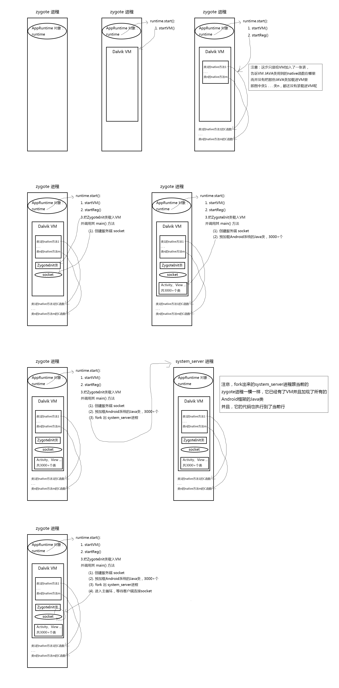
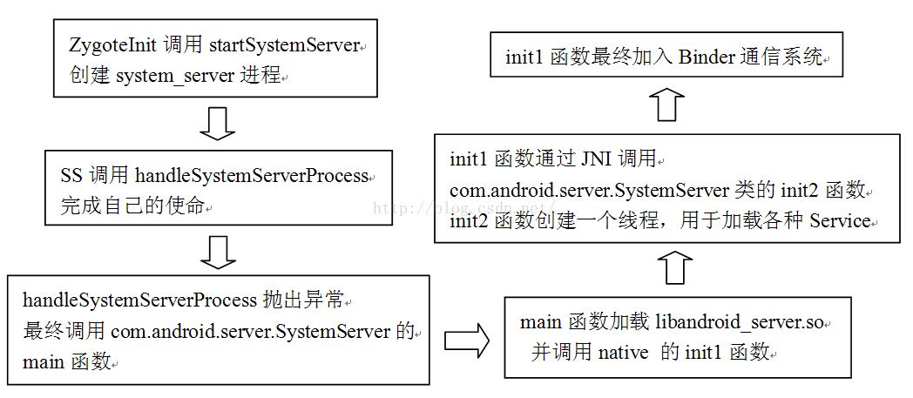

##写在前面

* zygote 是在一个 Android Linux 上的一个进程
* zygote 进程中启动的过程中，fork 出了 system\_server 进程
* zygote 进程稳定后，就在自己的主循环里等待客户端连接自己执行命令
* system\_server 进程里面跑着很多 Android 系统的 Service，包括 ActivityManagerService
* 用户 app 进程，都是从 zygote 进程 fork 出来的
* 用户 app 启动的时候，首先会由 system\_server 进程里面的 ActivityManagerService 向 zygote 进程发一个创建进程的命令
* 然后 zygote 才 fork 出一个进程作为 app 进程

##本章讲的两件事儿
1. zygote 进程是怎么来的：即它的启动过程
2. system\_server 进程是干嘛用的

###1.zygote 进程的启动过程

###2.system\_server 进程是干嘛用的
* 绕了一大圈，最终，system\_server 这个进程：
	* 加入了 Binder 系统
	* 启动了很多个 Service

### app
* 一个 app，一般来说就是一个独立进程
* app 进程，都是从 zygote 进程 fork 出来的，所以 
	* app 进程不用现去创建 Dalvik VM 了，zygote 进程已经创建好了 
	* app 进程使用任何一个 Android SDK 提供的 Java 类时，都不用现加载了，因为 zygote 已经加载完了

### app 进程从 zygote fork 出来的过程
* 书中讲解了一下这个过程，总结为下图：

* 图中的1. ，因为 zygote 进程的稳定状态下就是在这个主循环里呆着的，所以没什么好说的
* 图中的2. ，当 Android OS 发现有一个 app 被运行的时候，会让 system\_server 进程里的 ActivityManagerService 去创建这个 app 的 Activity。 当然，我们假设这是一个有 Activity 的 app。而 ActivityManagerService 实际干的活（当然，其中的逻辑非常复杂），就是告诉 zygote 进程，你给我 fork 一个进程出来。
* 图中的3. ，zygote 进程收到命令，fork 出一个进程
* 图中的4. ，app进程有了，app去干自己的事儿了