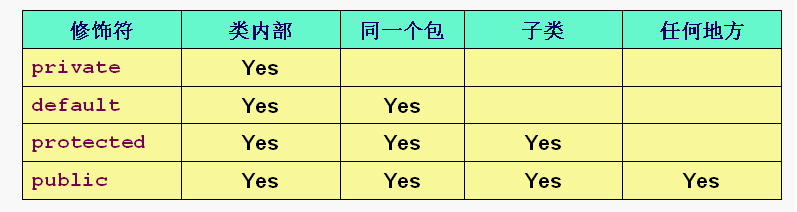

## 权限控制

### 1.JAVA 的权限控制
* Java 的权限控制分为对成员的权限控制和对类的权限控制。
* 对类的权限控制比较简单，只分 default 和 public 两种，public 的类可以被别的 package 使用（只要你 import 了），而 default 的类只能被本包使用，其他包即便你 import 了也不行。所谓使用，就是 new 一个对象出来之类的。
* 今天要说的，主要是对成员的权限控制（跟 C++ 对比）。对于权限控制来说，成员变量和成员函数是一样的。

#### 1.1 能不能被对象“点”出来
* private 的成员（无论是方法还是变量），无法被对象（无论是子类的还是本类的）“点”出来。

		:::Java
		class Person{
			public int pub = 0;
			       int dft = 0;
			protected int prot = 0;
		    private int priv = 0;
			
		    private int getAge(){
		        return 100;
		    }
		}
		
		class Man extends Person{
			
		}
		
		public class AccessTest{
		    public static void main(String argv[]){
		        Person p = new Person();
				System.out.println(p.pub); // OK
				System.out.println(p.dft); // OK
				System.out.println(p.prot); // OK
				System.out.println(p.priv); // Error
		        p.getAge(); // Error
				
				Man m = new Man();
				System.out.println(m.pub); // OK
				System.out.println(m.dft); // OK
				System.out.println(m.prot); // OK
				System.out.println(m.priv); // Error
		        m.getAge(); // Error
		    }
		}

* 从能不能被对象“点”出来的角度看，只有 private 是不能。其他所有权限的成员都能被本类以及子类对象“点”出来。
* 即 default、protected 和 public 是一样的，只有 private 有所不同。

#### 1.3 子类的类体里
* 因为子类继承自父类，所以子类具有父类的所有成员，包括 private 成员。只不过，子类的类体里不能访问 private 而已。
* 子类的类体里，除了 private 成员，可以直接访问父类的所有其他权限的成员。

		:::JAVA
		class Person{
		    public int pub = 0;
		           int dft = 0;
		    protected int prot = 0;
		    private int priv = 0;
		
		    private int getAge(){
		        return 100;
		    }
		}
		
		class Man extends Person{
			public void test(){
				pub = 2;
				dft = 2;
				prot = 2;
				priv =2 ; // Error
				getAge(); // Error
			}
		}

* 所以，从这个角度看，也只有 private 是特殊的，default、protected 和 public 仍是一样的。
* 那么，default、protected 和 public 的区别是什么呢？这体现在通过类名访问成员的时候。

#### 1.2 能不能通过类名直接访问
* 因为 Java 里只有静态成员才能通过类名直接访问，所以这里讨论的全是 static 的成员
* 首先这几个权限修饰符的区别如下图：

* 例子如下，体现出了 default、protected 和 public 的区别：

		::: Java
		/* Person.java in package pk1 */
		package pk1;
		
		public class Person{
		    public static int pub = 0;
		           static int dft = 0;
		    protected static int prot = 0;
		    private static int priv = 0;
		}
		
		class Man extends Person{
			public void test(){
				pub = 2;
				dft = 2;
				prot = 2;
				priv =2 ; // Error
				getAge(); // Error
			}
		}
		
		class Dog{
			public void test(){
				Person.pub = 1; // OK
				Person.dft = 1; // OK
				Person.prot = 1; // OK, Same pakcage,even Dog not child of Person.
				Person.priv = 1; // Error
			}
		}

		/* Pen.java in package pk2*/
		package pk2;
		import pk1.Person;
		
		class Pen{
			public void test(){
				Person.pub = 5; //OK
				Person.dft = 5; //Error, not same package
				Person.prot = 5; //Error, not same package and not child class of Person
				Person.priv = 5; //Error
			}
		}

### 2.C++ 的权限控制
* C++ 的权限控制几乎跟 JAVA 一样
* 只是因为 C++ 非静态的东西也可以通过 :: 来访问，所以带来了一些不同

### 3.继承中的权限控制
* Java 的继承不分 public protected 之类的
* C++ 继承时 public protected private 的区别在于，父类成员到子类里变成了什么权限。
	* public 继承复制父类的权限：public 的还是 public，protected 还是 protected，private 子类不可见。
	* protected 继承把父类的public和protected成员在子类里都变成 protected，private 子类不可见。
	* private 继承把父类的public和protected成员在子类里都变成 private，private 子类不可见。
* C++ 无论哪种继承，父类的 private 成员子类都不可见。

## 多继承
* 多继承据老师说企业中并不常用，所以没听。

