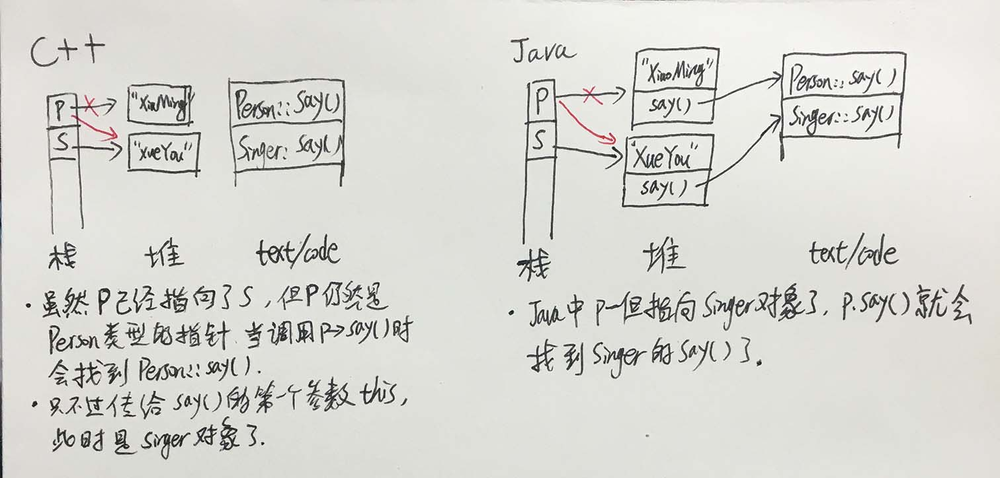

#### 成员函数在不在对象“里面”
* C++ 的对象是不持有成员函数的函数指针的，除非该函数被声明为 virtual 的。 可以自己写个 sizeof 小程序验证一下，这里就不写了。
* Java 的对象是持有成员函数的指针的
* C++ 编译器靠类型来判断该调用哪个函数，Java 靠对象内部的函数指针

#### 举例，先看代码，后面有内存分析图

#####C++

	#include <stdio.h>
	
	class Person {
	protected:
		char* name;
	public:
		Person(char *name) 
		{
			this->name = name;
		}
		void say() 
		{ 
			printf("i am a person,my name is %s\n",name); 
		}
	};
	
	class Singer : public Person {
	public:
		Singer(char *name):Person(name) 
		{}
		void say() {
			printf("i am a singer,my name is %s\n", name);
		}
	};
	
	void main()
	{
		/* 情形1，对象在堆上 */
		Person *p = new Person("XiaoMing");
		Singer *s = new Singer("XueYou");
		p = s;
		p->say(); // i am a person,my name is XueYou
	
		/* 情形2，对象在栈上，结果和对象在堆上是一样的 */
		//Person p("XiaoMing");
		//Singer s("XueYou");
		//p = s;
		//p.say(); // i am a person,my name is XueYou
	
		getchar();
	}

#####Java

	public class JavaTempTest {
		public static void main(String[] args) {
			Person p = new Person("XiaoMing");
			Singer s = new Singer("XueYou");
			p = s;
			p.say(); //i am a singer, my name is XueYou
		}
	}
	
	class Person {
		protected String name;
	
		Person(String name) {
			this.name = name;
		}
	
		public void say() {
			System.out.println("i am a person, my name is " + name);
		}
	}
	
	class Singer extends Person {
		Singer(String name) {
			super(name);
		}
	
		public void say() {
			System.out.println("i am a singer, my name is " + name);
		}
	}

#####内存分析图

#### 造成的困扰：“重写”，好像失去了意义
* 因为 C++ 里的上述特性：成员函数在不在对象“里面”，这让子类重写父类方法在很多场景下失去了意义
* 比如，你做了一个系统，管理人的，但是你不知道你管理的人是歌手还是警察。所以你在你的程序里写的代码是这样的：

		:::c++	
		Person *mPerson;
		...
		mPerson->doJob();

* 你希望，当 mPerson 是警察的时候，他调用警察的 doJob()，当时歌手的时候，调用歌手的。
* 但是，因为 mPerson 是 Person 类型的指针，所以，他永远只能调用 Person 的 doJob()，无论警察和歌手作为 Person 的子类，把 doJob() 重写成了什么样。
* 这种时候，我们只能把 doJob() 声明为 virtual 类型的。
* 所以 C++ 里，把需要子类重写的函数，都声明为 virtual 类型的。
* 可以理解为，Java 里的所有方法，都是C++里的虚函数，Java 里的 abstract 方法，是C++里的纯虚函数。
* 而 Java 里根本不存在 C++ 里普通的成员函数，即“重写了也没多大意义”的方法。
* C++ 中的虚函数，跟Java里的方法一样，在对象的里面。
* 如果子类不重写虚函数，则子类对象里的这个函数，指向的还是父类的函数，这点也跟Java一样。

#### 为什么析构函数一般是虚函数
* 因为父类指针指向子类对象，析构的时候我们往往通过 delete 父类指针来析构子类对象
* 如果析构函数不是虚函数，则只能调用到父类的析构函数，造成子类扩展出来的成员无法被释放
* 所以一般需要被继承的类，其析构函数都定义成虚函数。尤其是有虚函数的类（这种类肯定是要被继承的，要不你弄虚函数干嘛？），我们需要把它的析构函数写成虚函数。
* clang 编译器就会为这种情况报 Warning：

		'Person' has virtual functions but non-virtual destructor