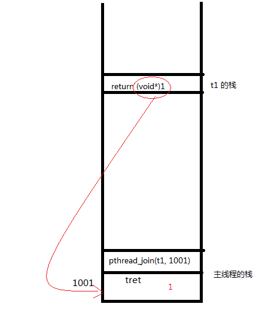

##1.线程概念
1. 轻量级进程(light-weight process)，线程也有PCB,创建线程使用的底层函数和进程一样，都是clone。从内核里看进程和线程是一样的，都有各自的PCB，
2. 但是PCB中指向内存资源的三级页表是相同的。即同一进程的不同线程使用的物理内存是相同的，都是同样的0~3G。
3. 进程可以蜕变成线程。比如，进程中创建一个线程之后，主程序就可以看成是一个线程了，即所谓的主线程。
4. 在美国人眼里，线程就是寄存器和栈。
	* 寄存器：线程是最小的执行单元，是最小的可以独占CPU/寄存器的单位。所以每个线程有自己的寄存器。当CPU从一个线程交给另一个线程时，寄存器现场是要被保存起来的，另一个线程来了以后会覆盖掉寄存器里的内容。
	* 栈：其实栈又分为内核栈和用户栈。无论哪个栈，线程都是独占的，而不是跟其他线程共享。
		* 用户栈：即函数调用压栈出栈的那个栈空间。任何一个线程都有一个独立的栈空间。任意线程在自己的栈空间上创建的变量其他线程是不可见的。即线程的函数内部变量，其他线程不可见。
		* 内核栈：是内核为每个线程分配的一小块内存，当线程让出CPU时，寄存器现场就保存在内核栈里。每个线程都有自己的内核栈。  
5. 在linux下，线程最是小的执行单位；进程是最小的分配资源单位
6. 察看LWP号：`ps -eLf`（或者 `ps -eo "pid lwp ......"`） 其中的 LWP 那列显示的就是 LWP 号。可以理解为线程号，这是对操作系统而言的“线程号”，是调度的最小单位。tid 跟 `ps -eLF` 出来的 LWP 不是一回事： tid 是在进程内部使用的，用于区别各个线程。LWP 是面向操作系统的。

###线程间共享资源
1. 文件描述符表
2. 每种信号的处理方式（只是处理方式，不是信号屏蔽字）
3. 当前工作目录
4. 用户ID和组ID
5. 内存地址空间（不包括栈）

###线程间非共享资源
1. 线程id
2. 处理器现场和栈指针(内核栈)
3. 独立的栈空间(用户空间栈)
4. errno变量
5. 信号屏蔽字
6. 调度优先级

##2.线程原语
###2.1创建线程：`pthread_create`
* 函数原型

		:::c
		int pthread_create(pthread_t *thread, const pthread_attr_t *attr, void *(*start_routine) (void *), void *arg);

* `pthread_t *thread`:带出参数，新建线程的tid
* `const pthread_attr_t *attr`:线程属性设置，如使用默认属性，则传NULL。这个参数不能直接设置其值，需要用特定的函数，会在后面详细讨论。
* `void *(*start_routine) (void *)`:函数指针，指向新线程应该执行的函数。注意，函数必须返回 `void*`，函数的参数必须是 `void*`
* `void *arg`:指定线程将要调用的那个函数的参数
* 返回值:成功返回0，失败返回错误号。

####注意事项
* 一个线程一旦创建出来，它就开始去执行第三个参数指定的那个函数
* 该函数必须返回 `void*`, 该函数的参数也必须是 `void*`
* 因为线程执行的函数肯定返回 `void*`, 所以如果线程正常结束，则该线程的退出值肯定是 `void*` 类型。

###2.2线程退出：`pthread_exit`
* 函数原型

		:::c
		void pthread_exit(void *retval);

* `void *retval`:线程退出时传递出的参数，可以是退出值或地址，如是地址时，不能是线程内部申请的局部地址。
* 终止线程有三种方法：
	1. 从线程主函数 return，即线程正常执行完。这种方法对主线程不适用，因为从main函数return相当于调用exit，会使整个进程退出。
	2. 被 `pthread_cancel` 终止，这个函数会在下一节看。
	3. 调用 `pthread_exit` 终止自己。

* 任何线程里exit导致进程退出。

####注意事项1
* 线程正常结束（其主函数return），它的退出值由 return 语句带出，类型是 `void*`
* 线程用 `pthread_exit` 退出，它的退出值由 `pthread_exit` 的参数决定，类型也是 `void*`
* 如果线程是被`pthread_cancel`取消的，它的退出值是常数 `PTHREAD_CANCELED`。该宏在pthread.h定义：`#define PTHREAD_CANCELED ((void *) -1)`，也是 `void*` 类型

####注意事项2：僵尸线程
* 线程退出了，并不等于线程消失了。线程只是处于了停止态（跟进程的停止态一样。还记得进程的4个状态吗？），不会被调度了而已。但是它占用的系统资源并没有释放，比如PCB，tid，栈空间。
* 跟僵尸进程一样，已经运行完的线程，如果不被回收，则会变成僵尸线程，它占用的系统资源得不到释放。
* 僵尸进程，我们用 wait/waitpid 来回收，那线程呢？ 用 `pthread_join`，我们后面会讨论。
* 进程只能被父进程回收，而线程，可以被任意线程回收。

###2.3取消线程：`pthread_cancel`
* `pthread_exit` 是线程自己退出，而 `pthread_cancel` 是去终止别的线程
* 函数原型

		:::c
		int pthread_cancel(pthread_t thread);

* 参数是被终止的那个线程的 tid。
* 被取消的线程，退出值，定义在Linux的pthread库中常数 `PTHREAD_CANCELED` 的值是-1，类型是 `void*`。

###2.4线程回收：`pthread_join`
* 调用该函数的线程将挂起等待，直到被回收的线程终止。
* 函数原型

		:::c
		int pthread_join(pthread_t thread, void **retval);

* `pthread_t thread`:回收线程的tid
* `void **retval`:接收退出线程传递出的返回值。如果对thread线程的终止状态不感兴趣，可以传NULL给retval参数。
* 返回值：成功返回0，失败返回错误号

####注意事项
* 因为线程退出值肯定是 `void*` 类型的，所以用于获取退出值的带出参数是 `void**` 类型的，即一个放着 `void*` 类型变量的地址。当被回收线程退出的时候，会把退出值放到这个地址里。
* 任意线程都可以去 `pthread_join` 另外一个线程，即不一定非得主线程去回收线程。

####例子

		#include <stdio.h>
		#include <stdlib.h>
		#include <pthread.h>
		#include <unistd.h>
		void *thr_fn1(void *arg)
		{
			printf("thread 1 returning\n");
			return (void *)1;
		}

		void *thr_fn2(void *arg)
		{
			printf("thread 2 exiting\n");
			pthread_exit((void *)2);
		}

		void *thr_fn3(void *arg)
		{
			while(1) {
				printf("thread 3 writing\n");
				sleep(1);
			}
		}

		int main(void)
		{
			pthread_t tid;
			void *tret;

			pthread_create(&tid, NULL, thr_fn1, NULL);
			pthread_join(tid, &tret);
			printf("thread 1 exit code %d\n", (int)tret);

			pthread_create(&tid, NULL, thr_fn2, NULL);
			pthread_join(tid, &tret);
			printf("thread 2 exit code %d\n", (int)tret);

			pthread_create(&tid, NULL, thr_fn3, NULL);
			sleep(3);
			pthread_cancel(tid);
			pthread_join(tid, &tret);
			printf("thread 3 exit code %d\n", (int)tret);

			return 0;
		}

* 把其中第一部分画个图示意一下：

	

##3.线程的分离态：detach
* 分离态的线程不用回收，当它退出时，它占用的系统资源随即被释放。
* 不能对一个已经处于detach状态的线程调用 `pthread_join`，这样的调用将返回 `EINVAL`。不能对一个已经处于detach状态的线程调用 `pthread_join`。
* 线程默认不是分离态的，把线程设置成分离态可以调用 `pthread_detach` 函数，也可以使用设置线程属性的方法

##杂项
* 线程调试比较困难（gdb支持不好）
* 使用了 pthread 的程序中编译的时候要加上 -lpthread 去连接 pthread 的库。

* 主线程里 `pthread_create()` 返回的 tid 是否等价于被创建出来的线程里 `pthread_self()` 得到的 tid？
	* `pthread_create()` 返回之前，被创建的线程就已经活了
	* 有可能 `pthread_create()` 还没返回新建的线程就执行完了，或者出问题了。
	* 这时候 `pthread_create()` 带出的 tid 就没有意义了

* 如果任意一个线程调用了exit或\_exit，则整个进程的所有线程都终止。
* 从main函数return也相当于调用exit