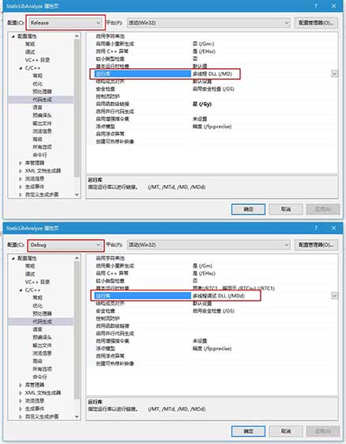

### COFF 文件，dumpbin.exe，符号表

#### COFF的概念，摘自百度百科：
* COFF –通用对象文件格式（Common Object File Format），是一种很流行的对象文件格式。注意：这里不说它是“目标”文件，是为了和编译器产生的目标文件（.o，.obj）相区别。
* 因为 COFF 格式不只用于目标文件。库文件、可执行文件也经常是这种格式。
* VC 所产生的目标文件（.obj）就是这种格式。VC 的库文件也是 COFF 格式的。
* 其它的编译器，如 GCC、ICL（Intel C/C++ Compiler）、VectorC，也使用这种格式的目标文件。
* 不仅仅是C/C++，很多其它语言也使用这种格式的对象文件。

#### dumpbin.exe 可以产看 COFF 文件的符号表
* dumpbin.exe 是MSVC自带的工具
* 命令行参数挺多，可以用 `dumpbin.exe /?` 查看所有参数
* 其中参数 `/symbols` 可以产看符号表
* 例如：

		dumpbin.exe /symblos xxx.lib

### MSVC 的 libc
* 微软的 libc 分为动态库和静态库两个版本，每个版本又分为 release 和 debug 版，所以一共四个版本

		 多线程调试 (/MTd)：对应 LIBCMTD.lib
		 多线程 (/MT)：对应 LIBCMT.lib
		 多线程调试 DLL (/MDd)：对应 MSVCRTD.lib
		 多线程 DLL (/MD)：对应 MSVCRT.lib

* VS2015 新建空 win32 项目，类型选择为静态库。
* 新建 calc.c ，内容仅为实现一个 add 函数：

		int add(int x, int y) {
			return x + y;
		}

* 右键项目，属性，C/C++，代码生成。可以发现，该项目默认连接的 libc 是动态库版本。如下图：  

* 可见，**即便你创建的是静态库，微软默认也使用动态库的方式，去连 libc**
* 我们直接生成一下这个项目，会产生出一个 StaticLibAnalyze.lib 文件
* 用 `dumpbin.exe /symbols StaticLibAnalyze.lib` 看一下这个 lib 文件的符号表：

		...
		COFF SYMBOL TABLE
		000 010459F2 ABS    notype       Static       | @comp.id
		001 80000191 ABS    notype       Static       | @feat.00
		...
		011 00000000 SECT4  notype ()    External     | _add
		012 00000000 UNDEF  notype ()    External     | __RTC_InitBase
		013 00000000 UNDEF  notype ()    External     | __RTC_Shutdown
		017 00000000 SECT6  notype       Static       | __RTC_InitBase.rtc$IMZ
		018 00000000 SECT7  notype       Static       | .rtc$TMZ
		    Section length    4, #relocs    1, #linenums    0, checksum        0, selection    2 (pick any)
		    Relocation CRC 4C2E11CC
		01B 00000000 SECT7  notype       Static       | __RTC_Shutdown.rtc$TMZ

* 其中，我们定义的唯一函数 add 对应的行是：

		011 00000000 SECT4  notype ()    External     | _add

* 其中的 External 表示该符号是外部可见的。即除了在 StaticLibAnalyze.lib 的内部，也可见。而相对的，如果是 Static，则表示这一符号仅在内部可见。

### 几个简单结论：
1. 对于只定义了 add() 一个函数的静态库项目，无论选择链接动态的 libc 还是静态的 libc，其符号表都是一样的，即只有一个 External 的 add。
2. 即便在定义 add() 之前加了 `#include <stdio.h>` ，生成的 lib 符号表里也不会有 printf 之类的东西，因为代码里没有调用到 printf，所以目标文件里没有 printf 这个符号，也没必要去寻找这个符号。
3. 如果在 add() 的函数体里，调用了 printf()，则生成的库文件（其实就是目标文件的打包）里就会有 printf 这个符号，无论链接的是动态的 libc 还是静态的 libc。