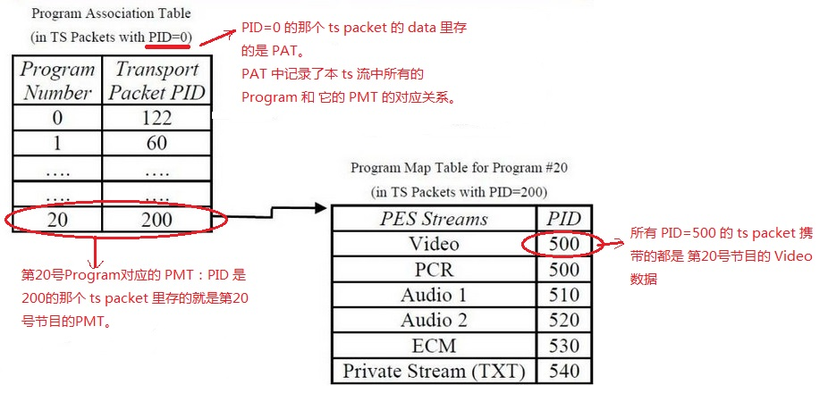
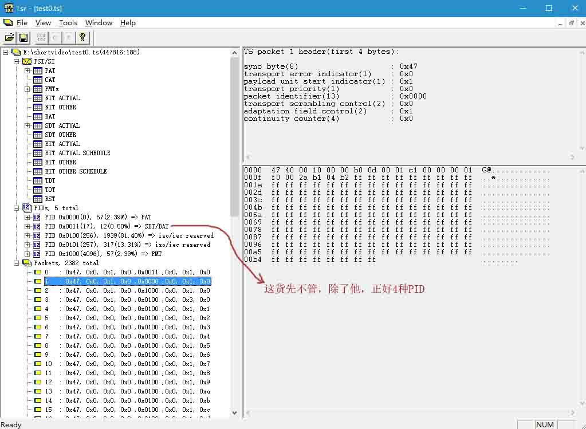
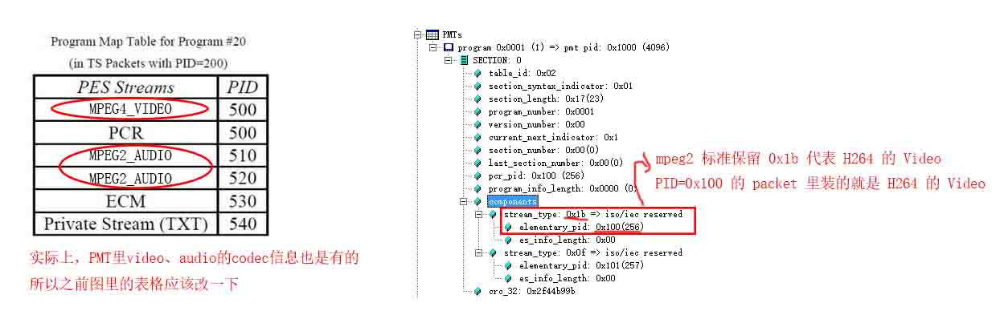
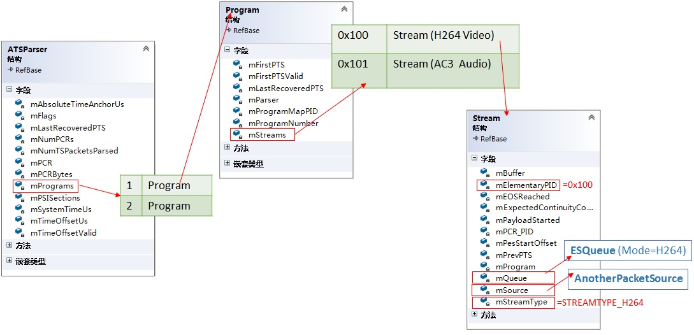
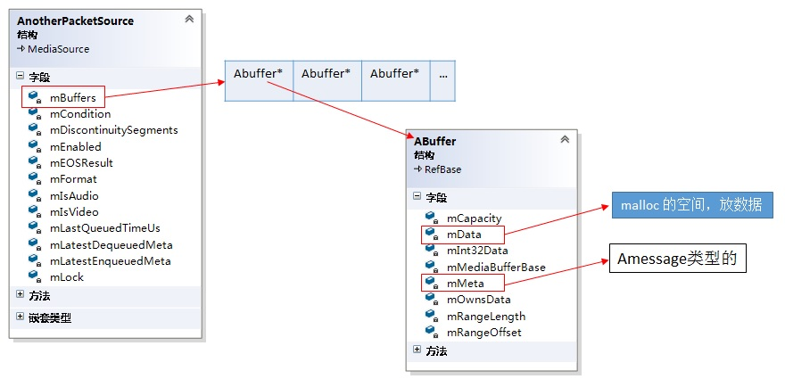

## 前提
* HLS 里的 ts “分片” 文件，也是正常的 ts 文件。ts 格式是由 mpeg2 标准定制的，最初用在电视行业。
* 一个后缀名为 .ts 的视频文件，其中可以包含很多 program，比如 cctv1，cctv2，芒果tv等等。每个 program 又包含多个流，比如音频流，视频流，字幕流等。
* 只是我们常见的 ts 文件（包括 HLS 里的），大多数只包含一个 program，program 又只包含一个视频流和一个音频流。
* 工具：
	1. 网上找的一个很好用的 ts 分析工具：[tsr.exe](http://pan.baidu.com/s/1bWDkdS)。
* 参考文章：
   	1. [TS流分析](http://blog.csdn.net/zxh821112/article/details/17587215)
	2. [TS文件格式详解](http://blog.chinaunix.net/uid-24922718-id-3686257.html) 

## ts 文件
* ts 文件是由固定长度的 packet 组成的，每个 packet 固定为 188 字节。
* 比如我电脑上有个大小为 447816 字节的 ts 文件，它里面正好有 2382 个 packet。
* 每个 packet 的前 4 个字节为 header，剩下的 184 个字节为 data。
* 一个 ts 文件里，大部分 packet 的 data 携带的都是视频/音频数据。还有少量 packe 携带的是一些描述信息。

#### PSI Tables
* 所谓“描述信息”，在 ts 里有个专门的词，叫 PSI Tables。即用各种 talbe 来描述 ts 的结构信息。
* 最有用的两种 PSI 表： PAT（Program Association Table） 和 PMT（PMT Program Map Table）。
* PAT 是描述整个 ts 文件里有哪些 program 以及每个 program 对应的 PMT 是谁。
* PMT 是描述一个 program 里有哪些 stream （也叫 component）的，比如一个 video、一个 audio、一个 text。
* PAT <=> 整个 ts 文件； PMT <=> 一个 program。
* PSI Tables 是存放在某个 packet 的 data 区的，那么，
	1. 怎么知道一个 packet 的 data 区是音视频还是 PSI Table 呢？
	2. 在知道了一个 packet 的 data 区是 PSI Table 之后，那么它是那种 Table 呢？

#### PID：Packet ID
* 每个 packet 都有一个 PID，写在 header 的固定位置，占 13 个 bits。
* ts 标准规定，PID=0 的 packet，其 data 区携带的 PAT。
	* 除了 PAT，标准还规定了其他几种 PSI Table 的专用 PID，这些都是保留值，不能更改。我们目前只记住 PID=0 的即可。
* 并不是所有的 PSI Table 都用保留的 PID 来标识的，有些事需要用户定义的，比如 PMT。
* PID 是多少的 packet 里携带的是 PMT 呢？ —— 到 PAT 里去查。
* 下图阐释了 PAT 和 PMT 的关系  
  

* 这样，两个问题都有了答案：
	1. 如果一个 packet 的 PID 是保留值，那么这个 packet 携带的就是这个保留值对应的 PSI Table
	2. 如果 PID 不是保留值，则首先去 PAT 里看看，这个 PID 是不是某个 program 对应的 PMT，如果是，那么这个 packet 就携带的是 PMT。如果还不是，则要去每一个 PMT 里看看，这个 PID 是不是该 program 的 video、audio、text 等。

#### packet header
* 现在来看看 header，就是每个 packet 最开始的那4个字节。
* 我们已经知道了其中有 13 bits 是 PID，其他的 bit 是干什么的呢？ 
* header 这4个bit一共分为8个部分，其中，到目前为止，需要了解的只有3部分：sync byte， PID，continuity counter。

		sync byte(8 bit)                    : 0x47   //必须是 0x47，标识着一个 packet 的开始
		transport error indicator(1 bit)    : 0x0    //只有一个 bit，可以取0或者1，目前不用了解其作用    
		payload unit start indicator(1 bit) : 0x1    //只有一个 bit，可以取0或者1，目前不用了解其作用
		transport priority(1 bit)           : 0x0    //只有一个 bit，可以取0或者1，目前不用了解其作用
		packet identifier(13 bit)           : 0x0000 //PID 非常非常的重要啊
		transport scrambling control(2 bit) : 0x0    //目前不用了解其作用
		adaptation field control(2 bit)     : 0x1    //目前不用了解其作用
		continuity counter(4 bit)           : 0x0    //我是这个PID的packet中的第几个

* PID 的作用上面已经说过了。它标识了一类 packt，比如图中的 PID=500 的 packet，都是 20 号 program 的 video。
* sync byte 用来标识这是一个 packet 的开始，这样能避免网络传输错误造成整个影片的错乱。万一某个 packet 错了，我们再等待下一个 sync byte，接收下一个 packet 也能接着播放。
* continuity counter，比如 PID=500 的 packet，第一个这种 packet 的 continuity counter = 0，第二个这种 packet 的 continuity counter = 1，依次递增。如果接收端收到的一个 packet，他的 continuity counter 没有递增而是减少了，则可能出现了错误。

## 再看 ts 文件
* 有了以上的知识，我们应该能想到：
* 一个 ts 文件里，应该只有一个 PID=0 的 packet，这个 packet 里放的是 PAT。
* 如果这个 ts 文件里只有一个“节目”，正如我们日常从网上下载的绝大多数视频文件一样，那么它应该也只有一个 packt 是 PMT。
* 但是，如果真的只有一个 PAT 和 一个 PMT，会有风险：万一网络传输中吧 PAT 丢了，那么整个文件就完蛋了，或者万一 PMT 丢了，那么整个 program 就完蛋了。
* 所以实际的做法是，每隔一定数量的 packet 就插入一个 PAT、PMT。
* 好了，现在有两种 PID了，一个等于0，是PAT，一个在PAT里定义，是PMT。这两种 PID 的 packet 都比较少。
* 剩下的 pakcet，要么是 video，要么是 audio。所有的 video packet 都有相同的 PID，所有 audio packet 也有相同的 PID。
* 所以，我们常见的 ts 文件里，至少有 4 种 PID：PAT、PMT、video、audio。
* 下图是用 tsr.exe 分析我电脑上的一个 ts 文件的结果，具体功能自己用一下就能体会，很好理解。  

## video audio codec
* 从哪里知道一个 PID 里装的是音频还是视频呢？音视频又是什么 codec 的呢？
* 从 PMT 里，PMT 里有一个字段，说明某种 PID 对应的是某种类型的 stream  

* mpeg2 标准里保留的 stream_type 如下：

		:::c
		/*摘自 Android 源码的 ATSParser.h*/
        STREAMTYPE_RESERVED             = 0x00,
        STREAMTYPE_MPEG1_VIDEO          = 0x01,
        STREAMTYPE_MPEG2_VIDEO          = 0x02,
        STREAMTYPE_MPEG1_AUDIO          = 0x03,
        STREAMTYPE_MPEG2_AUDIO          = 0x04,
        STREAMTYPE_MPEG2_AUDIO_ADTS     = 0x0f,
        STREAMTYPE_MPEG4_VIDEO          = 0x10,
        STREAMTYPE_METADATA             = 0x15,
        STREAMTYPE_H264                 = 0x1b, 
        STREAMTYPE_AC3                  = 0x81,
        STREAMTYPE_LPCM_AC3             = 0x83,

## Android 系统的 mpeg2ts 组件
* 直接附上类图(其中 Program 和 Stream 都是 ATSParser 的内部类 )  

