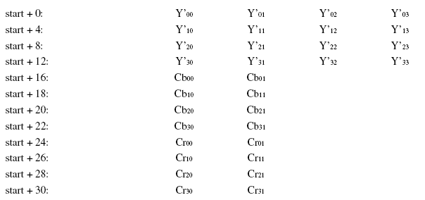

## 参考文档
* [http://www.cnblogs.com/azraelly/archive/2013/01/01/2841269.html](http://www.cnblogs.com/azraelly/archive/2013/01/01/2841269.html)
* 本文中的所有图片以及部分文字摘自以上这篇博客

## 关于 YUV

### 基本概念
* YUV 是一种颜色空间（color space），另外一种常用的色彩空间是 RGB。YUV在电视行业用的多，RGB在电脑行业用的多。
* YUV 的Y分量表示亮度(Luminance)，UV表示色度(Chroma)。这种表示法有一个好处：即便只保留Y分量，也可以表示黑白图像。
* 用YUV表示一幅图像的时候，每个像素点都必须有Y分量，但uv分量可以几个像素点共用一个分量。（其原理好像是人眼对亮度信息更敏感）
* 这样就能用更少的bit数来表示一幅图像了（当然色度有些损失，即图像质量会有些损失，但人眼感觉不明显）。
* 而RGB就不行，它必须保证每个像素点的RGB三个分量都有，才能正确表达一幅图。
* 题外话：RGB24 和 RGB32
	* RGB32和RGB24相比没有本质区别，除了多了一个字节外。
	* 这个多出的字节可能被用作alpha通道，也可能没有任何意义。  

---

###　采样模式
* YUV 分好几种，常用的有 444,422,420。
* YUV 4:4:4采样，每一个Y对应一组UV分量。
* YUV 4:2:2采样，每两个Y共用一组UV分量。 
* YUV 4:2:0采样，每四个Y共用一组UV分量。  

* 图中以黑点表示Y分量，空心圆圈表示UV分量。
* 当然，YUV422 肯定比 YUV44 的图像质量有损失，但也节省了存储空间。YUV420同理，更省空间也损失了更多的色度信息。

---

### 存储结构
* 以上是从采样模式上，把 YUV 分成了3种：YUV444,YUV422,YUV420。
* 对于任意一种采样模式，我们从存储结构上，还可以把 YUV 分成2种：打包(Packed)存储和平面(Planar)存储

#### Packed 存储
* Packed 存储：就是 Y 分量和 UV 分量交替着存储，比如（图中Cb、Cr 即 U、V）：

	
* 上图是一个 YUV422 采样的 Packed 存储，ffmpeg里叫做：yuyv422
* 同样是 YUV422，同样是 Packed 存储，也可以有多种存储方法。
* 比如上图是按 yuyvyuyv 这么存的，还可以按 yvyuyvyu 或者 uyvyuyvy 这么存。

#### Planar 存储
* Planar 存储：先连续存储所有的Y，接着存储所有的U，随后是所有的V，比如：

	
* 上图是一个 YUV422 采样的 Planar 存储，ffmpeg 里叫做 yuv422p
* 同样是 YUV422，同样是 Planar 存储，也可以有多种存储方法。
* 比如上图是按 yyyyyyyyuuuuvvvv 这么存的，还可以按 yyyyyyyyuvuvuvuv 或者 yyyyyyyyvvvvuuuu 这么存。

#### 总之
* 总之，用 YUV 来表示图像：
	 * 首先，可以从采样模式上，划分为 YUV444，YUV422，YUV420 
	 * 其次，任意一种采样模式的 YUV 都可以按存储结构不同，分为 Packed 和 Planar
	 * Packed 和 Planar 又分为很多具体的存储结构。
* 所以 YUV 的图像格式非常非常多，ffmpeg 里就支持60+种（当然搞出来这么多种还有其他区别造成的，比如每个分量用8、10、12、16 bit表示，大/小端存储等等） 

---

#### YUV 的命名规则
* YUV 各种格式的命名规则很乱套
* 常见的有 yuv420p，uyvy422p，IYUV，I420，YV12，UYVY
* 因为在不同的软件、标准、公司里，对yuv有各自的命名规则。
* ffmpeg : 像 yuv420p 这种就是 ffmpeg 用来表示yuv的。用 `ffmpeg -pix_fmts` 可以输出 ffmpeg 支持的所有像素格式
* FOURCC：（[http://fourcc.org/yuv.php](http://fourcc.org/yuv.php "FOURCC")），像 IYUV，I420，UYVY 这种，就是 FOURCC 的。
* 在ffmpeg里最常用的就是 yuv420p了，他对应 FourCC 的 IYUV 和 I420（ 在FOURCC里 IYUV==I420 ）
即：yuv420p==IYUV==I420
* 虽然有这么多种命名，但本质上各种命名都属于 444,422,420 中的一种
* 具体用到的时候还需具体去查

