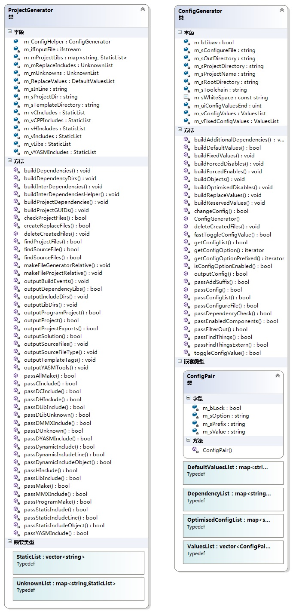

### 关于目录结构
* ConfigGenerator 有如下3个成员变量跟目录结构有关：

* `m_sRootDirectory`: 默认值是 `{"./", "../", "./ffmpeg", "../ffmpeg", "../../ffmpeg/", "../../libav/", "../../../", "../../"}` 之一，以上目录哪里放着 configure 文件，`m_sRootDirectory` 就会被设成哪个。可以通过参数 --rootdir= 自定义。这是 ffmpeg 的 configure 脚本所在的地方。这个值还可能影响生成的 .sln 等文件存放的地方，如果用户不单独指定的话。见下文。
* `m_sProjectDirectory`: 默认值是 `m_sRootDirectory + "SMP/"`，可以通过参数 --projdir= 自定义。 这是生成的 .sln 等文件将要存放的地方。
* `m_sOutDirectory`: 默认值是 "../../../msvc/"，可以通过参数 --prefix= 自定义。这是生成的 vs 工程里面，每个 project 的“输出目录”。

### 一些其他

* `project_generator` 在执行过程中会试着去编译需要引入工程的所有源文件，它使用的编译选项（比如 `-I'../../msvc/include'`）也是最终要加入到工程配置文件里的。
* 注意，因为执行 `project_generator` 是在 ffmpeg configure 所在目录，而生成的工程文件是在该目录下的 SMP 里，所以差了一层。
* 所以这执行 `project_generator` 过程中，它试着编译源文件时，把相对目录都减少了一级。比如最后生成的工程里会写附加包含目录为 `$(ProjectDir)../../../msvc/include`，而试着编译时（test.bat里），`-I` 参数只会写 `-I'../../msvc/include'`

* 虽然从 MinGW 里取头文件，能成功骗过 `project_generator`，但真正在 VS 编译生成时，肯定还会报错。因为会需要诸如 libbz2.lib 这种东西，这种东西，只能去 SMP 里 clone。

* 可以在 `project_generator` 的代码里把删除 test.bat 的部分注释掉，保留 test.bat 来定位问题。
* 如果因为 test.bat 运行 cl.exe 时报找不到头文件相关的错，又不知道头文件到底是从哪 Include 进来的，可以用 `cl /E` 展开源文件来跟踪一下。
* 测试 test.bat 里的 cl 语句之前，需要先在 cmd 里初始化 VS 的环境变量：

		call "%VS140COMNTOOLS%\vsvars32.bat" 

* 具体取决于你电脑上安装的 VS 版本，这些命令可以在 test.bat 最顶端找到。
* 并且注意 test.bat 里面每一条 cl 语句之前，如果有 mkdir 命令也要运行一下，不让 cl 无法往输出目录里写文件。

###第一步：命令行解析
* 整个程序第一步是解析用户命令行：

		ProjectGenerator.ConfigGenerator.passConfig(argc, argv)

* 这一步的意义是：把用户通过命令行传入的参数（--disable-ffplay 之类的），经过处理，存到 ConfigGenerator 的成员变量 `m_vConfigValues` 里。用户没有传的参数，取 ffmpeg 的默认值（当然包括 ffmpeg auto detect 出来的那些）。
* 它的做法是模拟 ffmpeg 的 configure 脚本，用户传的最优先，需要 auto detect 的就 模拟 configure 进行 auto detect，其他的按照 configure 的做法设置默认值。
* 这个函数结束之后，`ConfigGenerator.m_vConfigValues` 形如：

		----------------------------------------
		| m_sOption: X86_64                     |
		| m_sValue:  1                          |
		| m_sPrefix: ARCH_                      |
		| m_bLock:   false                      |
		----------------------------------------
		----------------------------------------
		| m_sOption: ARM                        |
		| m_sValue:                             |
		| m_sPrefix: ARCH_                      |
		| m_bLock:   false                      |
		----------------------------------------
		.
		.
		.
		----------------------------------------
		| m_sOption: SSE42                      |
		| m_sValue:  1                          |
		| m_sPrefix: HAVE_                      |
		| m_bLock:   false                      |
		----------------------------------------
		.
		.
		.
		----------------------------------------
		| m_sOption: LIBVPX                     |
		| m_sValue:                             |
		| m_sPrefix: CONFIG_                    |
		| m_bLock:   false                      |
		----------------------------------------
		----------------------------------------
		| m_sOption: ENCODERS                   |
		| m_sValue:  1                          |
		| m_sPrefix: CONFIG_                    |
		| m_bLock:   false                      |
		----------------------------------------

* 注意，project generator 支持的命令行参数只有如下几个，**而不是它声称的用 --help 列出来的都支持**。（因为 changeConfig() 函数只支持这几个，详见本文 “passConfig详解” 部分）

		--help
		--toolchain （取值只支持 =msvc 或者 =icl）
		--prefix
		--rootdir
		--projdir
		--list-
		--enable- （包括 --enable-xxx 和 --enable-xxx=xxx 两种形式都支持）
		--disable- （包括 --disable-xxx 和 --disable-xxx=xxx 两种形式都支持）

* 需要了解详细过程的，可以看本文 “passConfig详解” 部分
* 如果用户加了 --enable-libfribidi，则在这步结束时，`ConfigGenerator.m_vConfigValues` 里面的 LIBFRIBIDI 值为 1。

###第二步：输出 config.h 和 avutil.h
* 第二步是这句话：

		ProjectHelper.m_ConfigHelper.outputConfig()
* 其作用就是根据 `m_ConfigHelper.m_vConfigValues`，生成 config.h 和 avutil.h
* 这步没有细看
* 遗留问题：为什么比 configure 多生成了一个 avutil.h 呢？

###第三步：通过 passAllMake() 生成工程文件和解决方案文件
* 第三步是：

		ProjectHelper.passAllMake()

* 把模板里的（FFVS-Project-Generator/templates目录下） compat.h，math.h，unistd.h 拷贝到 `m_ConfigHelper.m_sProjectDirectory` 目录
* 对 `LIBRARY_LIST` 里的9个 Library 进行循环，处理 enable 了的那些：
	* 把 ProjectGenerator 成员变量 `m_sProjectDir` 赋值为该 Library 的目录，例如 `m_sProjectDir="./libavcodec"` 
	* 去 `m_sProjectDir` 目录下找到 Makefile，比如 `./libavcodec/Makefile`
	* 调用 passMake()
		* 如果该 Library 有 x86 子目录，则把 `m_sProjectDir` 赋值为x86目录，例如 `./libavcodec/x86`
		* 去 `m_sProjectDir` 目录下找到 Makefile，比如 `./libavcodec/x86/Makefile`
		* 调用 passMake()
		* 把 `m_sProjectDir` 变回 `./libavcodec`
	* 调用 `outputProject()`，生成 Project

* 调用 `outputSolution()`，生成解决方案

####passMake()
* 把当前的 `m_sProjectDir` 目录下的 Makefile 读入程序，逐行分析

#####OBJS 开头的行
* 1.形如 `OBJS = allcodecs.o \` 的，调用 passCInclude()
	* passCInclude() 只有一句话：`return passStaticInclude(4, m_vIncludes); `
	* 它的意思是，从当前行（`m_sInLine`）的第4个字符开始处理，把结果返回到 `m_vIncludes` 里。
	* 看一下该函数的详细执行过程：
			
			-> // passStaticInclude(4, m_vIncludes)：
				uint uiStartPos = m_sInLine.find_first_not_of(" +=:", 4);
				// 找到当前行 OBJS（即从4开始往后）后面的不是空格、加号、等号、冒号的第一个字符的位置
				//  比如当前行是 OBJS = allcodecs.o ，则 uiStartPos=7
				passStaticIncludeLine(7, m_vIncludes);
				// passStaticIncludeLine(7, m_vIncludes) 将从第7个字符开始处理当前行，把结果写入 m_vIncludes。 它能处理一行有多个 .o 的情况。
					-> // passStaticIncludeLine(7, m_vIncludes):
						uint uiEndPos;
						passStaticIncludeObject(7, uiEndPos, m_vIncludes);
						// passStaticIncludeObject(7, uiEndPos, m_vIncludes) 从当前行的第7个字符开始处理，能取出去掉.o后缀的部分。 如果取出的是变量，该函数还能展开之，不细看了。把取出的 allcodecs 放到 m_vIncludes 里去。uiEndPos 这个带出参数是为了 passStaticIncludeLine() 处理一行有多个 .o 用的。
						....
						// 总之，passStaticIncludeLine() 会处理完一行所有的 .o，把 .o 前面的东西写入 m_vIncludes
				//Check if this is a multi line declaration
				while (m_sInLine.back() == '\\')
					...
				/* passStaticInclude() 能处理有续行的情况，一次性把 
					OBJS = allcodecs.o \
						   audioconvert.o \
						   ...
					这种的都处理完
				*/
	
	* 总之，passCInclude() 完成后，`m_vIncludes` 添加了所有 .o 对应的文件名（去掉.o）。
			

* 2.形如 `OBJS-$(CONFIG_AANDCTTABLES) += aandcttab.o` 的，调用 passDCInclude()
	* 我们知道，对于 ffmpeg 原生的 configure 方式来说，`$(CONFIG_AANDCTTABLES)` 这种变量是根据用户运行 configure 脚本时的命令行参数决定的。生成在 config.mak 里。 
	* 如果用户配了，则 `$(CONFIG_AANDCTTABLES)=yes`。 否则 `$(CONFIG_AANDCTTABLES)` 不存在，因为用户没配置的情况下，config.mak 里写的是 `!CONFIG_AANDCTTABLES=yes`.
	* ffmpeg 最后只会编译生成那些 OBJS-yes 里的 .o 文件，而 OBJS- 里的则不予理会。
	* 所以我们的 project generator 也只需要把用户配置了的那些东西记录到 `m_vIncludes`。 project generator 没有 config.mak，它是用 `m_ConfigHelper.m_vConfigValues` 来记录用户打开了那些选项的。
	* passDCInclude() 做的事情，以 `OBJS-$(CONFIG_AANDCTTABLES) += aandcttab.o` 为例：
	* 去 `m_ConfigHelper.m_vConfigValues` 取出 `CONFIG_AANDCTTABLES` 这个配置项
	* 如果没有取到，则报告一个 Warning： Unknown dynamic configuration option..。并且不会把 aandcttab 添加到 `m_vIncludes`
	* 如果取到了，且其值为1，则把 aandcttab 添加到 `m_vIncludes`
	* 如果取到了，且其值为0，则不添加
	* 注意，因为 Makefile 里可能会有这种行：`OBJS-$(!CONFIG_AANDCTTABLES) += aandcttab.o`，即当用户没配置 AANDCTTABLES 时，才生成 aandcttab.o。
	* 所以 project generator 用了个小技巧，也能正确处理这种情况。
	* 注意2，在把 aandcttab 添加到 `m_vIncludes`时，其实是有个判断的：
	* 要看一下 `CONFIG_AANDCTTABLES` 是否在 `m_ReplaceValues` 里面，在的话则把 aandcttab 添加到 m_mReplaceIncludes，而不添加到`m_vIncludes`了:
	
			m_mReplaceIncludes["aandcttab"].push_back("CONFIG_AANDCTTABLES");

	* 总之，passDCInclude() 完成后，`m_vIncludes` 添加了所有需要生成的 .o 对应的文件名，如果某些模块被 project generator 认为是其头文件需要被替换的，则添加到 `m_mReplaceIncludes` 里。

#####YASM-OBJS / MMX-OBJS开头的行
* 处理方式跟 OBJS 开头的行一样，也是把需要生成目标文件的文件名（去掉.o）加入 `m_vIncludes`

#####HEADERS/BUILT_HEADERS 开头的行
* 处理方式也是类似，只不过把发现的所有 .h 文件去掉后缀加入 `m_vHIncludes`

#####FFLIBS 开头的行
* 这个比较少见，只有在 libpostproc/Makefile 里出现了一行： `FFLIBS = avutil`
* 处理方式也是类似，只不过把 avutil 加入了 `m_vLibs`

#####含有 `-OBJS-$` / `LIBS-$` 的行
* 比如 libavcodec/Makfile 里的：`FFT-OBJS-$(CONFIG_HARDCODED_TABLES) += cos_tables.o cos_fixed_tables.o`
* 没有细看，处理方法也是类似，只不过会添加到的是 `m_mUnknowns["FFT-OBJS-yes"]`

####passMake() 总结
* Makefile 里需要生成的所有 .o 文件名把 .o 去掉，保存在了 `m_vIncludes` 里面。`m_vIncludes`代表了某个 project （比如libavcodec）需要生成的所有目标文件。 对于 libavcodec ，`m_vIncludes` 有 800 个元素。
* Makefile 里直接写明需要的头文件，去掉 .h，保存在了 `m_vHIncludes`
* Makefile 需要的 fflib，保存在了 `m_vLibs` 里面
* 在 `m_mUnknowns` 这个 map 里，还保存了一些其他有用东西，没有细研究。

####outputProject()
* 本函数生成 Project 文件，即 libavcodec.vcxproj，libavcodec.vcxproj.filters 等文件
* 过程分析：

#### 1.调用：checkProjectFiles(sProjectName)
* 其中的这句话比较关键：

		findProjectFiles(m_vIncludes, m_vCIncludes, m_vCPPIncludes, m_vYASMIncludes, m_vHIncludes)

* 根据 `m_vIncludes` 里保存的内容，找到相应的 .c 文件放到 `m_vCIncludes` 里，找到相应的 .cpp 文件放到 `m_vCPPIncludes`里，找到相应的 .asm 文件放到 `m_vYASMIncludes` 里，找到相应的 .h 文件放到 `m_vHIncludes` 里。
* `m_vIncludes` 代表的是该 project 需要生成的所有目标文件 .o 

#### 2.加载模板，写入内容
* 加载的2个模板是：`template_in.vcxproj，template_in.vcxproj.filters`

* 调用：outputTemplateTags()， 改变一些固定的值
	* 把模板里面的 `template_in` 都替换成 Project Name（比如libavcodec）
	* 把  `template_shin` 都替换成 short project name（比如 avcodec）
	* 替换模板中一些其他字段，比如 <PlatformToolset>，<ProjectGuid>
	* 替换所有的 `template_outdir` 为 `m_ConfigHelper.m_sOutDirectory`，如果 `m_ConfigHelper.m_sOutDirectory` 是以 “.” 开头的，则替换为` $(ProjectDir)+m_ConfigHelper.m_sOutDirectory`。
	>注：`m_sOutDirectory` 默认是 `../../../msvc/`，可以用 `--prefix=` 来设置成其他值。

* 调用：outputSourceFiles()， 添加所有的源文件、头文件、资源文件等到模板里
	* 根据 sProjectName 搜索资源文件，例如： avcodecres.rc，找到了则调用`outputSourceFileType()`，把资源文件添加到模板中去。
	* outputSourceFileType() 说明：
		* 第一个参数是要写入模板的文件列表
		* 第二个参数是文件类型，比如 "ClCompile"，"YASM"，"ResourceCompile"
		* 第三个参数 Filter 类型（应该就是VS2013右侧解决方案视图里的分类），比如 "Resource"，"Source"，"Header"
	* 几次调用 outputSourceFileType() 分别把 `m_vCIncludes`，`m_vYASMIncludes` 等里面的源文件添加到模板中去：
	
			outputSourceFileType(m_vCIncludes, "ClCompile", "Source", ...
			outputSourceFileType(m_vYASMIncludes, "YASM", "Source",  ...

* 调用 outputBuildEvents()，也是往模板里添加东西，没细看
* 调用 outputYASMTools() 没细看
* 调用 outputDependencyLibs()，把本 project 需要的库添加到模板里
* 调用 buildDependencyDirs(sProjectName, vIncludeDirs, vLib32Dirs, vLib64Dirs)：根据 ProjectName 生成 IncludeDirs，Lib32Dirs，Lib64Dirs。 后三个参数是带出参数。
* 调用 outputIncludeDirs() 和 outputLibDirs() 把刚才得到的 Include 目录和 Lib 目录添加到模板。具体过程没细看。
* 把修改好的两个模板写文件。

#### 3.调用 outputProjectExports(sProjectName, vIncludeDirs) 
* 第2个参数是上一步中由 buildDependencyDirs() 带出的。指的是当前 Project 需要的 Include 目录。详见“buildDependencyDirs()详解”。
* 找到当前 Project 目录下的 .v 文件并载入，比如 libavcodec.v。其内容如下：

		LIBAVCODEC_$MAJOR {
		        global: av*;
		                #deprecated, remove after next bump
		                audio_resample;
		                audio_resample_close;
		        local:  *;
		};

* 截取 global 和 local 之间的部分，去掉注释（#后面的行）和空白符。
* 把 `av*，audio_resample，audio_resample_close` 存到局变 vExportStrings 里。
* 搞了个局变 sCLExtra，用来存放 cl 的 "/I" 参数。 sCLExtra 的取值由2部分组成
	1. 写死的 `m_ConfigHelper.m_sOutDirectory/include/` ，默认情况即 `../../../msvc/include/`
	2. vIncludeDirs 里的目录经过整理。所谓“整理”是指：
		* 把 `$(OutDir)` 替换成  `m_ConfigHelper.m_sOutDirectory/`
		* 把形如 `$(ProjectDir)` 替换成形如 `%ProjectDir%`

* 生成 test.bat，用来编译 `m_vCIncludes` 中的所有 .c 文件以及 `m_vCPPIncludes` 中的所有 .cpp 文件。

		@echo off 
		if exist "%VS150COMNTOOLS%\vsvars32.bat" ( 
		call "%VS150COMNTOOLS%\vsvars32.bat" 
		goto MSVCVarsDone 
		) else if exist "%VS140COMNTOOLS%\vsvars32.bat" ( 
		call "%VS140COMNTOOLS%\vsvars32.bat" 
		goto MSVCVarsDone 
		...
		) else ( 
		echo fatal error : An installed version of Visual Studio could not be detected. 
		exit /b 1 
		) 
		:MSVCVarsDone 
		mkdir "avcodec" > nul 2>&1
		mkdir "avcodec/libavcodec" > nul 2>&1
		cl.exe /I"./" /I"./SMP/" /I"../../msvc/include/" /Fo"avcodec/libavcodec/" /D"_DEBUG" /D"WIN32" /D"_WINDOWS" /D"HAVE_AV_CONFIG_H" /D"inline=__inline" /FI"compat.h" /FR"avcodec/libavcodec/" /c /MP /w /nologo "libavcodec/allcodecs.c" "libavcodec/audioconvert.c" "libavcodec/avdct.c" "libavcodec/avpacket.c" "libavcodec/avpicture.c" "libavcodec/bitstream.c" "libavcodec/bitstream_filter.c" "libavcodec/codec_desc.c" "libavcodec/dv_profile.c" "libavcodec/imgconvert.c" "libavcodec/mathtables.c" "libavcodec/options.c" "libavcodec/parser.c" "libavcodec/qsv_api.c" "libavcodec/raw.c" "libavcodec/resample.c" "libavcodec/resample2.c" "libavcodec/utils.c" "libavcodec/vorbis_parser.c" "libavcodec/xiph.c" "libavcodec/aandcttab.c" "libavcodec/ac3dsp.c" "libavcodec/audio_frame_queue.c" "libavcodec/audiodsp.c" "libavcodec/blockdsp.c" "libavcodec/bswapdsp.c" "libavcodec/cabac.c" "libavcodec/dct.c" "libavcodec/dct32_fixed.c" "libavcodec/dct32_float.c" "libavcodec/error_resilience.c" "libavcodec/exif.c" > log.txt 2>&1
		if %errorlevel% neq 0 goto exitFail
		cl.exe /I"./" /I"./SMP/" /I"../../msvc/include/" /Fo"avcodec/libavcodec/" /D"_DEBUG" /D"WIN32" /D"_WINDOWS" /D"HAVE_AV_CONFIG_H" /D"inline=__inline" /FI"compat.h" /FR"avcodec/libavcodec/" /c /MP /w /nologo "libavcodec/tiff_common.c" "libavcodec/faandct.c" "libavcodec/faanidct.c" "libavcodec/fdctdsp.c" "libavcodec/jfdctfst.c" "libavcodec/jfdctint.c" "libavcodec/avfft.c" "libavcodec/fft_fixed.c" "libavcodec/fft_float.c" "libavcodec/fft_fixed_32.c" "libavcodec/fft_init_table.c" "libavcodec/flacdsp.c" "libavcodec/fmtconvert.c" "libavcodec/golomb.c" "libavcodec/h263dsp.c" "libavcodec/h264chroma.c" "libavcodec/h264dsp.c" "libavcodec/h264idct.c" "libavcodec/h264pred.c" "libavcodec/h264qpel.c" "libavcodec/hpeldsp.c" "libavcodec/huffman.c" "libavcodec/huffyuvdsp.c" "libavcodec/huffyuvencdsp.c" "libavcodec/idctdsp.c" "libavcodec/simple_idct.c" "libavcodec/jrevdct.c" "libavcodec/iirfilter.c" "libavcodec/imdct15.c" "libavcodec/intrax8.c" "libavcodec/intrax8dsp.c" "libavcodec/ivi_dsp.c" > log.txt 2>&1
		if %errorlevel% neq 0 goto exitFail
		cl.exe /I"./" /I"./SMP/" /I"../../msvc/include/" /Fo"avcodec/libavcodec/" /D"_DEBUG" /D"WIN32" /D"_WINDOWS" /D"HAVE_AV_CONFIG_H" /D"inline=__inline" /FI"compat.h" /FR"avcodec/libavcodec/" /c /MP /w /nologo "libavcodec/jpegtables.c" "libavcodec/lossless_audiodsp.c" "libavcodec/lossless_videodsp.c" "libavcodec/lpc.c" "libavcodec/lsp.c" "libavcodec/mdct_fixed.c" "libavcodec/mdct_float.c" "libavcodec/mdct_fixed_32.c" "libavcodec/me_cmp.c" "libavcodec/mpeg_er.c" "libavcodec/mpegaudio.c" "libavcodec/mpegaudiodata.c" "libavcodec/mpegaudiodecheader.c" "libavcodec/mpegaudiodsp.c" "libavcodec/mpegaudiodsp_data.c" "libavcodec/mpegaudiodsp_fixed.c" "libavcodec/mpegaudiodsp_float.c" "libavcodec/mpegvideo.c" "libavcodec/mpegvideodsp.c" "libavcodec/rl.c" "libavcodec/mpegvideo_motion.c" "libavcodec/mpegutils.c" "libavcodec/mpegvideodata.c" "libavcodec/mpegpicture.c" "libavcodec/mpegvideo_enc.c" "libavcodec/mpeg12data.c" "libavcodec/motion_est.c" "libavcodec/ratecontrol.c" "libavcodec/mpegvideoencdsp.c" "libavcodec/mss34dsp.c" "libavcodec/pixblockdsp.c" "libavcodec/qpeldsp.c" > log.txt 2>&1
		if %errorlevel% neq 0 goto exitFail
		...
		cl.exe /I"./" /I"./SMP/" /I"../../msvc/include/" /Fo"avcodec/libavcodec/x86/" /D"_DEBUG" /D"WIN32" /D"_WINDOWS" /D"HAVE_AV_CONFIG_H" /D"inline=__inline" /FI"compat.h" /FR"avcodec/libavcodec/x86/" /c /MP /w /nologo "libavcodec/x86/vp3dsp_init.c" "libavcodec/x86/vp8dsp_init.c" "libavcodec/x86/aacpsdsp_init.c" "libavcodec/x86/sbrdsp_init.c" "libavcodec/x86/g722dsp_init.c" "libavcodec/x86/cavsdsp.c" "libavcodec/x86/dcadsp_init.c" "libavcodec/x86/dnxhdenc_init.c" "libavcodec/x86/hevcdsp_init.c" "libavcodec/x86/jpeg2000dsp_init.c" "libavcodec/x86/mlpdsp_init.c" "libavcodec/x86/xvididct_init.c" "libavcodec/x86/proresdsp_init.c" "libavcodec/x86/rv40dsp_init.c" "libavcodec/x86/svq1enc_init.c" "libavcodec/x86/ttadsp_init.c" "libavcodec/x86/v210-init.c" "libavcodec/x86/v210enc_init.c" "libavcodec/x86/vc1dsp_init.c" "libavcodec/x86/vorbisdsp_init.c" "libavcodec/x86/vp6dsp_init.c" "libavcodec/x86/vp9dsp_init.c" "libavcodec/x86/dirac_dwt.c" "libavcodec/x86/fdct.c" "libavcodec/x86/simple_idct.c" "libavcodec/x86/snowdsp.c" "libavcodec/x86/vc1dsp_mmx.c" "libavcodec/x86/diracdsp_mmx.c" > log.txt 2>&1
		if %errorlevel% neq 0 goto exitFail
		del /F /S /Q *.obj > nul 2>&1
		del log.txt > nul 2>&1
		exit /b 0
		:exitFail
		rmdir /S /Q avcodec
		exit /b 1

* 其中 cl 命令跟 Include 目录相关的（/I）选项如下：

		/I"./"                   ----> 默认的 m_sRootDirectory
		/I"./SMP/"               ----> 默认的 m_sProjectDirectory
		/I"../../msvc/include/"  ----> 默认的 m_sOutDirectory

-----
* 对于 configure 脚本，--enable-libfribidi 只是在最后输出的 config.h 和 config.mak 里面有相应的行。
* 如果想编译时 libfribidi 也能编译通过并被连接到ffmpeg里去，则 configure 的命令行参数要单独加上对应的 `--extra-cflags=-Ixxxx，--extra-ldflags=-lfribidi`。这样在生成的 config.mak 里才会有相应的编译器选项 -I 和 -l。
* 对于 project generator，它并不支持 `--extra-cflags，--extra-ldflags` 这种参数。
* project generator 在看到了 --enable-libfribidi 这种参数后，会“自动”检测其需要的头文件，并给编译器加上类似 -I 这种选项。
* 如果有个第三方库是 project generator 不认识的，就没有这个功能了。

-----

####passConfig()详解
* 如果没兴趣可以不看，它干了什么上面已经说过了。
* passConfig() 里比较重点的几步：
	1.  `passConfigureFile()`
	2.  `for i in argc: changeConfig(argv[i])`

####1. passConfigureFile() 分析

#####1.1
* 调用 `loadFromFile()`：把 configure 脚本的**全部文本**读入到 `m_sConfigureFile` 里面

#####1.2
* 找到 configure 里的 `#define FFMPEG_CONIG_H` 到 `EOF` 之间的文本，按逻辑存入 `m_vFixedConfigValues` 里面。
* 因为 configure 脚本的这部分内容是要写入 config.h 的（用 `cat > $TMPH <<EOF`），所以我们的程序也要把它保存起来。
* 这步结束后`m_vFixedConfigValues` 形如:

		----------------------------------------
		| m_sOption: FFMPEG_CONFIGURATION       |
		| m_sValue:  ""                         |
		| m_sPrefix:                            |
		| m_bLock:   false                      |
		----------------------------------------
		----------------------------------------
		| m_sOption: FFMPEG_LICENSE             |
		| m_sValue:  "lgpl"                     |
		| m_sPrefix:                            |
		| m_bLock:   false                      |
		----------------------------------------
		.
		.
		.
		----------------------------------------
		| m_sOption: SWS_MAX_FILTER_SIZE        |
		| m_sValue:  256                        |
		| m_sPrefix:                            |
		| m_bLock:   false                      |
		----------------------------------------

* `m_vFixedConfigValues` 是个装着 ConfigPair 的 vector，即 ValuesList：

		:::C++
		typedef vector<ConfigPair> ValuesList;
		ValuesList m_vFixedConfigValues;

#####1.3
* 找到 configure 里紧随上面那部分之后的 `print_config` 部分，并把需要写入文件的值按逻辑存入 `m_vConfigValues` 里
* 因为 configure 里 `print_config` 函数的意思就是往文件（config.h, config.mak...）里写东西，所以我们必须保存这些值。
* 关于 configure 的 `print_config` 函数，可以看这里：《ffmpeg的configure脚本分析.md》
* 我们的程序需要模拟 configure 这个 shell 脚本的工作，把 `print_config` 函数干的事情做一遍。我们要将其参数变量进行展开。展开变量是一个递归的过程，并且，变量还有可能是由 shell 函数得到的，所以这部分稍微复杂。
* 这部分的实际工作是调用函数 `passConfigList(sPrefix, "", sList)` 完成的。passConfigList() 又调用了递归展开变量的 getConfigList() 函数。
* 注意：这一步需要从一些 c 文件里读取内容，这一做法跟 configure 脚本是一致的。configure 的 `find_things` 函数就是这么干的。我们的程序有个函数：passFindThings()，模拟了 configure 的`find_things` 函数。
* 总之，这一步结束之后，`m_vConfigValues` 形如：

		----------------------------------------
		| m_sOption: X86_64                     |
		| m_sValue:                             |
		| m_sPrefix: ARCH_                      |
		| m_bLock:   false                      |
		----------------------------------------
		----------------------------------------
		| m_sOption: ARM                        |
		| m_sValue:                             |
		| m_sPrefix: ARCH_                      |
		| m_bLock:   false                      |
		----------------------------------------
		.
		.
		.
		----------------------------------------
		| m_sOption: SSE42                      |
		| m_sValue:                             |
		| m_sPrefix: HAVE_                      |
		| m_bLock:   false                      |
		----------------------------------------
		.
		.
		.
		----------------------------------------
		| m_sOption: LIBVPX                     |
		| m_sValue:                             |
		| m_sPrefix: CONFIG_                    |
		| m_bLock:   false                      |
		----------------------------------------
		----------------------------------------
		| m_sOption: ENCODERS                   |
		| m_sValue:                             |
		| m_sPrefix: CONFIG_                    |
		| m_bLock:   false                      |
		----------------------------------------

* 这个变量超大，有2000多个节点

####2. changeConfig(const string & stOption) 分析
* 更改传入的 stOption
* 上来是一系列的 if 语句，判断 stOption 类型。其能处理的只有以下几种：

		--help
		--toolchain （取值只支持 =msvc 或者 =icl）
		--prefix
		--rootdir
		--projdir
		--list-
		--enable-
		--disable-

* **如果 stOption 不在以上范围，则直接返回 false**，并打印出错信息

#####2.1 对 --enable- 和 --disable- 的处理
* 首先检查用户 enable / disable 的东西在不在保留列表里。保留列表里的东西不允许用户配置，一旦用户配置了，该函数什么也不做，**直接返回 true**。保留列表如下：

	    "x86_32"
	    "x86_64"
	    "xmm_clobbers"
	    "shared"
	    "static"
	    "aligned_stack"
	    "fast_64bit"
	    "mm_empty"
	    "ebp_available"
	    "ebx_available"
	    "debug"

#####2.1.1 对于 --enable-key=value / --disable-key=value 这种形式
* `value_key` 必须存在于 `m_vConfigValues` 里，否则报错并返回false。 
* 比如 `x264_encoder` 是合法的，对应的合法命令行参数是 `--enable-encoder=x264，--disable-encoder=x264`
* `m_vConfigValues` 里面到底存了哪些东西，是分析 configure 脚本写死的一系列变量后生成的。
* 这跟 configure 脚本的做法是类似的。
* 对于正确的参数，将更改 `m_vConfigValues` 里对应的值，把它的 `m_sValue` 置1或0。

#####2.1.2 对于不含有等号 =  的形式
* 不细细分析其支持的形式了，跟 configure 脚本是一致的
* 对于正确的参数，将更改 `m_vConfigValues` 里对应的值，把它的 `m_sValue` 置1或0。

#### buildDependencyDirs()详解
* 函数原型：

		buildDependencyDirs(const string & sProjectName, StaticList & vIncludeDirs, StaticList & vLib32Dirs, StaticList & vLib64Dirs)

* 后三个是带出参数。
* 函数根据 ProjectName（比如 libavcodec），把该 Project 需要 Include 的目录，需要连接的 Lib 目录用后三个参数带出。
* 这个函数首先调用 `buildProjectDependencies(sProjectName, mProjectDeps)` 根据 ProjectName 可以知道需要哪些库（写死），通过 mProjectDeps 带出。 

		mProjectDeps["avisynth"] = false;	// 写死，任何 project 都不需要	
		mProjectDeps["bzlib"] = (sProjectName.compare("libavformat") == 0) || (sProjectName.compare("libavcodec") == 0); // libavformat 和 libavcodec 需要 bzlib, 其他不需要。
		mProjectDeps["libgsm"] = (sProjectName.compare("libavcodec") == 0); // libavcodec 需要 libgsm，其他不需要
		

* mProjectDeps 是个 map。比如 libavcodec 需要 iconv，则 mProjectDeps["iconv"]=1
* 然后对 mProjectDeps 循环，对某些需要指定 Include 或者 Lib 目录的库，就把对应的（写死）值赋给带出参数：

		// mitLib 是 for 循环中取出的 mProjectDeps 元素，形如：["iconv", 1]
		vitProjectDep = m_ConfigHelper.getConfigOption(mitLib->first);
		if (mitLib->second && (vitProjectDep != m_ConfigHelper.m_vConfigValues.end()) && (vitProjectDep->m_sValue.compare("1") == 0)) {
			if (mitLib->first.compare("libfreetype") == 0) {
			    vIncludeDirs.push_back("$(OutDir)/include/freetype2");
			    vIncludeDirs.push_back("$(ProjectDir)/../../prebuilt/include/freetype2");
			}
			...
		}

* 需要同时满足如下几个条件才会把它的 Include，Lib 目录加入到带出参数 vIncludeDirs 里：
	* `mitLib->second`： 即 mProjectDeps 里对应的值为 1，即确实被当前 project 依赖
	* `vitProjectDep != m_ConfigHelper.m_vConfigValues.end()`： 即 iconv 存在于 `m_vConfigValues` 里，即是 ffmpeg 认识的配置项
	* `vitProjectDep->m_sValue.compare("1") == 0)`： 即 iconv 配置项是 enable 的

* 调用完 `buildDependencyDirs("libavcodec", vIncludeDirs, vLib32Dirs, vLib64Dirs)`，我们就知道 libavcodec 需要 /I 哪些目录才能编译通过了，这些目录存放在 vIncludeDirs 里。
* 它工作的原理是“写死”。
* 在函数 `buildProjectDependencies()` 里写死了哪个 project 需要哪些库；`buildDependencyDirs()` 里写死了那些库需要 Include 目录和 Lib 目录。
* project generator 认为只有如下几个库需要额外的 Include 目录或者 Lib 目录：

		libopus          // 被 libavcodec 依赖。 如果当前处理的是 libavcodec，且用户 enable 了 libopus，则需要额外的 Include 目录："$(OutDir)/include/opus"，"$(ProjectDir)/../../prebuilt/include/opus"
		libfreetype		 // 被 libavfilter 依赖。 如果当前处理的是 libavfilter，且用户 enable 了 libfreetype，则需要额外的 Include 目录 "$(OutDir)/include/freetype2"，"$(ProjectDir)/../../prebuilt/include/freetype2"
		libfribidi       // 被 libavfilter 依赖。 如果...
		sdl              // 被 libavdevice，ffplay，avplay 依赖。...
		sdl2             // 被 libavdevice，ffplay，avplay 依赖...
		opencl           // 被 libavutil，libavfilter，ffmpeg，avconv 依赖...
		openal           // 被 libavdevice 依赖...
		nvenc            // 被 libavcodec 依赖...
		cuda             // 被 libavutil 有条件依赖，被 libavfilter 依赖，被 libavcodec 有条件依赖...

###若干函数分析

####1.getConfigList()
* 该函数在 configure 脚本里展开“`XXXX_LIST`”变量。第一个参数是要找的变量名，第二个参数用来带出返回值，是一个 `vector<string>`。
* 该函数在展开变量时可以理解 configure 脚本里的 `find_things`，`find_things_extern`，`add_suffix`，`filter_out` 函数，并模拟这些函数，对变量做相应处理。
* 举例：

	    vector<string> vList;
	    getConfigList("PROGRAM_LIST", vList);

* 以上代码将在 configure 脚本里解析出 `$PROGRAM_LIST` 的最终值，把结果存到 vList 里。vList 的结果将是："ffplay","ffprobe","ffserver","ffmpeg"
* 以上变量 `PROGRAM_LIST` 在 configure 脚本里是直接定义的，所以展开也比较容易。 getConfigList() 只是递归的去找 `PROGRAM_LIST=` 这种语句就能解决。
* 还有的变量是通过函数返回值获取的，比如 `ENCODER_LIST`。当 getConfigList() 去找 `ENCODER_LIST=` 时，最终会找到这句：

		ENCODER_LIST=$(find_things  encoder  ENC      libavcodec/allcodecs.c)

* 因为这是通过调用 `find_things` 函数得到的，所以此时 getConfigList() 就开始模拟 `find_things` 函数做事了。也会去打开 `libavcodec/allcodecs.c` 文件，找到匹配的行，提取想要的文本，加上后缀。
* 注： configure 脚本的 find_things 函数在 《ffmpeg的configure脚本分析.md》 里有分析。 

####2.toggleConfigValue()
* 更改 `m_vConfigValues` 里元素的值，把元素的 `m_sValue` 置1或者0。
* 举例：

		toggleConfigValue("ffplay", true);

* 将把 `m_vConfigValues` 里 `m_sOption==FFPLAY` 那个元素的 `m_sValue` 置1:

		----------------------------------------
		| m_sOption: FFPLAY                     |
		| m_sValue:  1                          |
		| m_sPrefix: CONFIG_                    |
		| m_bLock:   false                      |
		----------------------------------------

---

## 类图

---

## 实操

### 直接在 ffmpeg 源码目录运行 project_generate.exe，无参数：
* 报错：

		 Error: Errors detected during test compilation :-
		   error C1083: 无法打开包括文件: “iconv.h”: No such file or directory

* 查看 log.txt:

		libavcodec/utils.c(61): fatal error C1083: 无法打开包括文件: “iconv.h”: No such file or directory

* 原因: 在用 cl 编译 libavcodec/utils.c 时（即 project generator 在运行 test.bat 时），找不到头文件 iconv.h
* 解决方法：把 iconv.h 加入到 Include 目录中去
* iconv.h 可以从 ShiftMediaProject 的 git 上 clone：[https://github.com/ShiftMediaProject/libiconv](https://github.com/ShiftMediaProject/libiconv)，在 SMP 文件里
* 如果你的项目里本来就有 prebuilt 的 libiconv，也可以用你自己的 iconv.h
* 把 iconv.h 放到 Include 目录： 如果你不设置 --prefix 参数的话，则放在 `../../msvc/include/` 里

### 所有.h 找不到的问题都可以这么干，.h 文件用 MinGW32 的即可
* 需要目录层级的就连目录一起拷贝到 msvc/include/ 即可
* **注意！！！！** stdatomic.h 不行。这个头文件要从 ShiftMediaProject 的 FFmpeg 里拷。在 FFmpeg 的 SMP 目录下。git 地址： [https://github.com/ShiftMediaProject/FFmpeg](https://github.com/ShiftMediaProject/FFmpeg)。 如果这个头文件也用 MinGW32 里的，是会出错的。

---

## Producer 的 ffmpeg_module 移植到 VS2013
* 运行 `project_generate.exe` 参数：

		project_generate.exe --disable-symver --disable-w32threads --enable-pic --enable-libass --disable-avdevice --enable-libfribidi --enable-libfreetype --enable-fontconfig --enable-libfdk-aac --enable-librv11dec --enable-librv11enc --enable-librv40enc --enable-avisynth --enable-memalign-hack --disable-ffserver --enable-ffprobe --enable-ffplay --toolchain=msvc

* 首先把编译标准 ffmpeg 需要的头文件都弄到 `../../msvc/include/` 里放好
* 然后把 libavcodec 里，helix 自己加的源文件内容统一改为编译必过的一个语句，比如：

		int main(void){return 0;};

* Helix 需要被做如上修改的源文件列表如下：

		bitstrmint.cpp       chxmapptrtoptr.cpp
		gaConfig.cpp         gettickcount.c       hxalloc.cpp          hxmaputils.cpp
		hxslist.cpp          hxstring.cpp         librv11dec.c         librv11enc.c
		librv40enc.c         wraphxalloc.cpp

* 当然这些文件要先备份一下，等生成完解决方案还得拷回去。这里只是防止 Helix 的源文件在生成解决方案阶段编译不过导致无法生成。
* 生成 libavutil 的时候，因为 producer 加入了 controller，修改了 log.c，include 了 `hb_sock.c` 和 `hb_clt.c`，所以我们要把这两个 .c 文件拷贝到 msvc/include/ 里面去。 