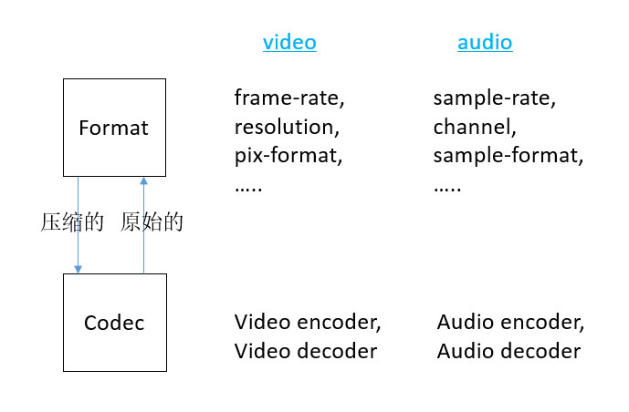
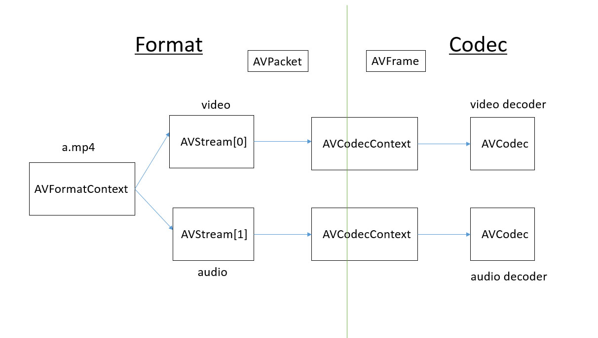

## 目标
* 调用 FFmpeg 的接口，把一个视频文件解码，保存成yuv文件。
* 代码量： 80行左右

## FFmpeg 解码过程
* 解封装
* 准备解码
* 解码

## 回顾

## FFmpeg 如何抽象音视频中的基本组件
* 压缩后的音视频数据：AVPacket
* 原始音视频数据：AVFrame
* 音视频文件：AVFormatContext
* 音视频 stream： AVStream
* 音视频 Codec： AVCodecContext、 AVCodec

##### `AVFormatContext`
* 这个结构体很重要，ffmpeg 将一直使用这个结构体来表示一个视频文件，它的成员变量不算多也不算少。
* 本例中，它最重要的两个成员如下：
	* `unsigned int nb_streams`：音视频流的个数，比如一个含有一条音频流和一条视频流的文件，`nb_streams` 就等于2。
	* `AVStream **streams`：音视频流的指针数组，数组里每个元素指向一条流。音频/视频流用结构体 `AVStream` 表示。

##### `AVStream`
* 这个结构体用来表示音视频文件中的一条流，可以是视频流、音频流、字幕流等
* 这个结构体中最重要的，也是本例唯一用到的成员是：`AVCodecContext *codec`。
	* （可惜这个成员在新版的-2016年5月-ffmpeg里也弃用了，后面会提到，这不影响我们学习。
	* 注意新版只是在 AVStream 里不再使用 codec 这个成员了，并不是说ffmpeg不再使用 AVCodecContext 这个结构体了！AVcodecContex 仍然是 ffmpeg 最重要的结构体。）
* 注意，每一条流都有一个 `AVCodecContext *codec`，他们是一一对应关系。用来描述一条流的大多数信息也都是写在 `AVStream.codec` 里的。

##### `AVCodecContext` 
* 这个结构体也非常重要，ffmpeg 编解码都要用到。他的成员变量巨多，很多是给编码用的。解码用到的也很多。
* 可以说`AVCodecContext` 是连接解封装与解码器的桥梁。
* 在解封装阶段，要把这个结构体的成员变量都写成正确的值，后续解码器才能正确的解码。
* 本例中用到的  `AVCodecContext` 的重要成员如下：
	* `enum AVMediaType codec_type`：流的类型，可以是音频、视频、字幕等。
	* `enum AVCodecID codec_id`：codecID
	* `int width, height`：如果是视频的话，代表宽和高
	* `struct AVCodec  *codec`：编解码器。用 ` AVCodec` 类型来表示一个解码器
	* `enum AVPixelFormat pix_fmt`：图像格式，比如 yuv420p，RGB24 之类的。

##### `AVCodec`
* 这个结构体比较简单，在 ffmpeg 里用来表示一个编码器/解码器。
* 他的成员包括 codec\_id、codec\_name、codec\_type 这种基本信息，剩下的是指向真正编解码器的函数指针。比如 encode2 就指向编码函数，对于h264，可能就指向x264的编码函数（当然也是ffmpeg包裹后的）。
* 函数`avcodec_find_decoder(AVCodecID id)` 会分配一个 AVCodec 并返回它的地址，根据参数 id，这个函数会把它的成员变量都设置成正确的值。

##### 有点容易混淆的两个 codec
* `pFormatCtx->streams[i]->codec->codec`，其中第一个 codec 是 AVCodecContext 类型的，第二个是 AVCodec 类型的。
* AVCodecContext 用来记录编解码器的context信息，比如，codec\_id、codec\_name、codec\_type、width、height、pix\_fmt。当然，它还有个很重要的成员：AVCodec 类型的 codec。
* AVCodec 用来记录某一个编解码器本身的信息，最重要的就是一些函数指针，指向真正做编解码工作的函数。
* 当然 AVCodec 里也有一些基本的成员变量跟 AVCodecContext 重复，比如，codec\_id、codec\_name、codec\_type

##### `AVPacket`
* 本例用的成员只有：`stream_index`，它表示这个 packet 来自哪一条 stream。
* 目前只需要知道，从文件里读出的压缩过的数据是一个一个的packt即可，packet既可以是视频包，也可以是音频包
* 对于视频，一个packet就是一帧。音频一个packet可能是一帧也可能是多帧。固定size的音频是多帧（e.g. PCM or ADPCM data），可变size的音频就是一帧（e.g. MPEG audio）。

##### `AVFrame`
* 像素数据存放在 data[4] 里面
    * 对于 YUV420 的图像，data[0] 存Y，data[1] 存U，data[2] 存V
    * 对于 RGB24 的图像，data[0] 存 rgb，data[1]~data[3] 没有意义
    * 其他格式的图像数据有其他的存法
    * 总之 data 是一个存放指针的数组，data[0]~data[3] 都是指针，各自指向一片像素数据区

* 还需一个额外的 linesize[4] 来表示
    * 比如 RGB24 的图像，data[0] 指向了一大片内存，里面全是二进制数据，表示一整副图像。
    * 那么 linesize[0] 就表示了多少个字节之后，就是图像的下一行了。
    * YUV 同理。

* linesize 不一定等于图像的宽度：padding
    * 每一行像素的结尾处有一个 padding，linesize=图像宽度+padding
    * 不同格式的图像，padding 值不同，比如 RGB 的 padding 是 0, YUV 的 padding 是 32
    * padding 是为了做复杂的编解码运算时提高速度，比如做运动补偿啥的，具体的也不了解，也不用了解。
    * padding 的值是有公式的：RGB 的 padding = 0， YUV 的 padding = 32
    * 所以说知道了 `pix_format` 之后，是可以根据图像宽度换算出 linesize 的
    * 不过 AVPicture 结构体里，只有 data 和 linesize 两个成员，没有描述图像宽度和 `pix_format` 的成员

## 解封装

#### 基本步骤
1. 打开文件：`avformat_open_input()`。分配一个 `AVFormatContext`，把读到的文件头信息写进去。
2. 读取码流信息：`avformat_find_stream_info()`。把码流信息写到 `AVFormatContext` 里面。使 `AVFormatContext` 信息更全面。

##### 解封装函数
* `avformat_open_input()`：
	* 原型：

			int avformat_open_input	( AVFormatContext ** 	ps,
					const char * 	url,
					AVInputFormat * 	fmt,
					AVDictionary ** 	options 
					)	
	
	* 函数会分配一个 `AVFormatContext` 结构体，并把它的地址返给第一个参数。
	* 第三个参数为 NULL 的时候，函数自己 detect 文件格式，否则强制按照第三个参数指定的格式打开文件。 
	* 第四个参数目前用不上，先不用管，传 NULL 即可。
	* 本函数打开文件，读取封装头，分配一个 `AVFormatContext` 把读到的信息写进去。
	* 因为本函数仅仅读取封装头，如前面所说，对于很多封装格式，是读不全码流信息的。所以我们需要下一个函数，去读一下流的信息。
* `avformat_find_stream_info()` :
	* 原型：

			int avformat_find_stream_info	( AVFormatContext * 	ic,
							AVDictionary ** 	options 
							)	

	* 这个函数会去读取 packets，以得到文件中每一条流的信息：Read packets of a media file to get stream information.
	* This function populates streams with the proper information.  
	* 这个函数会把第一个参数里的每一个 stream 里的 codec（AVCodecContext 类型）都填充上正确的值。
	* 这个函数成功返回后，我们的 CodecContext 就准备好了，就可以准备开始解码了。

## 准备解码
* 找到 video stream
* 找到 codec context
* 找到 decoder
* 打开 decoder：实际上就是让 AVCodec 里的函数指针，指向真正的decoder

##### 打开 decoder：把 codec 设置给 codecContext
* 用函数 `avcodec_open2()` 来打开解码器，函数原型如下：

        int avcodec_open2	(  AVCodecContext * 	avctx,
				        const AVCodec * 	codec,
						AVDictionary ** 	options 
					 )	
					 
* 这个函数的作用是根据 codec 去初始化 codecContext：Initialize the AVCodecContext to use the given AVCodec.  
* 而 codecContex 需要提前分配好，用 `avcodec_alloc_context3()`：`Prior to using this function the context has to be allocated with avcodec_alloc_context3().`   
* 在开始真正的解码之前必须要调用这个函数来初始化 codecContext：`Always call this function before using decoding routines (such as avcodec_decode_video2()).`   
* 参数：
	* avctx：	The context to initialize.
	* codec：	The codec to open this context for.
	* options： codec 的私有选项，一般不用设，传 NULL 即可。

## 解码

#### 循环读 packet，读一个解一个

##### 循环读 packet

* 用`av_read_frame()`读取packet，函数原型如下：

		int av_read_frame	(	AVFormatContext * 	s,
								AVPacket * 	pkt 
							)	

* 每次调用读取一个 packet。
* `av_read_frame()` 会分配空间，让 packet 的 buf 指向那里。
* 再次调用 `av_read_frame()` 读下一个 packet 之前要用 `av_free_packet(&packet)` 释放 `av_read_frame()` 为 packet 的 buf 分配的空间
* 再次调用 `av_read_frame()` 会读下一个packet
* 读到的可能是音频packt也可能是视频packet，要判断一下。

	
####  把 packet 解成 frame

* 函数原型

        int avcodec_decode_video2	(	AVCodecContext * 	avctx,
            							AVFrame * 	picture,
            							int * 	got_picture_ptr,
            							const AVPacket * 	avpkt 
            						)
    
* 把 avpkt 里的数据解码，解出来的 frame 存入 picture
* The codec will allocate memory for the actual bitmap，即这里的输出参数 picture 不用提前分配好 buffer，这个函数会为他分配。

## 其实
* 严格的说，以上过程只有最后一个步骤里的 `avcodec_decode_video2()` 才是真正的codec在干活，才应该划分到codec层
* 其他所有动作都是format层在工作
* 实际应用中不要那么纠结，该明白的时候能弄明白即可