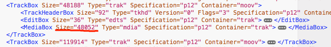

## MP4 文件的构成：Box
* MP4 用 Box 来组织文件结构。
* 文件由许多 Box 组成，每个 Box 由 Header 和 Data 组成。
* Header，包含了整个 Box 的长度和类型等信息。
* Data，是 Box 的实际数据，可以是纯数据也可以是更多的子 Box。当一个 Box 的 Data 中是一系列子 Box 时，这个 Box 又可称为 Container Box。
* Box 如下图所示：


* 对于纯数据的 Data 来说，以 chunk + sample 的形式来组织存储。
* sample：媒体数据单元，可以是音频数据或视频数据。一个 sample 可以表示一个视频帧或者一个音频采样。
* chunk: 文件读取单元，每个 chunk 里可以装一个或若干个 sample。


## MP4 总体结构
* 先来看一个示意图：


* 1. 一个 ftyp box：file type。描述整个文件，很小
* 2. 一个 moov box：movie。描述整个音视频信息，要有它才能起播，较大。其大小跟视频长度有关，本例视频时长6分34秒，moov box 大小为168K。(如果是30分钟的文件，约 1M)。moov 是 container box，它的 data 是各种子 box。
* 3. 一个 mdat box：media data。这里面是真正的音视频数据（sample），这是最大的box，其大小约等于整个文件。mdat 的 data 区是纯的数据了，它不是 container box。
* 下图是一个实际的 mp4 文件的总体结构：


## moov
* moov 特别重要，它是一个 Container box，我们要展开看的子 box。
* moov 的大小主要被它里面的 trak box 给占了
* 常见的mp4文件包括一个视频流和一个音频流，那么 moov 里就有两个 track box，一个代表视频，一个代表音频。
* moov 里一般包括：
	* 1. 一个 mvhd box：movie header。
	* 2. 多个 trak box：track。 具体个数取决于有几个音视频流，常见的就是一个视频 track，一个音频 track。
	* 3. 一个 udta box：user data。


* 本例的视频如上图，moov下面有2个 trak，因为本例的mp4里面有一个视频和一个音频。
* 可以看到 moov 里最大的就是两个 trak 了。

## trak
* moov 里面最大是 trak，trak 的结构如下：
	* 1. 一个 tkhd box：track header。
	* 2. 一个 edts：edit box。这个先不理会。	
	* 3. 一个 mdia box：media box。这个是 trak 里最大的，trak 的大小几乎都被它占了。



## 音频 trak 和 视频 trak
* 可以根据 trak 的子节点来区分音频、视频，如下图：


* 其中 vmhd box 代表 video media header，它所在的 trak 是视频 track。
* smhd box 代表 sound media header，所在的 trak 为音频 track。

## mdia -> minf -> stbl
* 接下来没必要一层一层看了，现在已知占用 moov 最大的是两个 trak，而占用每个 trak 最大的是它的 mdia
* 而占用 mdia 最大的，是其下面两层的 stbl：mdia -> minf -> stbl，眼尖的从上面区分音视频 track 的图中应该已经看到了
* 下图用红色标出了确实 stbl 最大


* stbl 是非常重要的 box，之所以说要下载完整个 moov 才能起播，正是因为 stbl 存在于 moov 里面。
* stbl 是 sample table 的缩写，下面就来重点看一下这个 box。

## stbl (重点)

### stbl 的位置回顾：
* moov 有2个 trak，每个 trak 有一个 mdia，每个 mdia 有一个 minf，每个 minf 有一个 stbl
* 即每个 trak 对应一个 stbl

### stbl 的作用
* stbl box：sample table。**用于描述 sample 在文件中的物理布局以及时序**。**让播放器知道去文件的什么位置读取需要播放的数据**。
* stbl box 是通过它的子节点来完成该功能的。在本例种，stbl 有 6 种子节点：stsd，stsz，stsc，stco，stts，stss。这些子节点名都是以 st 开头的，代表是 stbl 的子节点，后面两个字母是自己功能的缩写。
* 下面分别看一下这些子节点，就知道 stbl 是怎么完成这项功能的了，当然没有兴趣的可以略过。

#### 1. stsd box: sample description
* 描述信息，虽然很重要，但这里不展开说，它体积很小。

#### 2. stsz box: sample size
* 描述每一个 sample 的大小。所以有多少个 sample，stsz 就有多少个子节点。
* 音频的 stsz box 如下图：


* 如上图，本例种音频共有 8491 个 sample。
* 每条 SampleSizeEntry 需要4个字节，所以本例音频的 stsz 的大小为 33984 字节（8491x4）.
* 视频的 stsz box 如下图：


* 可以看出，音频共有 5913 个 sample 即 5913 帧。音频 stsz 的大小为 23672 字节。
* 题外话：本例视频时长6分34秒，5913 帧，所以可以推算出其帧率为：15fps。
* stsz 里的 sample 是按顺序排列的。**从 stsz 里，播放器可以知道第几个 sample 的大小是多少字节**。

#### 3. stco box: chunk offet
* 描述每个 chunk 在文件的什么位置。
* **播放器可以根据 stco 从文件中找到某个想要的 chunk 的起始位置**。
* 本例音频的 stco 结构如下图：


* 可以看到，音频的第一个 chunk 位于文件的第 168385 字节，这差不多正好是 moov 的大小 + ftyp 的大小。
* 还可以看出，本例的音频共有 5914 个 chunk，数量小于音频的 sample 数：8491。因为音频的一个 chunk 里装有不定数量个 sample。
* 本例视频的 stco 结构如下图：


* 可以看到，视频的第一个 chunk 差不多紧挨着音频的第一个chunk，在文件的第 169023 字节处。即在 mdat 区，音频 chunk 和视频 chunk 是交替存放的。
* 还可以看出，本例的视频共有 5913 个视频 chunk，正好等于视频的 sample 数。即视频每个 chunk 里只装一个 sample。
* 通过 stco 播放器可以找到 chunk 的起始位置，但结束位置呢？
* 对于视频比较简单，因为一个 chunk 里只有一个 sample，所以只需要用 chunk 的起始位置 + sample 的大小即可。而 sample 的大小可以从 stsz 表中得到。
* 比如本例中，视频的第一个 chunk 起始于文件的 169023 字节，结束于 169023+404=169427 字节。404 就是视频 stsz 的第一个子节点得到的。
* 这样，对于视频，播放器想要解码第几个 sample 时，只需要 stsz 和 stco 两张表，就可以搞定了。
* 但是音频要复杂一些，因为音频一个 chunk 里可能有多个 sample。这就需要另一张表来记录每个 chunk 里有几个 sample。这就是 stsc：sample to chunk。

#### 4. stsc box: sample to chunk
* 这个 box 用来表示 sample 和 chunk 的对应关系。
* **stsc 配合 stco 和 stsz，播放器才能准确找到一个 sample 的起始和结束位置。**
* 音频的 stsc box 如下图，音频 stsc 一共有五千多个子节点：

	

* 比如播放器想播放音频的第4个 sample，它首先根据 stsc，知道第4个 sample 在第2个 chunk 里。（因为第一个 chunk 里装了 3 个 sample）。 然后根据 stco 找到第2个 chunk 的起始位置。 然后再根据 stsz 找到这个 sample 的结束位置。
	
* 视频的比较简单，可以看到视频的 stsc 只有一个子节点，如下图：

		
		

#### 5. stts box: time to sample。
* 表示时间和 sample 的对应关系。
* **播放器根据 stts 知道第几秒要播放第几个 sample。**
* 本例音频的 stts 如下图：


* 图中 stts 只有一个子节点，那是因为本例种所有音频 sample 都有相同的 duration。如上图所示，每个 sample 的时长为 2048，共有 8491 个 sample。8491 正好是本例种的全部音频 sample。
* 这个 2048 并不是 2048 毫秒，它具体等于多少秒，需要另一个 box 配合才能算出来。即 mdia->mdhd box。每个 track 有自己的 mdhd box，mdhd box 有一个 TimeScale 属性。比如本例中音频 track 的 TimeScale = 44100。如下图所示：


* 用 2048 除以 44100，就得到了秒数。即 0.0464 秒，音频每个 sample 的 duration。音频一共有 8491 个 sample，所以总时长 394 秒，恰好等于本片的时长。
* 当播放器想播放第10秒的音频时，它就会根据 stts 知道，第10秒的 sample 应该是第（10 除以 0.0464 = 215 个），所以它就会去找第215个音频 sample。
* 视频与音频是一样的，这里贴一下视频的 stts box 截图：


* 视频的 TimeScale：


* 视频每个 sample 的时长是 1024 除以 15360 秒，共 5913 个 sample，总时长也正好是 394 秒。

#### 6. stss box: sync sample
* 音频没有，视频有，用来标识视频关键帧的。（音频的每个 sample 都是关键帧）
* 这个主要对 seek 有意义，因为只有关键帧才能成为 seek 的目标帧。这里不展开。


## stbl 小结
* stbl 的几个子节点让播放器可以播放视频文件。
* 播放器根据 stts 找到想要播放的时间点的 sample 是第几个 sample
* 播放器根据 stsc 找到这个 sample 在第几个 chunk
* 播放器根据 stco 找到这个 chunk 的起始位置
* 播放器根据 stsz 找到这个 sample 的结束位置
* 播放器读出 sample，进行解码，播放
* 如果需要seek，对于视频来说，还需要 stss 来配合以便找到关键帧。

## stbl 子节点的大小
* 以上 6 个子节点里，体积比较大的是：
	* 1. stsz： 很大，大小取决于 Sample 个数，因为其大小 = SampleCount x 4 字节。
	* 2. stco： 很大，大小取决于一共有多少个 chunk。
	* 3. stsc： 很大，对于音频。因为其大小取决于有多少个装了 sample 的 chunk。
	

## 思考题

### 为什么要减小 moov 的体积？
* 因为必须有了整个 moov box 视频才能播起来，为什么呢？
* 因为 stbl box 包涵在 moov 里 ，而必须有了整个 stbl box 视频才能播起来，为什么呢？
* 因为有了 stbl box 才能知道想要播放的音频/视频 sample 在文件的第几个字节，才能去拿过来解封装、解码、显示。
* 所以，对于在线视频来说，moov box 的体积一定要小，才能提高起播速度。不过 mp4 文件标准就决定了 moov box 不可能太小。

### 为什么 moov 的大小主要取决于视频时长？
* 首先，moov box 的大小主要取决于两个 stbl 的大小，音频一个、视频一个。
* 而 stbl 的大小主要取决于 sample 的个数，sample 的个数又主要取决于时长。

### 如何减少 moov 的体积？
* 可以参考这篇：[如何正确处理MP4文件中的大文件头](https://lark.alipay.com/nxqrq1/syn554/fz6d1i)

## 附录：实验环境

### 1. MP4Box 工具 （mac 版）
* MP4Box 是 [GPAC](https://gpac.wp.imt.fr/) 的一个工具，主要用于打包、拆解、转换MP4格式封装。
* 下载和安装：在 mac 上需要下载源码自己编译，可以参考这里：[https://gpac.wp.imt.fr/2011/05/02/compiling-gpac-for-macos-x/](https://gpac.wp.imt.fr/2011/05/02/compiling-gpac-for-macos-x/)
* 本文分析 mp4 文件所使用的命令行：

```
 MP4Box -info -dxml -diso zhenhunjie01.mp4  
```
* 运行结束后会生成 zhenhunjie01_info.xml

### 2. 测试用视频文件
* 优酷线上电视剧《镇魂街第一集第一分片》，时长6分34秒，文件体积 10.2 MB
