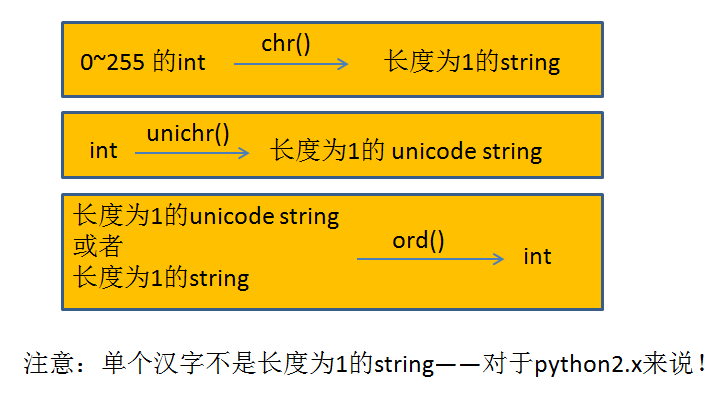
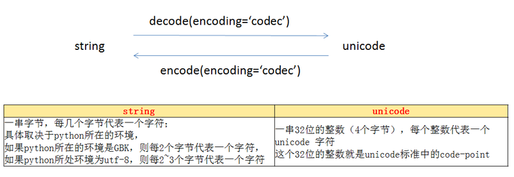

## 一：python2.x 字符串和 unicode  
* python 2.x 的 string，最气人的地方在于，它虽然叫 string，但实际上python内部把它当做了 byte。
* python2.x 的文档里写：The items of a string are characters. 这么写实际上是不准确的，起码会让人产生误解。
* 看下面两个例子：

		:::python
		>>> len("你好")
		6
* "你好" 明明是2个字符，你咋说他长度是6呢？
* 这个例子是在 utf-8的console下运行的，如果在GBK的console下运行len("你好")，得到的将会是4
* 总之，python 是把 string 当成了字节串，而不是字符串

		:::python
		>>> for chr in "你好":
		...     if chr == "你":
		...         print chr
		... 

* 咋啥也没打印出来呢？难道 "你" 没有 in "你好" 吗？ 对python2.x来说，是的！这显然是很坑的。
* python内部把"你好"当成了6个字节的序列(utf-8环境)，所以对他用 in 进循环的时候，每次取出来的是一个字节，而不是一个字符，所以永远取不出来"你"。
* 其他的面向对象编程语言对string的设计就没有这么坑，比如java，python3.x，等等。
* java的例子：

		:::java
		public class StringTest{
			public static void main(String[] args){
				String s = "你好";
				int len = s.length();
				System.out.println(len);
				for(int i=0;i<len;i++){
					String chr = s.substring(i,i+1);
					System.out.println(chr);
				}
			}
		}

* python3的例子：

		:::python
		>>> len("你好")
		2
		>>> for chr in "你好":
		...  if chr == "你":
		...   print(chr)
		...
		你

* **python 2.x 对string的划分是以字节为单位的，而不是以字符为单位。这就是产生问题的根源。**
* python 2.x 对unicode的划分是以字符为单位的。

		:::python
		>>> len(u"你")
		1
		>>> for chr in u"你好":
		...     if chr == u"你":
		...         print chr
		...         
		你

### String、Unicode、数字 之间的转换
* chr() 把一个0到255之间的数变成一个ascii字符
* ord() 把一个字符（长度为1的string或者长度为1的unicode串），转换为数字
* 注意，单个汉字不是长度为1的string，见上面的例子
* ord("你") 将报错，说你传进去的不是长度为1的string
* ord(u"你") 不报错，显示"你"的unicode code point
* unichr() 把一个整数按unicode标准变成一个unicode  

### 关键在于跟外界的交流
* python在跟外界交流的时候，外界提供给python的全是字符串，不可能是unicode，对任何程序设计语言来说，都是这样。
* python把东西交给外界的时候，也只能交出字符串，你交出unicode别人也不认识，因为unicode是python2.x的一个class而已。
* 所谓外界，包括console，文件，网络，操作系统等等。
* 当然，所有的编程语言都面临跟外界交流时的编码问题，这不是python2.x特有的

### 跟 python 无关的，但是必须了解的：
* “测试”，存储在计算机上的时候，到底是怎样的一串 0/1 bit 呢？
* 答案是，有时候是这样，有的时候是那样，这取决于你用什么编码格式来存储它。
* 如果用GBK方式编码，那么“测试”就是 0xB2E2CAD4，占4个字节；如果用utf-8方式编码，那么“测试”就是 0xE6B58BE8AF95，占6个字节。

### 当你在 python 代码里敲了被双引号引起来的“测试”， python 认为他是怎样的一串 0/1 bit 呢？
* 这取决于你的 python 代码所在的环境。如果 python 代码所在的环境是 GBK 的，则“测试”就是 0xB2E2CAD4，如果 python 代码所在的环境* 是 UTF-8 的，则“测试”就是 0xE6B58BE8AF95
* 所谓环境，包括 console，.py文件，等等。
* 下面分别举例：
* 对比两种不同编码的 console 中 输入 "测" 回车后，显示的是不同的：

		:::python
		>>> "测"
		'\xe6\xb5\x8b'
		>>> "测"
		'\xb2\xe2

* 另外：IDLE 不知道为何，设置了 Options ---> Configures ----> General ----> Default Source Encoding 为UTF-8之后，还是用 GBK 编码。此处请忽略IDLE。

### encoding

##### 概念1：code point
* 一个32位的整数（范围是 0 ~ 0x10ffff），代表着一个 unicode 字符

##### 概念2：Unicode string 
* 一串 code point

##### 概念3：string
* 在人类的理解中是一串字符，在python2.x的理解中，是一串字节。

##### 概念4：encoding
* 按照某种规则把 unicode string 转换成 string，就叫 encoding。

* 写在双引号内的东西就是str，它实际上是一串字节码
* python2.x 对于encoding的定义也挺坑的，一般来说，我们把这种叫做encoding：人类理解的字符串---->字节序列。

* 比如“测试”------> 0xB2E2CAD4，或者 “测试” ------> 0xE6B58BE8AF95。

### 题外话：ANSI == GBK
* ANSI 使用 0x80~0xFF 范围的 2 个字节来表示 1 个字符
* 简体中文Windows操作系统中，ANSI 编码代表 GBK 编码；在繁体中文Windows操作系统中，ANSI编码代表Big5；在日文Windows操作系统中，ANSI 编码代表 Shift_JIS 编码。

## 二：Unicode 和 Str ，Python2.x 的坑爹  

* 字符串替换时，只要有一边是unicode，python就自动把两边都转成unicode。即，把str隐式的decode成unicode，且使用的codec是ascii。

		:::python
		print '''<root>%s</root>'''%u"字"   #不报错：  python隐式的把'''<root>%s</root>'''用ascii decode 成 unicode，不会出现问题
		print u'''<root>%s</root>'''%u"字"  #不报错:   两边都是unicode，没有隐式的解码过程
		print u'''<root>%s</root>'''%"字"   #报错  UnicodeDecodeError: 'ascii' codec can't decode byte 0xe5：python试图把"字"（\xe5\xad\x97）用ascii解码成unicode

* fromstring期待的参数是一个str，如果你传入的是unicode，则会被转换成（encode）str，不幸的是，用的codec也是ascii：

		:::python
		from xml.etree.ElementTree import *
		fromstring('''<root>%s</root>'''%u"字") #报错  UnicodeEncodeError: 'ascii' codec can't encode character u'\u5b57'
		fromstring(u'''<root>%s</root>'''%"字") #报错  UUnicodeDecodeError: 'ascii' codec can't decode byte 0xe5
		fromstring(u'''<root>%s</root>'''%u"字") #报错 UnicodeEncodeError: 'ascii' codec can't encode character u'\u5b57'
		fromstring('''<root>%s</root>'''%"字") #不报错

* os.path.isfile、os.path.getsize等函数期待的参数是unicode，如果你传入的是str，则会报错，或者更可怕的是得到一个非预期的结果而不报错：

		:::python
		import os.path
		print os.path.getsize("D:\\python\\总结1.txt")  #报错 WindowsError: [Error 2] 
		print os.path.isfile("D:\\python\\总结1.txt")   #不报错，但会得到False，而实际上该文件是真实存在于硬盘上的

## 三：lxml 中文乱码  
1. 要保证传给 lxml 所有函数的参数都是 unicode，这样才最安全，在 lxml 里面统一用 unicode 进行处理。
2. 用 urlopen() 抓到的 file-like object ，或者用open()打开的硬盘上的 file object ，里面的文字肯定不是unicode，肯定是string。
3. 可以用 unicode(file-like-object.read(),"utf-8")，或者file-like-object.read().decode('utf-8')，来转换成 unicode。也可以用 codecs.open(filename, 'r', 'utf-8').read()。
4. 这样处理之后再传给lxml的fromstring()
5. xml.etree.ElementTree 也是一样
6. 虽然lxml.html.parse()可以接受file-like object 作为参数，但是不要用，因为这样传进去的肯定不是 unicode。

###

* 只要保证了传给 lxml 中一切函数的都是 unicode 就安全了。
* 虽然不是lxml中所有函数都要求传 unicode，比如 fromstring 就可以接收 string:

		:::python
		>>> html.fromstring("<html>中文</html>")
		<Element html at 0x25846f0>

* 但是这样并不安全：

		:::python
		>>> e = html.fromstring("<html>中文</html>")
		>>> html.tostring(e)
		'<html><body>
&#228;&#184;&#173;&#230;&#150;&#135;
</body></html>'

* 为毛fromstring的时候还是好好的“中文”，到了tostring的时候就变成一堆数字了呢？
* 先看看这些数字是啥：

		:::python
		>>> "中文"
		'\xe4\xb8\xad\xe6\x96\x87'
		>>> hex(228)
		'0xe4'

* 原来这些数字是“中文”对应的utf-8编码后的字节，只不过是用十进制表示的并加上了 &# 前缀以及 ; 后缀。 （之所是utf-8而不是GBK是因为当前的命令行环境为utf-8）
* 尽管我们知道了这一点，但还是无法利用 xpath 去找到中文：

		:::python
		>>> e.xpath('//*[text()="&#228;&#184;&#173;&#230;&#150;&#135;"]')
		[]

*  &#...; 这是html中的“实体编号”。 &#228; 在html实体中表示的是一个长得类似于小写的a上面加两个点儿的字符。也就是说我们的“中文”被fromstring给整乱了。所以最安全的方法还是全部使用unicode：

		:::python
		>>> e = html.fromstring("<html>中文</html>".decode('utf-8'))
		>>> html.tostring(e)
		'<html><body>
&#20013;&#25991;
</body></html>'
		>>> e.xpath(u"//*[text()='中文']")
		[<Element p at 0x26a6ea0>]