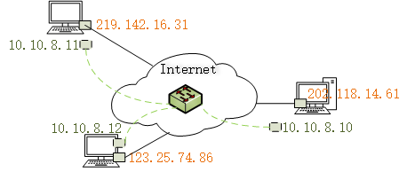
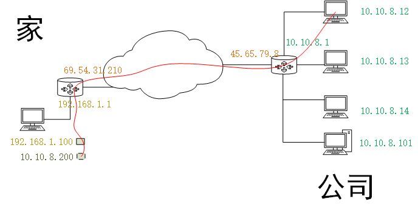
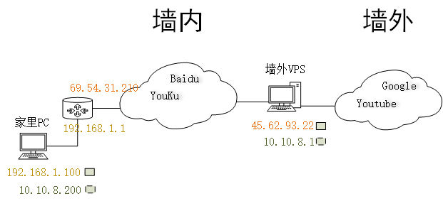
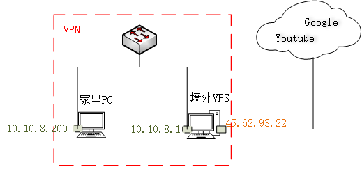
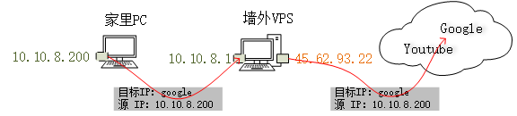
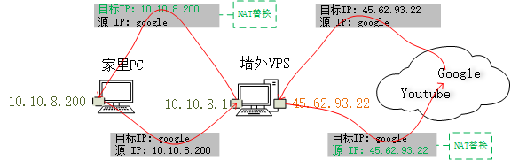

##VPN 的目的：
* 让处于互联网中的机器，看起来像是**二层互通**的，即虚拟的 LAN。如下图所示：    

* 这么做的实际需求（实际应用场景）
	1. 员工回家或出差时访问公司网络，不同分公司网络互连
	2. 科学（翻）上网（墙）：除了 VPN，还需要其他技术，包括转发和NAT
* 下面按照场景1，说一下员工回家时的实际情况：

###员工回家时访问公司网络

####场景描述
* 比如公司内部的网络是 10.10.8.0/24 。整个公司只有一个出口接入Internet，IP 是 45.65.79.8。
* 员工小张回家了，家里电脑在一台家用路由器后面，家用路由器通过拨号可以上Internet。家里运营商的公网IP是 69.54.31.210 。
* 小张希望能像在公司时一样，访问机房里的任何一台机器或者自己的任何一台PC，这些机器的 IP 都是 10.10.8.x 。
* 最简单粗暴的方法就是搞一根巨长的网线，把小张家里电脑和公司路由器连上，然后家里电脑IP改为 10.10.8.x（很可能是通过DHCP从公司路由器获取），这样小张就能快乐如在公司了，但这显然是扯淡。
* 比较现实的做法是，利用小张和公司都接入了互联网这个特点，使用软件技术在 Inertnet 上打造一根虚拟的“巨长的网线”。
* 这就是VPN：虚拟专用网。

####实现原理
* 先看一下组网图：  

* 小张想访问公司内网，需要利用互联网打造一个虚拟的专线。咋打造？

#####小张这边儿：
1. 虚拟出来一个网口，IP设置为 10.10.8.200 。
2. 路由表改一下，目标地址 0.0.0.0  的网关改为 10.10.8.1 （公司内网网关），使用的接口是虚拟网口。[这步可以省略，如果不改路由表，则发往Internet的包还走物理网口，只有发往公司的包才走VPN虚拟网口]
3. [最关键的]  所有发往公司内网（10.10.8.x） 的包，注意源地址是10.10.8.200，在原包的基础上再打一层头，把原来整个包作为数据。新头把目标地址写为公司的 Internet 入口地址( 45.65.79.8 )，把源地址写为家里电脑的物理网口地址( 192.168.1.100 )。
	* 这样，当小张访问公司内的某一个机器时，实际上这个包会通过 Internet 被发送到公司的 Internet 入口路由器上。
	* 注意，这种包也会被家用路由器做NAT，即把源地址由 192.168.1.100 替换为运营商公网地址 69.54.31.210。
4. 以上事情，一般是通过 VPN 客户端软件干的。

#####公司那边儿：
1. 路由器上进行设置，让路由器收到从互联网来的包的时候，先看看是不是VPN包。如果是的话就把VPN那层头解掉，按照原来的头找到目标IP，把包送过去。并且要记住，解开了VPN包头之后，里面的源地址是多少（10.10.8.200）。
2. 回程路由：同样，公司路由器收到公司机器发来的包时，检测一下目标地址是否是10.10.8.200，如果是，则把这个包打包成VPN包，发往小张家的公网IP，69.54.31.210。

### SSL-VPN, IPSec-VPN, PPTP, L2TP 等等
* VPN有很多种，包括 SSL-VPN, IPSec-VPN, PPTP, L2TP 等等。
* 他们的总体目的都跟上面描述的一样，区别在于他们实现细节（实现在网络的不同层次，以及加密方式不同）。
* 如果你仅限于搭建自己的VPN并且使用它，那么不用去了解实现细节。
* 只需要记住结果即可：VPN 借助互联网，实现了伪的**“二层互通”**。

##利用 VPN 科学（翻）上网（墙）
* 估计当今最常用的一种 VPN 使用方式就是科学上网了
* 不过实际上，通过 VPN 科学上网，不仅仅使用了 VPN 一种网络技术，只是大家习惯上，把整个解决方案叫做 “VPN”
* VPN 在科学上网中扮演的角色，跟他刚出现时的目的并没有区别：使Internet上的机器看起来**“二层互通”**。
* 科学上网中用到的其他网络技术： 转发，NAT。
* 想要科学上网，首先得有一台既能跟墙内互通，又能跟墙外互通的电脑。一般，我们使用国外的VPS来担任这一角色。
* 开始科学上网之前，我们首先要有如下的组网：  

  
###第一步：VPN，使墙内PC和墙外VPS处于同一个“局域网”
* 了解了VPN的原理之后，这一部很容易理解，这就是VPN存在的意义。无论使用何种VPN技术，总之，我们把墙内的PC和墙外的VPS，搞成了“二层互通”，即让他们看起来真“同一个局域网内”。
* 这步结束后，逻辑上的组网图如下：
  

* 当然，笔记本、手机、pad、Mac 等等等等，都可以。只要利用 VPN 使它跟 VPS 处于“同一个”局域网。

###第二步：转发，把VPS配置成路由器，作为PC的网关
* 当PC和VPS处于同一个局域网后，我们把PC的网关设为VPS的地址（10.10.8.1）。
* 我们需要让VPS把从 10.10.8.1 收到的包，从 45.62.93.22 转发出去。就像路由器一样。
* 最简单配置方法就是：在VPS上设置 sysctl， 把 `net.ipv4.ip_forward=1` 设置上，就能让VPS把收到的包转发出去。
* 当然，今天主要讲理论，具体配置细节先不说。
* 总之，配置好VPN，PC的网关，VPS的转发后，PC发往 google 的数据包将如图所示：
  

  
* 现在的问题是，因为是原样转发，所以google收到包后，找不到回程路由。10.10.8.200是VPN虚拟私网地址，google肯定不认识。
* 所以我们需要NAT。

###第三步：NAT，给VPS这台“软路由”加入NAT功能，使服务器能找到回程路由
* NAT的作用就是让路由器做转发包的时候，替换源地址，并记住这次替换，即建立所谓的session。
* 待到收到回来的包时，再把目标地址进行替换。
* 配置NAT功能一般是通过iptables实现。同样，今天主要讲理论，具体怎么配，先不说。
* 配置好了NAT之后，整个科学上网功能就算是全部实现了。这时的数据包如图：
  

  
* 全部理论基础到此结束。下次将说实际操作，如何把以上的理论变为现实。