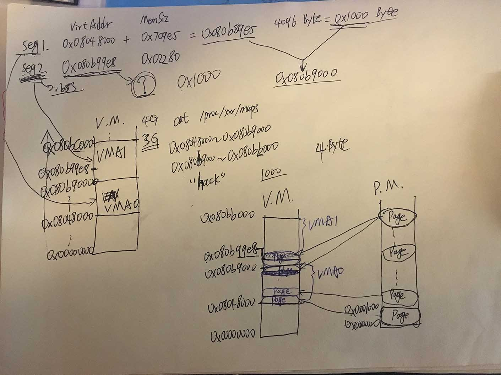

* 链接器生成的可执行文件里，已经做好的重定位，指令引用的地址，都是虚拟地址了。
* 编译器和链接器看到的，都是虚拟地址。只有OS和MMU才会看到物理地址。对于编译器链接器来说，没个程序都拥有3G的独立虚拟内存。（3G是对于32位Linux而言，对32位Windows可能是2G，设置后能成为3G）
* 我们感觉上是：存在于硬盘上的可执行程序，其中是各种的指令和数据，这个程序中运行时会被一次性赋值进内存，并开始执行。
* 但实际上，硬盘上的可执行程序被OS划分成了很多很多个Page，每个Page为4096字节，每次装入内存的只是若干个Page而已。当OS发现要访问的内存地址所在的Page没在内存里时——即页错误，才会进行替换，把需要的Page换进内存。
* 在发生页错误的时候：
	* OS 从物理内存上分配一个物理页
	* 将缺页从硬盘读入该物理内存：**此时 OS 必须知道需要的页在磁盘文件中的哪个位置。即 OS 需要知道虚拟地址和可执行文件之间的映射关系。**
	* 设置缺页的虚拟页和物理页的映射关系
* **VMA 就是 OS 用来保存虚拟地址和可执行文件之间映射关系的一个数据结构。**它记录的内容大致如下：
	* 本 VMA 的虚拟地址空间为：0x08048000~0x080B9000
	* 本 VMA 对应可执行文件的 .text, .init, .rodata 等 Section
	* 本 VMA 的属性是只读是 
* VMA 是 OS 进程数据结构（Linux 就是 PCB？）的一部分。
* 一个 VMA 对应一个 Segment，包含好多个 Page。
* 可执行程序真正开始拷贝进内存，实际上是**开始于第一个页错误**。

---
### 6.4.4 段地址对其
* 这节有点绕，录了个视频说明了一下： [http://pan.baidu.com/s/1kUCjmvX](http://pan.baidu.com/s/1kUCjmvX)
* 视频对应的草稿如下图：

---
* PAE 这一节并没有仔细的看，貌似用处不大。

