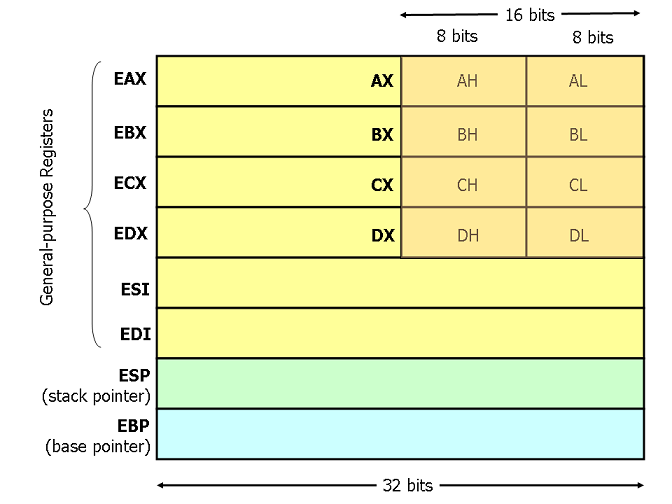

## 写在前面
* Intel 和 AT&T 的 x86 汇编语法不一样。以前书上学的和微软用的是 Intel 语法；GCC 里使用的汇编器叫 GAS，它使用的语法是 AT&T 的。
* 具体区别百度一下很多，不在这里记录了。
	* 参考1： [http://www.tuicool.com/articles/eaEVni](http://www.tuicool.com/articles/eaEVni)
	* 参考2： [http://blog.csdn.net/liufeng_cp/article/details/2134862](http://blog.csdn.net/liufeng_cp/article/details/2134862)
* 本文使用 AT&T 的汇编语法。
* AT&T 汇编语法需要注意的地方如下：
	* 立即数要加前缀 $， 不加前缀的被视为内存地址：`movl $0x4, 0x100` 把立即数 0x4 放入内存地址 0x100 处。
	* 寄存器要加前缀 %
	
* AT&T 汇编语法的内存地址
	* 内存地址的表达形式为：`offset(%base, %index, scale)`，其代表的内存地址为：offset + base + index * scale
	* 其中 offset 和 scale 必须为常数，注意，此处不能加 $ 前缀。
	* 其中 %base 和 %index 必须为寄存器，% 不能省略。
	* 表达式中的任何部分都不是必须的，可以简化。比如常见的：
		* (%eax): 最终地址即 (%eax)
		* 0x4(%ebp)： 最终地址即 (0x4+%ebp)

## 寄存器
* X86 CPU 有8个32位通用寄存器。如下图所示：

* 其中ESP和EBP有专门用途，ESP指向栈顶，EBP是基址指针，在函数调用时会用到，见后文。
* EAX、EBX、ECX和EDX的高2字节和低2字节可以独立使用，其中低2字节又被独立分为H和L部分。
* AT&T 汇编语法寄存器名称前面要加 %，形如：%eax

## 寻址方式
* 寻址，原则上讲是指“寻找**内存**上的地址”，但实际使用中把寄存器、立即数也算作寻址方式的一种
* 

## 函数调用